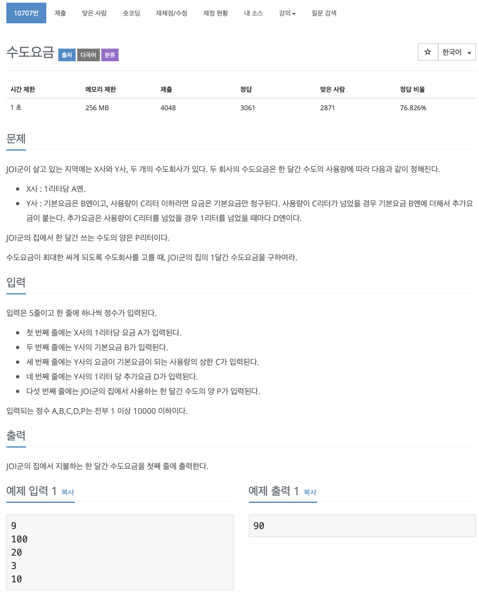

# BOJ 10707

## 수도요금

### 문제



</br> 

### 소스코드

```c++
#include <iostream>

using namespace std;

int main()
{

    int a, b, c, d, p;
    int resultA, resultB;
    cin >> a >> b >> c >> d >> p;
// A의 경우
    resultA = a * p;

// B의 경우
    if (c >= p)
    {
        resultB = b;
    }
    else if (c < p)
    {
        resultB = b + ((p - c) * d);
    }

// 비교
    if (resultA > resultB)
    {
        cout << resultB << endl;
    }
    else
    {
        cout << resultA << endl;
    }

    return 0;
}
```

