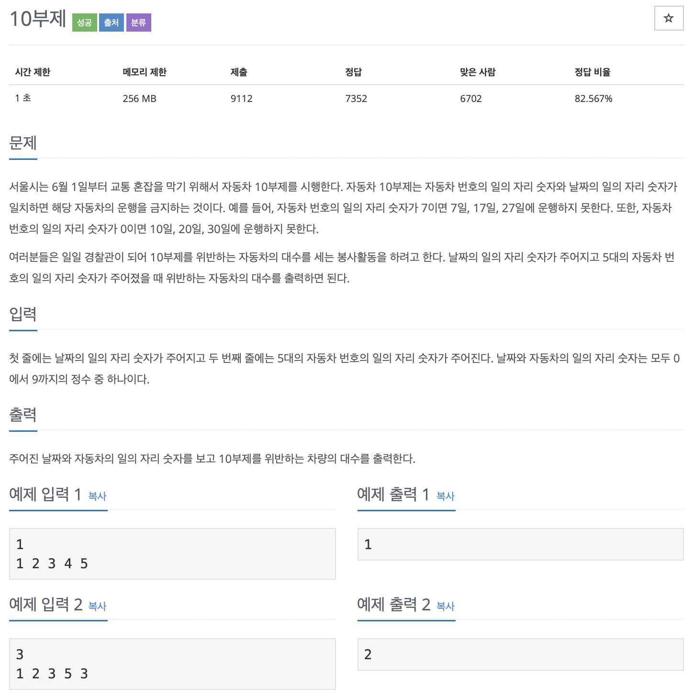

# BOJ 10797	

## 10부제

### 문제



</br>

### 소스코드

```c++
#include <iostream>

using namespace std;

int main()
{
		//날짜와 번호
    int date, num;
    cin >> date;
    int cnt = 0;

    for (int i = 0; i < 5; i++)
    {
        cin >> num;
//      	날짜와 입력 숫자가 일치하면 수 증가
        if (date == num)
            cnt++;
    }

    cout << cnt << endl;

    return 0;
}
```

