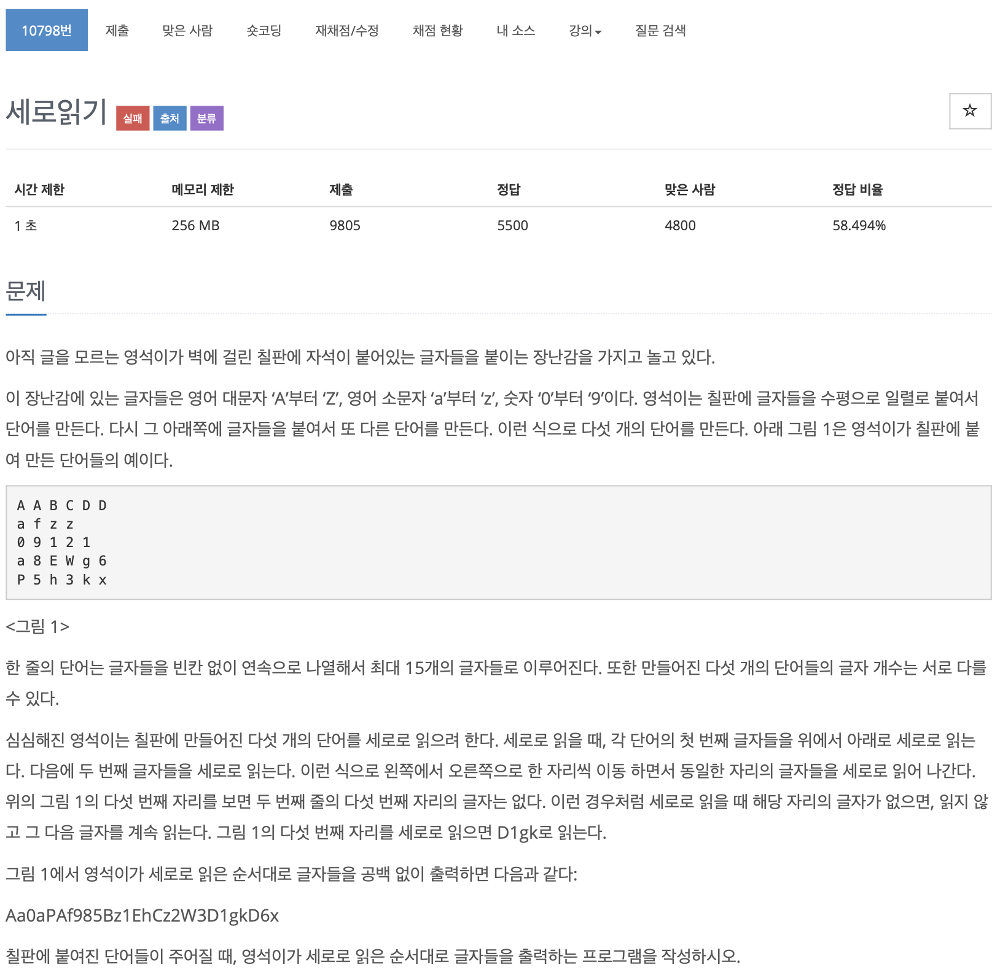

# BOJ 10798

# 세로읽기

### 문제



</br> 

### 소스코드

```c++
#include <iostream>
#include <string>

using namespace std;

// 기본 배열
string arr[5][10];

int main()
{

    string input, result;

  // 문자열 하나하나 잘라서 2차원 배열에 넣기
    for (int i = 0; i < 5; i++)
    {
        cin >> input;
        for (int j = 0; j < input.length(); j++)
        {
            arr[i][j] = input.substr(j, 1);
        }
    }

	// 문자열 최댓값을 구한다. 세로로 읽을 범위
    int max = -10;
    int longest = input.length();
    if (max < longest)
        max = longest;

	// 문자열을 세로로 가져와 result에 추가시킨다.        
    for (int i = 0; i < max; i++)
    {
        for (int j = 0; j < 5; j++)
        {
            result += arr[j][i];
        }
    }

    cout << result << endl;

    return 0;
}
```

- 정답은 구했지만 *런타임오류..*
  - 2중 for문이 4개나 있으니 뭐..

</br> 

### 다른사람의 코드

```c++
#include <iostream>
#include <string>

using namespace std;

int main()
{

    string s1, s2, s3, s4, s5;

    cin >> s1 >> s2 >> s3 >> s4 >> s5;

    for (int i = 0; i < 15; i++)
    {
        if (s1.size() >= i + 1)
        {
            cout << s1[i];
        }
        if (s2.size() >= i + 1)
        {
            cout << s2[i];
        }
        if (s3.size() >= i + 1)
        {
            cout << s3[i];
        }
        if (s4.size() >= i + 1)
        {
            cout << s4[i];
        }
        if (s5.size() >= i + 1)
        {
            cout << s5[i];
        }
    }

    return 0;
}
```

- 직관적으로 잘 짜여진것같다..!