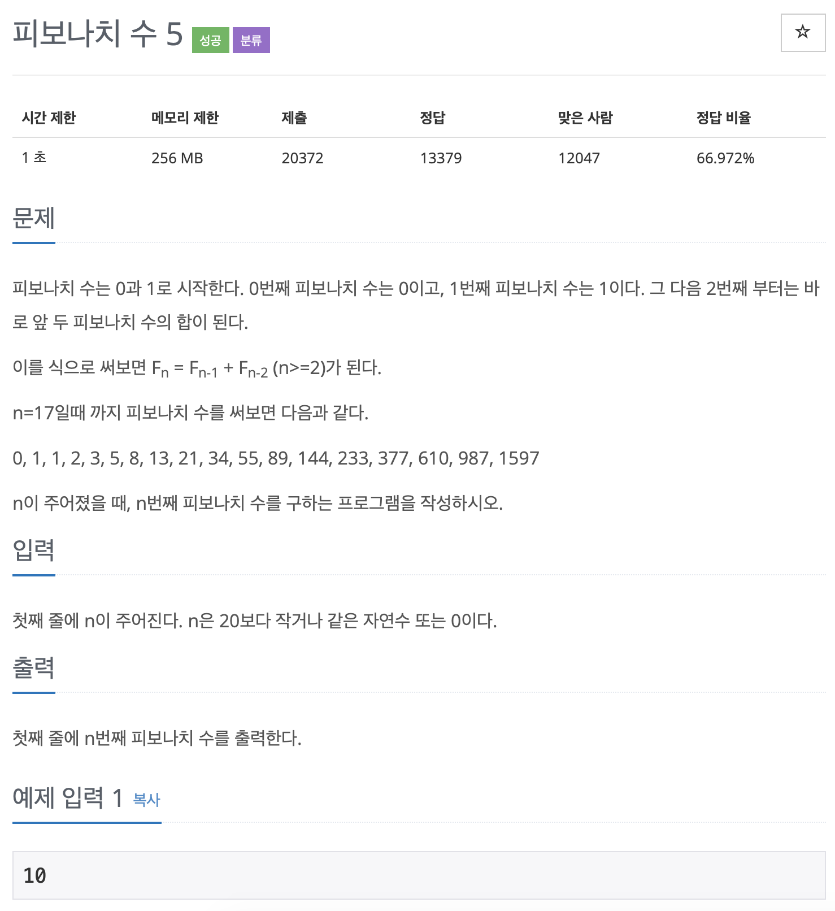
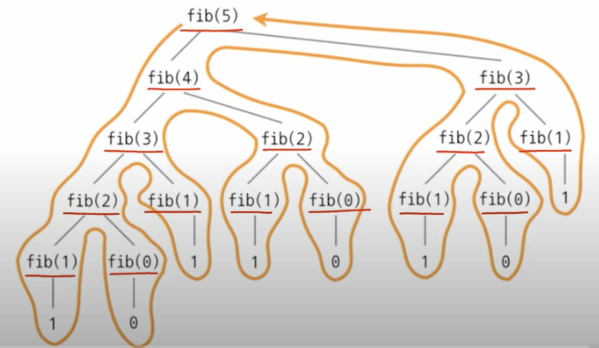

# BOJ 10870

# 피보나치수 5

### 문제



### 코드

```c++
#include <iostream>
using namespace std;
int fib(int num)
{
    if (num == 0)
    {
        return 0;
    }
    else if (num == 1)
    {
        return 1;
    }

    else
    {
        return fib(num - 1) + fib(num - 2);
    }
}

int main()
{

    int n;
    cin >> n;
    cout << fib(n) << endl;

    return 0;
}
```

**== > DFS방식**

