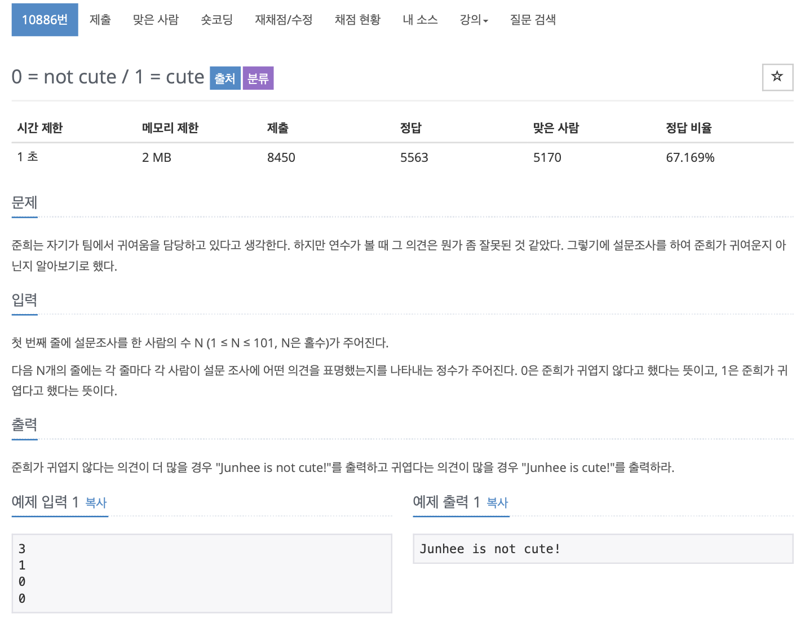

# BOJ 10886

# 0 = not cute / 1 = cute

### 문제



</br>

### 소스코드

```c++
#include <iostream>

using namespace std;

int main()
{

    int num, tcase, sum = 0;
    cin >> tcase;

    for (int i = 0; i < tcase; i++)
    {
        cin >> num;
      
//      	귀엽다는 의견은 1이고 더해준다
        if (num == 1)
        {
            sum++;
        }
      
//      	안귀엽다는 의견은 0이고 빼준다
        else
        {
            sum--;
        }
    }

// 총 합의 결과가 음수면 안귀엽다, 양수면 귀엽다
    if (sum < 0)
    {
        cout << "Junhee is not cute!" << endl;
    }
    else
    {
        cout << "Junhee is cute!" << endl;
    }

    return 0;
}
```

