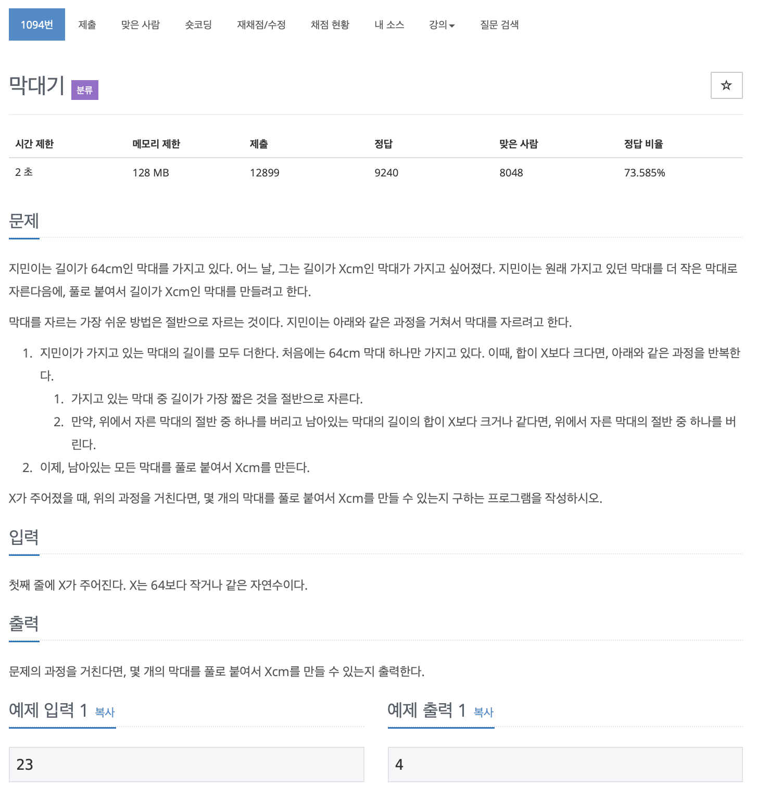

# BOJ 1094

## 막대기

### 문제



</br> 

### 소스코드

```++
#include <iostream>

using namespace std;

int main()
{

    int a;
    cin >> a;
    int result = 0;
    while (a != 0)
    {
        if (a % 2 == 1)
        {
            result++;
        }
        a /= 2;
    }

    cout << result << '\n';

    return 0;
}
```

