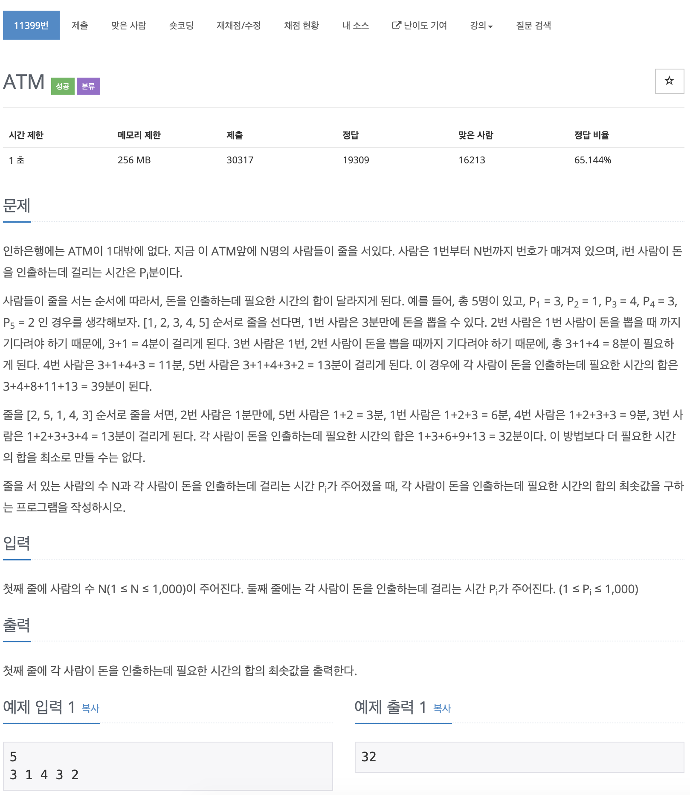

# BOJ 11399

# ATM

### 문제



<br/> 

### 코드

```c++
#include <iostream>
#include <algorithm>

using namespace std;

int main()
{

    int ppl, time = 0, result = 0;
	// 인원수를 입력 받는다
    cin >> ppl;

  // 걸리는 시간을 저장할 배열
    int arr[ppl];

  // 걸리는 시간 입력 받기
    for (int i = 0; i < ppl; i++)
    {
        cin >> arr[i];
    }

  // 오름차순으로 정렬
    sort(arr, arr + ppl);

  // 걸리는 시간 총합 구하기
    for (int i = 0; i < ppl; i++)
    {
        time += arr[i];
        result += time;
    }

    cout << result;

    return 0;
}
```

