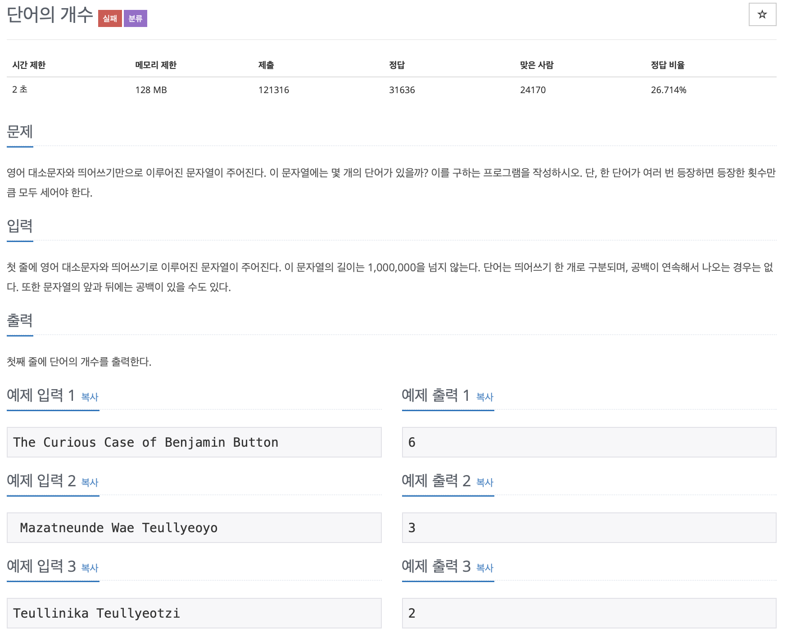

# BOJ 1152

## 단어의 개수

### 문제



</br>

### 소스코드

```c++
#include <iostream>
#include <string>

using namespace std;

int main()
{
    int cnt = 1;
    string sent;
    getline(cin, sent);
    
    //처음 또는 끝에 공백이 존재할 경우 cnt=0으로 초기화
    if (sent[0] == ' ' || sent[sent.length()] == ' ')
    {
        cnt = 0;

        for (int i = 0; i < sent.length(); i++)
        {
            if (sent[i] == ' ')
            {
                cnt++;
            }
        }
    }
    
    //처음 또는 끝에 공백이 존재하지 않을 경우에는 cnt = 1.
    else
    {


        for (int i = 1; i < sent.length(); i++)
        {
            for (int j = i; j < sent.length(); j++)
            {
               
                //공백이 여러개 들어가게 되는 경우 공백까지 포함하게 되면 안되므로 break;
                if (sent[j + 1] == ' ')
                {
                    break;
                }
                
                // 여러개의 공백이 아닐 경우 (일반적인 경우)
                if (sent[j] == ' ')
                {
                    cnt++;
                }
            }
        }
    }

    cout << cnt << "\n";

    return 0;
}


```

- 결과는 잘 나오지만 <u>시간초과 오류</u>
  - 두번째 for문에서 **시간복잡도**가 과하게 증가함..

</br>

### 참고 코드

```c++
#include <iostream>

#include <string>

using namespace std;

int main()

{

    int num = 0;

    string word = {};

    getline(cin, word);

    for (int i = 0; i < word.length(); i++)

    {

        if (word.at(i) == ' ')

            num++;
    }

    if (word.at(0) == ' ')

    {

        num = num - 1;
    }

    if (word.at(word.length() - 1) == ' ')

    {

        num = num - 1;
    }

    cout << num + 1 << endl;
}
```

- **`at()`**

- 정답이긴 한데, 

  공백이 두번나와도 수행된다는게 이상하다..
