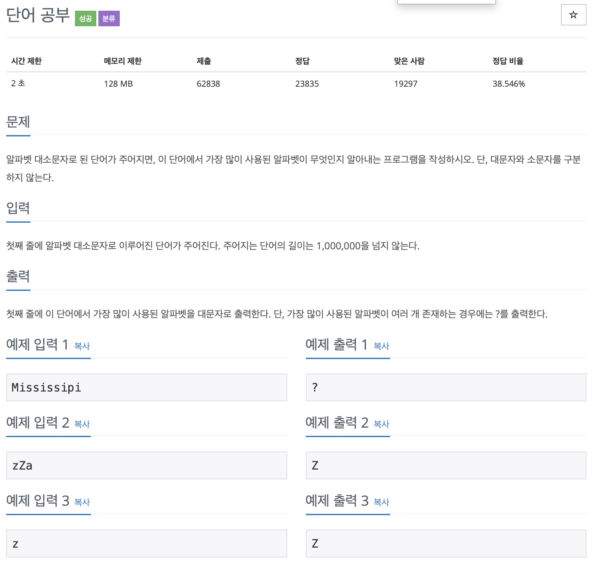

# BOJ 2675

## 단어공부

### 문제



</br>

### 소스코드

*아스키코드 이용*

```c++
#include <iostream>
#include <string>
#include <cstring>
using namespace std;

int main()
{
    // 아스키코드를 담을 임시 변수
    int tmp = 0;
    // 단어 입력
    string word;
    //아스키 코드를 받은 결과 string
    string result;
    //인덱스용 아스키코드 변수
    int asc = 0;
    //아스키 코드 숫자에 따라 카운트를 한 수를 담을 변수
    int arr[127] = {0};

    cin >> word;

    for (int i = 0; i < word.length(); i++)
    {
        asc = word[i];
        //소문자를 대문자로 바꾸는 과정
        if (asc >= 97 && asc <= 122)
        {
            asc = asc - 32;
            arr[asc]++;
        }

        //소문자면 그냥 플러스 카운트를 한다.
        else
        {
            arr[asc]++;
        }
    }

    // 최댓값을 구하기 위한 비교변수 max
    int max = arr[0];

    for (int i = 65; i <= 90; i++)
    {
        if (max < arr[i])
        {
            max = arr[i];

            // 최댓값을 받은 순서 다움부터 90(Z)까지 같은 수의 max가 있는지 검사
            for (int j = i; j <= 90; j++)
            {
                if (max == arr[j + 1])
                {
                    // 같은 수가 있으면 63(?) 대입
                    tmp = 63;
                    // cout << "?" << endl;
                    break;
                }

                // 같은 수가 없으면 그대로 대입
                else
                {
                    tmp = i;
                }
            }
        }
    }

    // integer형 tmp변수를 string형 result에 넣어 ascii to String으로 변환
    result = tmp;

    cout << result << endl;

    return 0;
}
```

