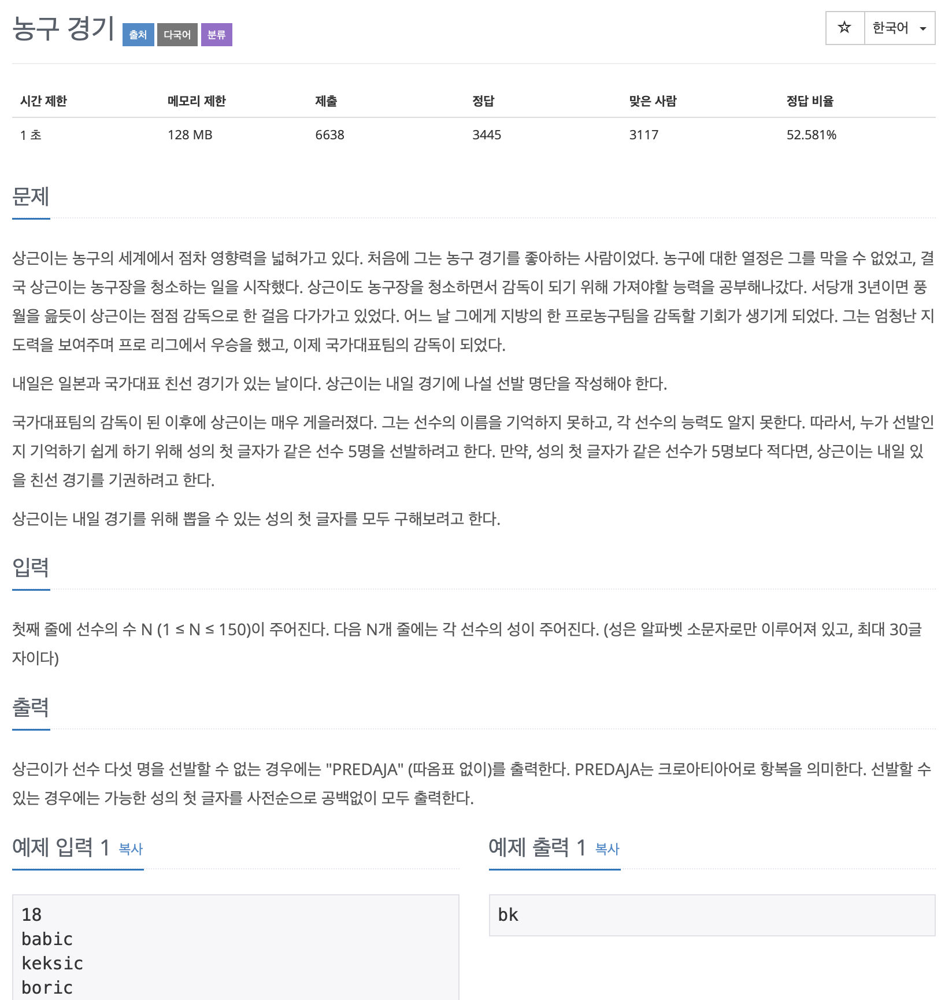

# BOJ 1159

## 농구 경기

### 문제




</br> 

## 소스코드

```c++
#include <iostream>
#include <vector>
#include <string>

using namespace std;

int main()
{
 // 아스키 코드 배열
    int arr[200] = {
        0,
    };
 // 선수 인원
    int inputSize = 0;
    bool isGiveUp = true;

    vector<string> v;
    cin >> inputSize;
  
 // 선수 인원만큼 예약 할당
    v.reserve(inputSize);

    for (int i = 0; i < inputSize; i++)
    {
      // 선수 이름 입력 및 벡터에 넣기
        string s;
        cin >> s;
        v.push_back(s);
    }
  
 // iterator 반복자 선언 첫번째 원소부터
    vector<string>::iterator iter = v.begin();

    for (iter; iter != v.end(); ++iter)
    {
      
     // 원소의 맨 앞글자들을 아스키코드로 바꿔 배열에 수 증가
     // b  k  b  b  s  b  k  h  b  b  k  p  k  k  s  k  k  p 이렇게 짤리고 
     // 해당되는 아스키코드 수에 맞게 배열의 인덱스 수 증가
        arr[(int)(*iter)[0]] += 1;
    }

  
    for (int i = 'a'; i < 'z' + 1; ++i)
    {
        if (arr[i] >= 5)
        {
            cout << (char)i;
            isGiveUp = false;
        }
    }
    if (isGiveUp)
        cout << "PREDAJA";
}
```

