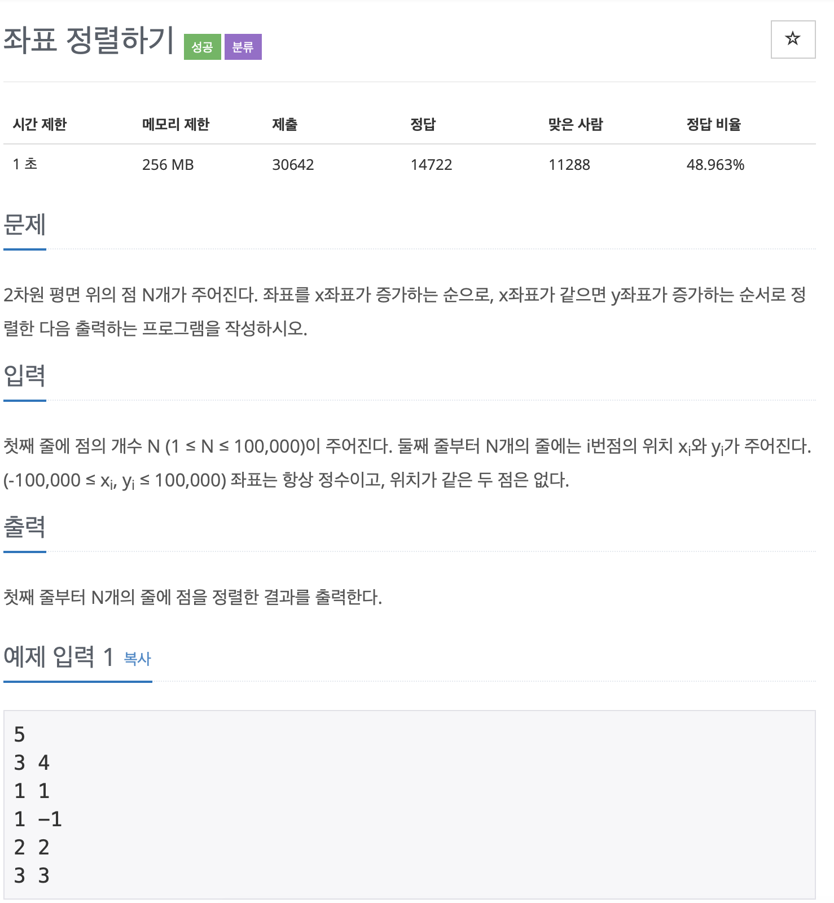

# BOJ 11650

# 좌표 정렬하기

### 문제



### <br/> 코드

```c++
#include <iostream>
#include <algorithm>
#include <vector>

using namespace std;

int main()
{

    int n;
    cin >> n;
    vector<vector<int>> arr(n, vector<int>(2, 0));

    for (int i = 0; i < n; i++)
    {
        cin >> arr[i][0];
        cin >> arr[i][1];
    }

    sort(arr.begin(), arr.end());

    for (int i = 0; i < arr.size(); i++)
    {
        cout << arr[i][0] << " " << arr[i][1] << '\n';
    }

    return 0;
}
```


--> **2차원 배열의 정렬**은 **2차원 벡터**를 사용해서 `sort()` 메서드를 쓰면 간편하다.