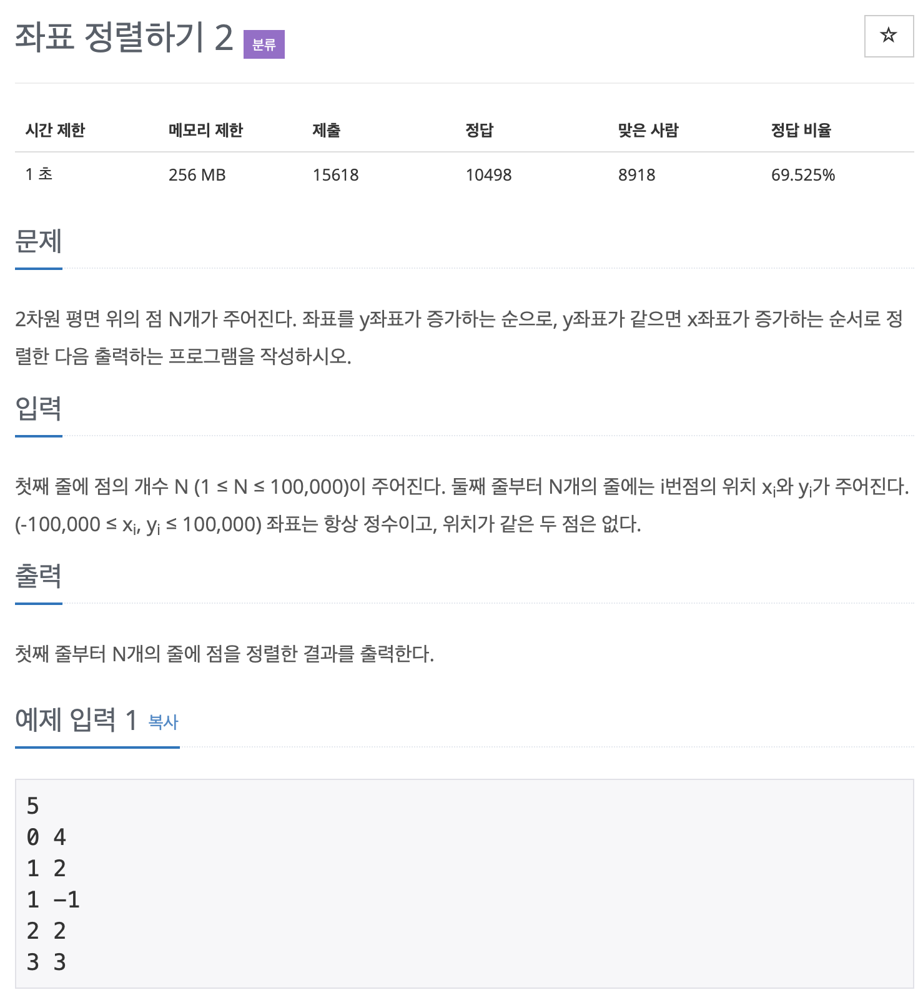

# BOJ 11651

## 좌표 정렬하기2

### 문제



### <br/> 코드1 (vector)

```c++
#include <iostream>
#include <algorithm>
#include <vector>

using namespace std;

int main() {


    int n; 
    cin>>n;


    vector<vector <int>> vec(n,vector<int>(2,0));

    for (int i = 0; i < n; i++)
    {
        cin>>vec[i][1]; 
        cin>>vec[i][0];
    }

    sort(vec.begin(),vec.end());


    for (int i = 0; i < vec.size(); i++)
    {
        cout<<vec[i][1]<<" "<<vec[i][0]<<'\n';
        
    }
    
    

    return 0;
}
```

<br/> 

### 코드2 (vector.Pair)

#### Pair클래스 

: 두 객체를 하나의 객체로 취급할 수 있게 **묶어주는** 클래스 ("쌍"을 표현할 때 사용)

<br/>

#### 형태

`template <typename T1, typename T2> struct pair;`
T1 : first
T2 : second 로 구분합니다.

<br/> 

#### 멤버함수 및 사용법

`pair<[type1], [type2]> p`

- `p.first()` : p의 첫번째 인자 반환
- `p.second()` : p의 두번째 인자 반환
- `make_pair(변수1, 변수2)` : 변수1과 변수2가 들어간 pair를 만들어줍니다.
- Sort 알고리즘 정렬 가능

#### <br/> 예제

```c++
#include <iostream>
#include <vector>

using namespace std;

int main(){

    vector<pair<int,string>> v;

    v.push_back(pair<int,string>(3,"Dok2"));
    v.push_back(pair<int,string>(6,"DMask"));
    v.push_back(pair<int,string>(1,"TigerJK"));
    v.push_back(pair<int,string>(4,"Block"));
    v.push_back(pair<int,string>(2,"banana"));
    v.push_back(pair<int,string>(2,"apple"));


    vector<pair<int,string>>::iterator iter;
    for (iter = v.begin(); iter != v.end() ;iter++)
    {
     cout<<"["<<iter->first<<","<<iter ->second<<"]"<<endl;

    }

    cout<<endl;

    sort(v.begin(),v.end());

    cout<<endl;

    for (iter =v.begin(); iter!= v.end() ;iter++)
    {
        cout<<"["<<iter->first<<","<<iter ->second<<"]"<<endl;
    }
    
    
    return 0;
}

//정렬 전
[3,Dok2]
[6,DMask]
[1,TigerJK]
[4,Block]
[2,banana]
[2,apple]

//정렬 후
[1,TigerJK]
[2,apple]
[2,banana]
[3,Dok2]
[4,Block]
[6,DMask]
```

<br/> 

### 11651번 풀이

```c++
#include <iostream>
#include <vector>

using namespace std;

bool compare(pair<int, int> a, pair<int, int> b)
{
    if (a.second == b.second)
    {
        return a.first > b.first;
    }
    else
    {
        return a.second < b.second;
    }
}

int main()
{

    int n, x, y;

    vector<pair<int, int>> v;

    cin >> n;

    for (int i = 0; i < n; i++)
    {
        cin >> x >> y;
        v.push_back(make_pair(x, y));
    }

    sort(v.begin(), v.end(), compare);

    for (int i = 0; i < n; i++)
    {
        cout << v[i].first <<" "<< v[i].second << endl;
    }

    return 0;
}

```


