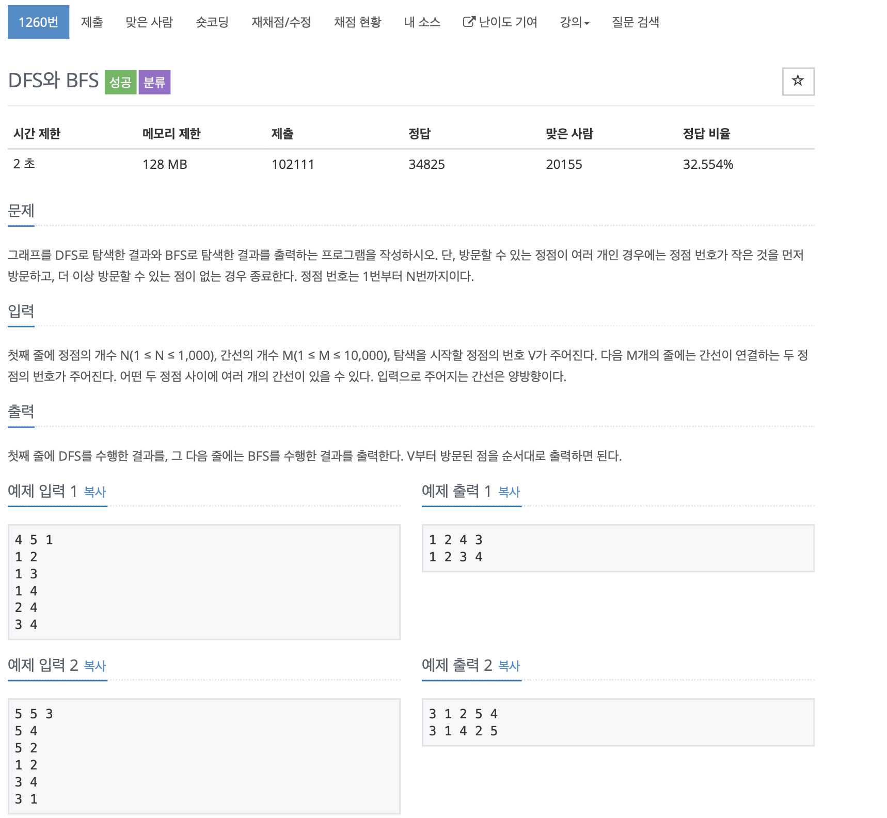

# BOJ 1260

## DFS & BFS

### 문제



</br> 

### 코드

```c++
#include <iostream>
#include <vector>
#include <queue>
#include <algorithm>
using namespace std;

vector<int> arr[1001];

int m, n, start;

// 체크를 하기위한 DFS 배열
int cDFS[1001];

// 체크를 하기위한 BFS 배열
int cBFS[1001];


// BFS
void bfs(int start)
{

    queue<int> q;
    q.push(start);
    cBFS[start] = 1;

    while (!q.empty())
    {
        int v = q.front();
        printf("%d ", v);
        q.pop();
      
        for (int i = 0; i < arr[v].size(); i++)
        {
            int next = arr[v][i];
            if (cBFS[next] == 0)
            {
                cBFS[next] = true;
                q.push(next);
            }
        }
    }
}

// DFS
void dfs(int x)
{
    if (cDFS[x])
        return;

    cDFS[x] = 1;

    cout << x << ' ';

    for (int i = 0; i < arr[x].size(); i++)
    {
        int y = arr[x][i];

        dfs(y);
    }
}


int main()
{

    int x, y;
    cin >> n >> m >> start;

  // 노드 연결 부분 
    for (int i = 0; i < m; i++)
    {
        cin >> x >> y;
        arr[x].push_back(y);
        arr[y].push_back(x);
    }
  
  // 번호 정렬
    for (int i = 1; i <= n; i++)
    {
        //정점 번호가 더 작은 것을 먼저 방문하기 위해 sort
        sort(arr[i].begin(), arr[i].end());
    }

    dfs(start);
    cout << '\n';
    bfs(start);
    cout << '\n';
    return 0;
}

```

