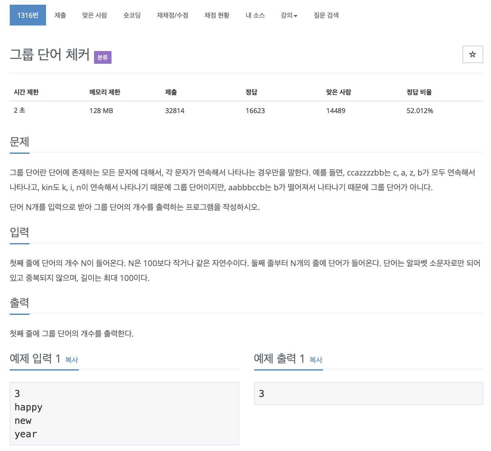

# BOJ 1316

## 그룹 단어 체커

### 문제




</br>


### 소스코드

```c++
#include <iostream>
#include <string>
#include <stack>

using namespace std;
int alphabet[26];
int main()
{
    //테스트 케이스
    int tcase;
    cin >> tcase;

    //스택
    stack<char> s;
    // 스택에서 이용할 변수
    string tmp;

    for (int i = 0; i < tcase; i++)
    {
        int cnt = 0;

        //문자열 입력
        string str;
        cin >> str;

        // 연속된 문자 제거하면서 스택에 저장
        for (int i = 0; i < str.length(); i++)
        {
            s.push(str[i]);

            if (str[i] != str[i + 1])
            {
                tmp += str[i];
            }
        }

        int idx = 0;

        // 한글자 뒤에 중복된 글자가 없으면 +1
        for (int i = 0; i < tmp.length(); i++)
        {

            idx = tmp[i];

            alphabet[idx] = idx;
            if (alphabet[idx] != 0)
            {
                cout << idx << endl;
                // cout<<alphabet[idx]<<endl;
                cnt = 1;
            }
        }

        cout << cnt << endl;
    }

    return 0;
}
```

</br>

#### 접근 방법

1. 스택을 이용해서 중복문자 제거 후, 

2. 한글자 건너 뛴 중복문자가 없을 경우 수 증가

   2-1. 빈 배열을 만들어 알파멧에 해당하는 아스키코드 수에 맞춰 넣고, 이미 넣은 값이 없으면 수 증가 ( 인터넷 참고 )

   