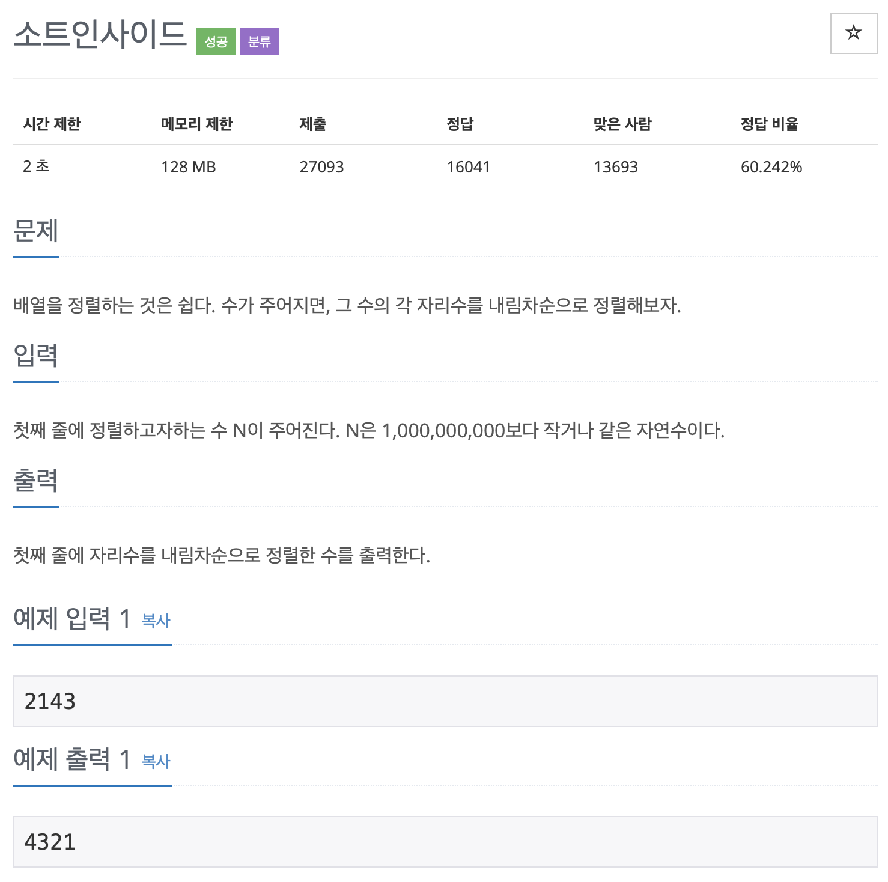

# BOJ 1427

# 소트 인사이드

### 문제



### <br/> 코드

```c++
#include <iostream>
#include <algorithm>

using namespace std;

int main()
{

    int n;

    cin >> n;

    // int -> string
    string str;
    str = to_string(n);

    // 문자열 길이
    int length = str.length();
    
    // 분해된 문자열 담을 배열
    int arr[length];

    //문자열 하나씩 담기
    for (int i = 0; i < length; i++)
    {
        arr[i] = str[i];
    }

    // 내림차순 정렬
    sort(arr, arr + length, greater<>());

    // 아스키코드->숫자로 변환
    for (int i = 0; i < length; i++)
    {
        cout << arr[i] - 48;
    }

    return 0;
}
```

