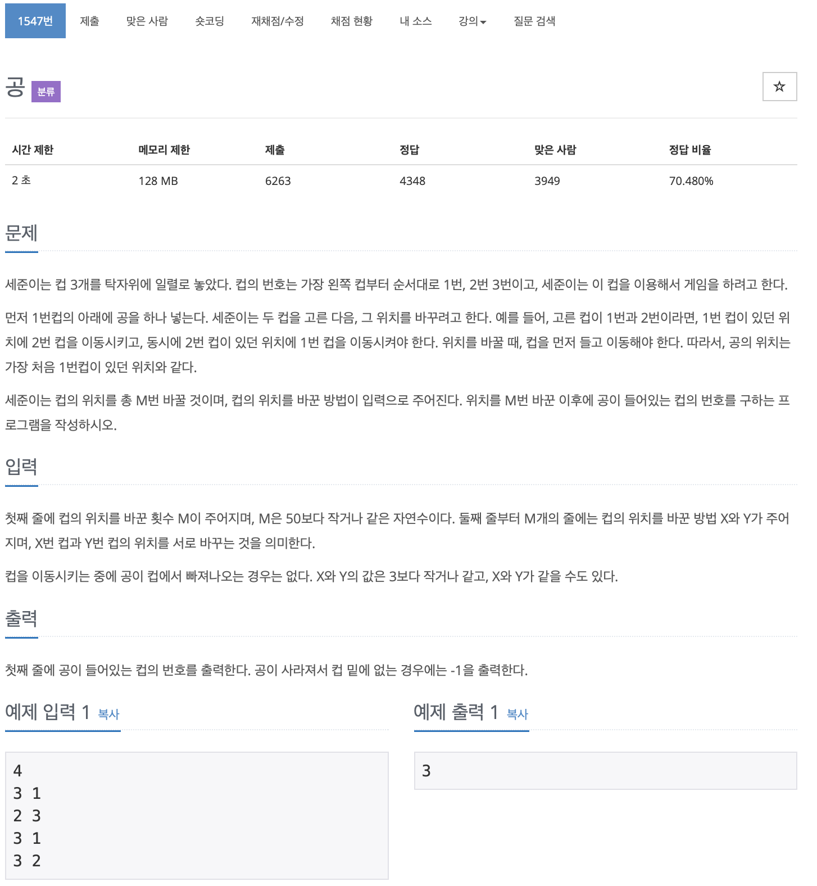

# BOJ 1547

## 공

### 문제



</br> 

### 소스코드

```c++
#include <iostream>

using namespace std;

int main()
{
    int m;
    int num1,num2, tmp;
    cin>>m;
    int arr[4]={1,2,3};

    
    for (int i = 0; i < m; i++)
    {
        cin>>num1>>num2;

        
        tmp  = arr[num2-1];
        arr[num2-1] = arr[num1-1];
        arr[num1-1] = tmp;

        
    }

    for (int i = 0; i < 3; i++)
    {
        cout<<arr[i]<<"  ";
    }
        
    // cout<<arr[0]<<endl;
    

    return 0;
}
```

- 인덱스 기준으로 값을 바꾸려고 하니까 입력하는 값에 대응하는 인덱스 값과 달라 오답이 계속 나왔다..
- 기준을 설정하지 못해서 해결하지 못함..

</br> 

### 다른사람의 코드

```c++
#include <iostream>

using namespace std;

int main()
{
    int size,point= 1;

    cin>>size;

    for (int i = 0; i < size; i++)
    {
        int a, b;
        cin>>a>>b;

        if(a== point) point = b;
        else if(b == point) point =a;
    }

    cout<<point;
    

    return 0;
}
```

- point를 기준으로 삼고 공이 이동하는 것처럼 코딩되어있다.