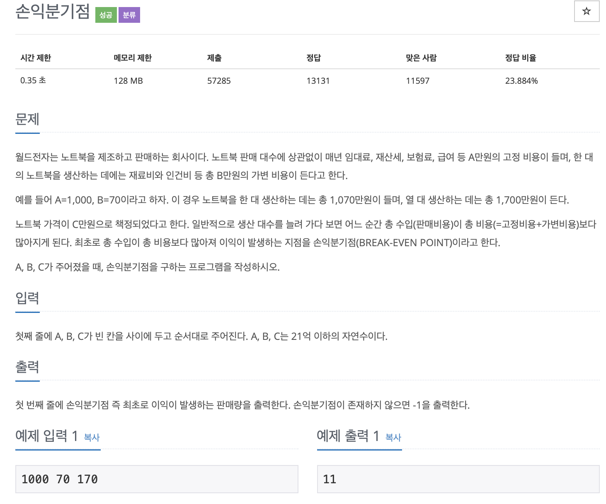

# BOJ 1712

## 손익분기점

### 문제



</br>

#### 소스코드

```c++
#include <iostream>
#include <string>

using namespace std;

int main()
{

    int a, b, c, result = 0;

    cin >> a >> b >> c;

    if (c - b <= 0)
    {
        result = -1;
    }
    else
    {
        result = (a / (c - b) + 1);
    }
    cout << result << endl;

    return 0;
}

```

