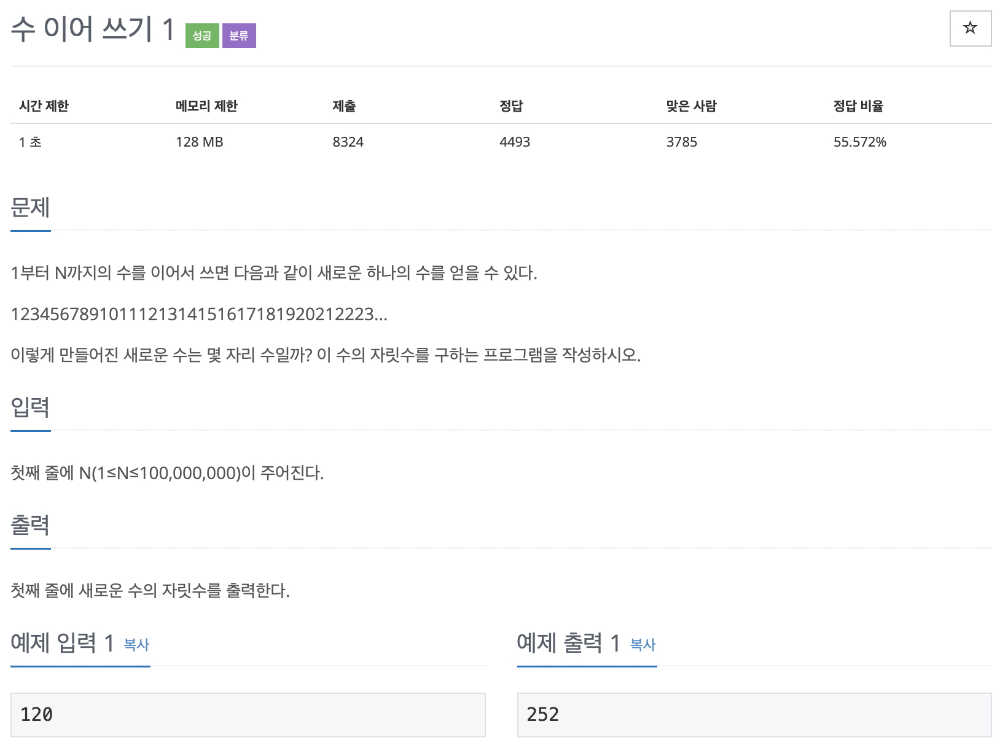

# BOJ 1748

# 수 이어 쓰기1

### 문제



</br> 

### 소스코드

```c++
#include <iostream>
#include <string>

using namespace std;

int main()
{
    int num;
    int cnt = 0;

    cin >> num;

    for (int i = 1; i <= num; i++)
    {
//      1자리수
        if (i >= 1 && i <= 9)
        {
            cnt += 1;
        }
      
//      2자리수     
        else if (i >= 10 && i <= 99)
        {
            cnt += 2;
            cout << cnt << endl;
        }
//      3자리수
        else if (i >= 100 && i <= 999)
        {
            cnt += 3;
        }
        else if (i >= 1000 && i <= 9999)
        {
            cnt += 4;
        }
        else if (i >= 10000 && i <= 99999)
        {
            cnt += 5;
        }
        else if (i >= 100000 && i <= 999999)
        {
            cnt += 6;
        }
        else if (i >= 1000000 && i <= 9999999)
        {
            cnt += 7;
        }
        else if (i >= 10000000 && i <= 99999999)
        {
            cnt += 8;
        }
        else if (i >= 100000000)
        {
            cnt += 9;
        }
    }

    cout << cnt << endl;

    return 0;
}
```

