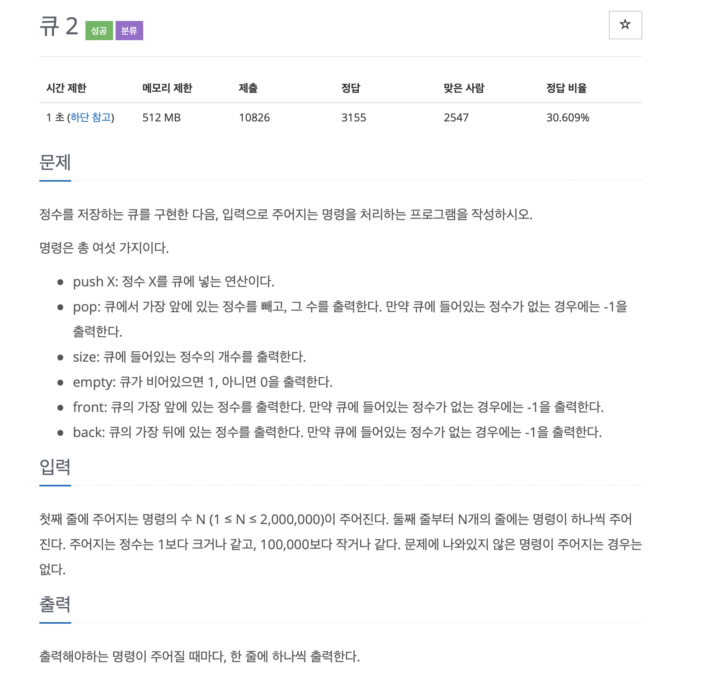

# BOJ 18258

## 큐 2

### 문제



<br/> 

### 코드

```c++
#include <iostream>
#include <queue>

using namespace std;

int main()
{
    cin.tie(0);
    cin.sync_with_stdio(0);
    int n, cnt = 0;
    string command;
    queue<int> q;
    cin >> n;

    for (int i = 0; i < n; i++)
    {
        int num;
        cin >> command;
        if (command == "push")
        {
            cin >> num;
            q.push(num);
        }

        else if (command == "front")
        {
            if (q.empty())
            {
                cout << -1 << '\n';
            }
            cout << q.front() << '\n';
        }

        else if (command == "back")
        {
            if (q.empty())
            {
                cout << -1 << '\n';
            }
            cout << q.back() << '\n';
        }

        else if (command == "size")
        {
            cout << q.size() << '\n';
        }
        else if (command == "empty")
        {
            cout << q.empty() << '\n';
        }
        else if (command == "pop")
        {
            if (!q.empty())
            {
                int temp = q.front();
                cout << temp << '\n';
                q.pop();
            }
            else
            {
                cout << -1 << '\n';
            }
        }
    }
    
    return 0;
}

```

