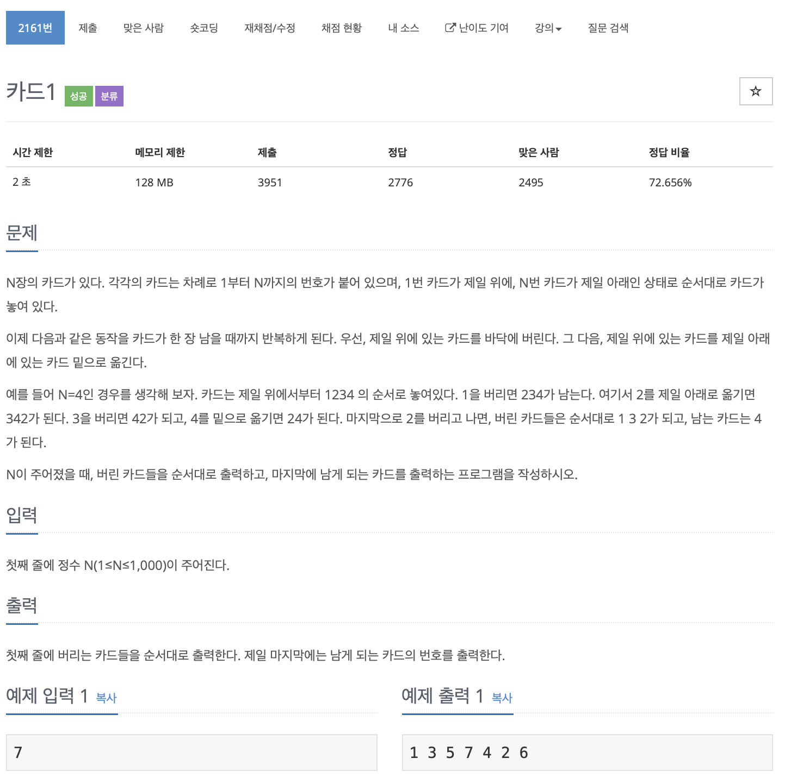

# BOJ 2161

## 카드1

### 문제



</br> 

### 소스코드

```c++
#include <iostream>
#include <vector>

using namespace std;

int main()
{

    int n;
    cin >> n;

// 초기값을 담을 벡터
    vector<int> v;
    
// 삭제한 값들을 담을 벡터
    vector<int> v2;
    
// 크기 할당
    v.reserve(n);
    v2.reserve(n);
  
// 값 넣기
    for (int i = 1; i <= n; i++)
    {
        v.push_back(i);
    }

    // 첫번째 원소 변수
    int first;
 
  v사이즈가 1이면 loop 종료
    while (v.size() != 1)
    {
      // 삭제 및 보관 작업
      // 첫번째 원소
        first = v[0];
      // v2에 보관
        v2.push_back(first);
      // 삭제
        v.erase(v.begin());
        
      // 교환작업
        first = v[0];
      // 맨 뒤로 push
        v.push_back(first);
      // 남아있는 맨 앞 값 erase
        v.erase(v.begin());

        if (v.size() == 1)
            break;
    }

    for (int i = 0; i < n - 1; i++)
    {
        cout << v2[i] << " ";
    }
    cout << v[0] << endl;

    return 0;
}
```

