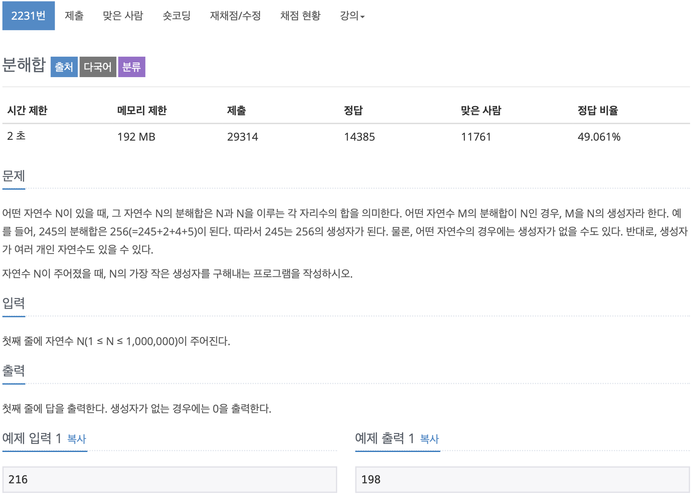

# BOJ 2231

## 분해합

### 문제



</br> 


### 소스(내꺼)

```c++
#include <iostream>

using namespace std;

int main()
{

    int n;
    cin >> n;
    int temp = 0;
    int result = 0;

    for (int i = 1; i < n; i++)
    {
        result = i;

        int n2 = i;
        while (n2 != 0)
        {
            result += (n2 % 10);
            n2 = n2 / 10;
        }


        if (result == n)
        {
            cout << i << endl;
            break;
        }
    }

    return 0;
}
```

<br/> 

### 소스 (sprintf)

```c++
#include <iostream>
#include <cstring>

using namespace std;

int main()
{

    long n;
    cin >> n;

    long m = n;
    int digit = 0;

    // 자릿수 구하기
    while (m)
    {
        m /= 10;
        digit++;
    }


    // 자릿수 별 최대 합을 빼고 난 후 부터 시작
    long begin = n - digit * 9;

    char s[10];
    long sum = 0;
    bool find = false;
    for (long i = begin; i <= n; i++)
    {
        // s배열에 자릿수별로 짤라서 들어감
        // begin= 189라면, 
        // s[0] = 1, s[1] = 8, s[2] = 9
        sprintf(s, "%ld", i);
        sum = i;
        for (int j = 0; j < strlen(s); j++)
        {
            cout<<s[j]<<endl;
            sum += s[j] - '0';
        }
        if (sum == n)
        {
            find = true;
            cout << i << '\n';
            break;
        }
    }
    if (find == false)
        cout << "0\n";

    return 0;
}

```

#### 문제 해결 과정

- 각 자릿수 별 최대 값은 9.

  - 각 자릿수마다의 최대 합은 **9 * 원래 숫자의 자릿수**
    - Ex) 254 는 3자리 이므로 최대 자릿수의 합은 9 + 9 + 9 = 27 

  <br/> 

- 부분합의 검사 시작 숫자는 최대 자릿수 합 - 원래 숫자

  - `    long begin = n - digit * 9;`
  - 254 - 27 = 227. 227부터 시작한다.

<br/>

- `sprint()` 로 문자열에 수치를 기록하고, 각 자리마다 숫자를 더해주는 방법 활용
  - 배열에 각 인덱스별로 잘라서 하나씩 들어간다.