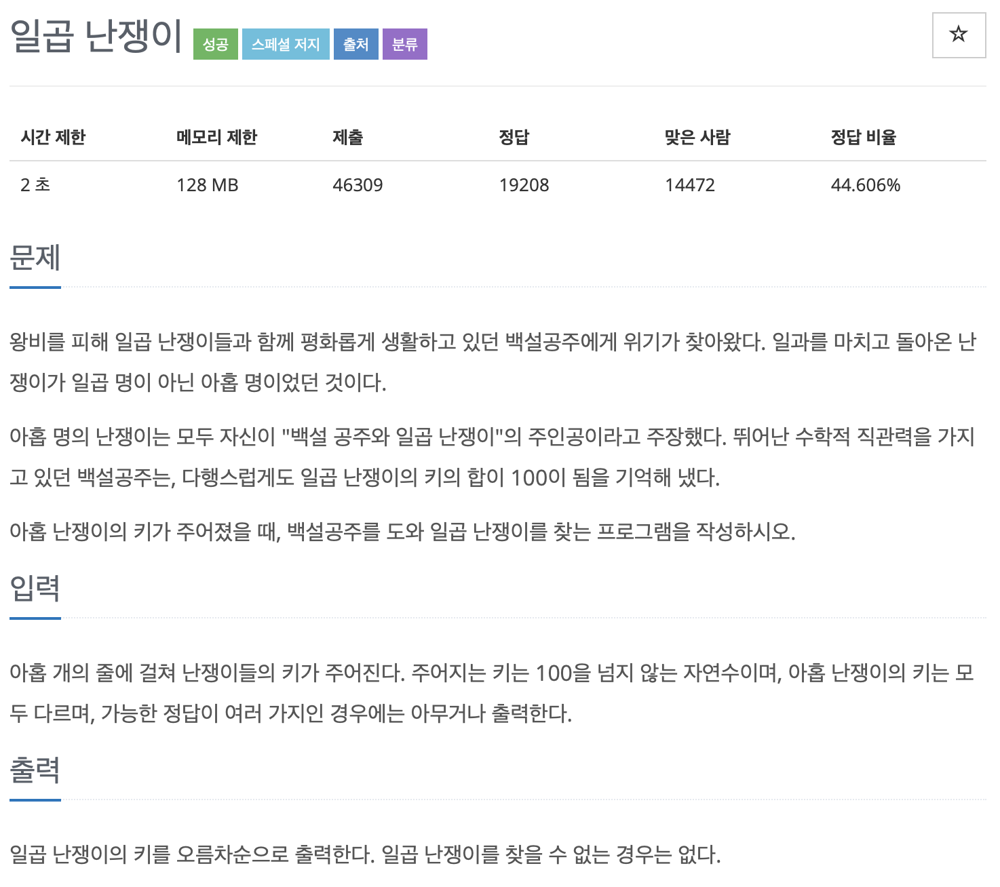

# BOJ 2309

## 일곱난쟁이

### 문제



### <br/> 코드

- 순열 문제

  - `next_permutation`

    : 가능한 순열들을 나열하고 `true/ false` 반환

    사용하기전에 `sort` 를 하도록 한다.

```c++
#include <iostream>
#include <algorithm>

using namespace std;
int a[10];
// 지역변수 stack에 저장
// 전역변수 segment
// 전역변수를 활용하는 것을 추천, 지역변수는 쓰레기 값이 들어갈 수 있기 때문
int main()
{

    int person = 9;
    // int height[person];

    for (int i = 0; i < 9; i++)
    {
        cin >> a[i];
    }

    sort(a, a + 9);
    int sum = 0;
    do
    {

        for (int i = 0; i < 7; i++)
        {
            sum += a[i];
        }

        if (sum == 100)
        {
            for (int i = 0; i < 7; i++)
            {
                cout << a[i] << '\n';
            }

            break;
        }
        else
        {
            sum = 0;
        }

    } while (next_permutation(a, a + 9));

    return 0;
}
```

