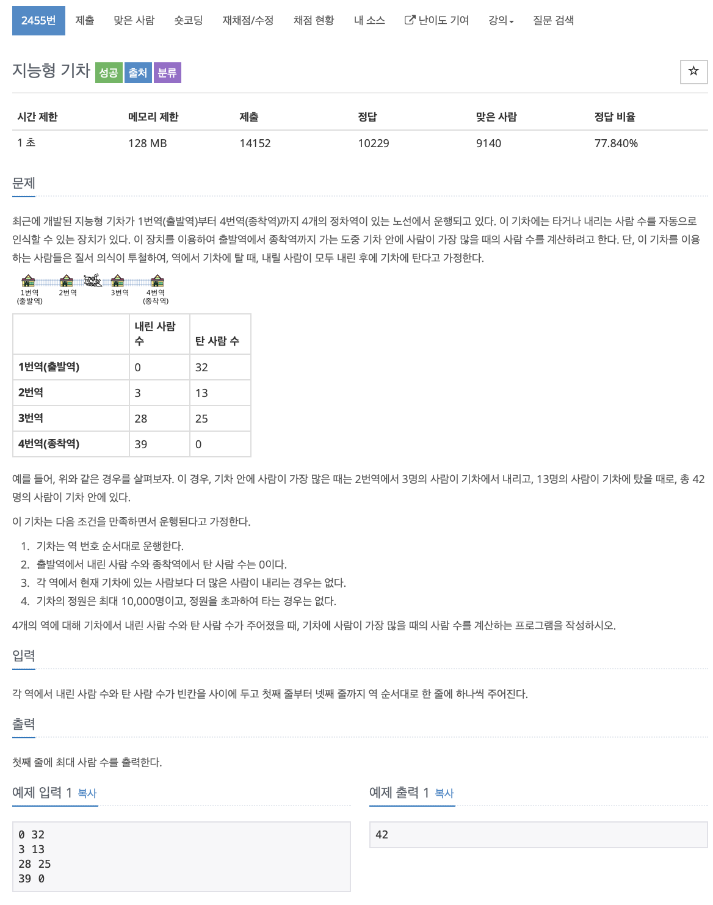

# BOJ 2455

## 지능형기차

### 문제



</br> 

### 소스코드

```c++
#include <iostream>

using namespace std;

int main()
{
// 현재원, 탑승, 나간인원, 최댓값 비교 변수
    int now = 0, in, out, max = -100;
// 정거장 수
    int station[5];

    for (int i = 0; i < 4; i++)
    {
        cin >> out >> in;
      //각 정류장별 인원 수
        station[i] = now + in - out;
        now = station[i];
    }

// 각 정류장 별 최대 인원 조사
    for (int i = 0; i < 4; i++)
    {
        if (station[i] > max)
        {
            max = station[i];
        }
    }
    cout << max << endl;

    return 0;
}
```


