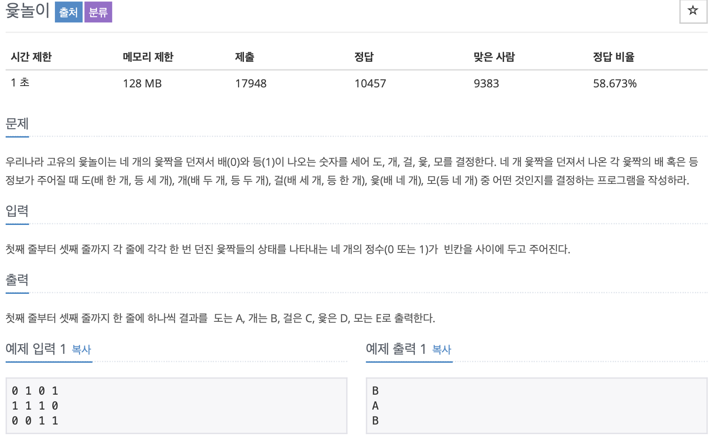

# BOJ 2490

## 윷놀이

### 문제



</br>

### 소스코드

```c++
#include <iostream>

using namespace std;

int main()
{

    int num;
    int cnt1 = 0;
    int cnt0 = 0;
    int cnt = 0;

  //while문으로 작성
    // while (1)
    // {
    //     cin >> num;

    //     if (num == 1)
    //     {
    //         cnt1++;
    //         cnt++;
    //     }
    //     else if (num == 0)
    //     {
    //         cnt0++;
    //         cnt++;
    //     }

    //     if (cnt == 4)
    //     {
    //         break;
    //     }
    // }
  
  
//  입력 줄 각각 출력을 하기 위한 반복(3개 입력)
    for (int i = 0; i < 3; i++)
    {

      // 윷 4개에 대한 수 연산
        for (int j = 0; j < 4; j++)
        {
            cin >> num;

            if (num == 1)
            {
                cnt1++;
            }
            else if (num == 0)
            {
                cnt0++;
            }
        }
      
      // 연산결과에 따른 출력 조건
        if (cnt0 == 0)
        {
            cout << "E" << endl;
            cnt0 =0;
        }
        else if (cnt0 == 1)
        {
            cout << "A" << endl;
            cnt0 =0;
        }

        else if (cnt0 == 2)
        {
            cout << "B" << endl;
            cnt0 =0;
        }
        else if (cnt0 == 3)
        {
            cout << "C" << endl;
            cnt0 =0;
        }
        else if (cnt0 == 4)
        {
            cout << "D" << endl;
            cnt0 =0;
        }
      
      // 처음 switch문을 하였으나, 반복문 안에서 각각에 대한 출력결과를 할 수 없어 if문으로 대체함.
        // switch (cnt0)
        // {
        // case 0:
        //     cout << "E" << endl;
        //     break;
        // case 1:
        //     cout << "A" << endl;
        //     break;
        // case 2:
        //     cout << "B" << endl;
        //     break;
        // case 3:
        //     cout << "C" << endl;
        //     break;
        // case 4:
        //     cout << "D" << endl;
        //     break;
        // default:
        //     break;
        // }
    }

    return 0;
}
```

