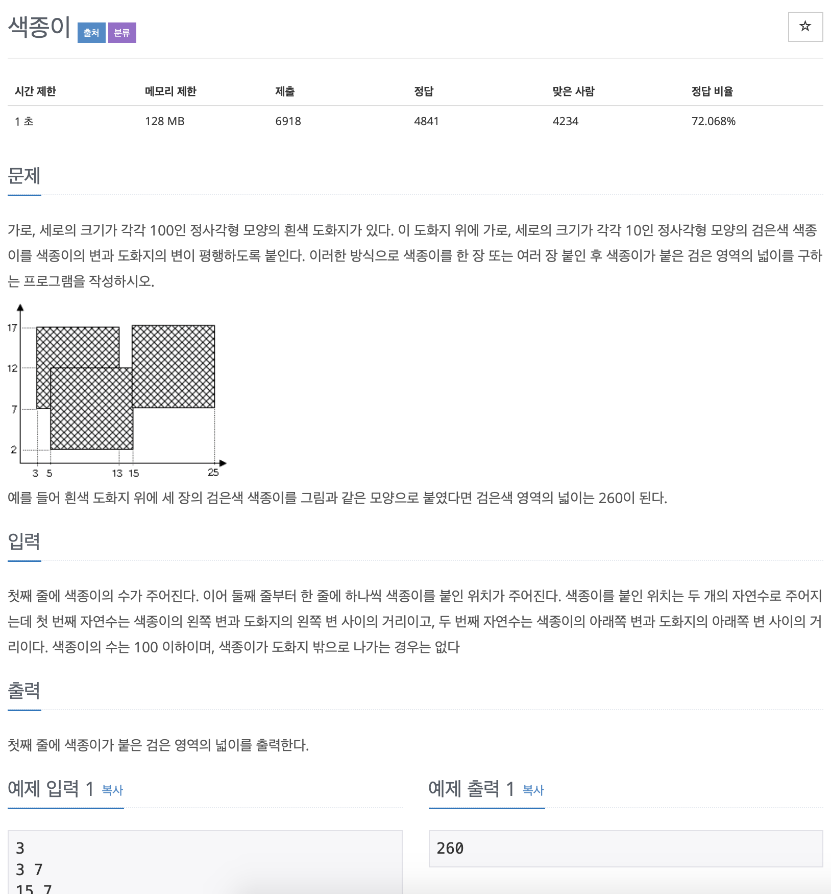

# BOJ 2563

# 색종이

### 문제



</br>

### 소스코드

```c++
#include <iostream>

using namespace std;
const int MAX = 100 + 1;

int arr[MAX][MAX];

int main()
{

    int N;

    cin >> N;

  
//  x, y를 입력받기
    for (int i = 0; i < N; i++)
    {
        int x, y;
        cin >> x >> y;

      // 입력받은 x, y를 2차배열안에서 1로 채우기
        for (int k = y + 1; k <= y + 10; k++)
        {
            for (int j = x + 1; j <= x + 10; j++)
            {
                arr[k][j] = 1;
            }
        }
    }
// 결과를 받을 변수
    int result = 0;

  // 값이 있는 경우에만 result 수 증가
    for (int i = 1; i < MAX; i++)

    {
        for (int j = 1; j < MAX; j++)
        {
            if (arr[i][j])
                result++;
        }
    }

    cout << result << endl;

    return 0;
}
```

</br>

- 처음에는 가로 x 세로 방식으로 넓이를 구하려고 했다.
- 그 후, 2차원 배열로 접근하는 방법을 떠올렸지만 1로 채워 넓이를 구하는 방법은 생각하지 못함..