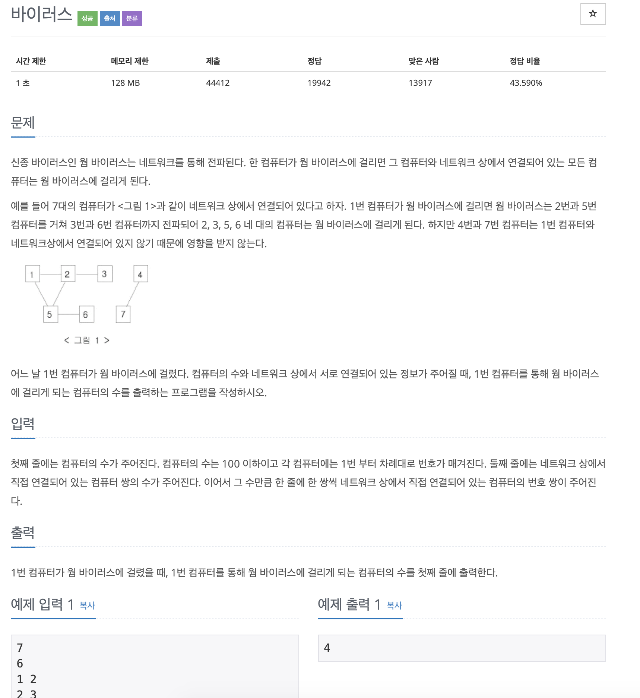

# BOJ 2606

## 바이러스

### 문제



</br> 

### 코드

```c++
#include <iostream>
#include <queue>
#include <vector>
#include <algorithm>

using namespace std;
int n, m, cnt;
// vector<int> a[8];
int checkVirus[101];
int a[101][101];

void virus(int x)
{
    queue<int> q;
    q.push(x);
    checkVirus[x] = 1;

    while (!q.empty())
    {

        int node = q.front();

        q.pop();

        for (int i = 1; i <= n; i++)
        {
            if (!checkVirus[i] && a[node][i] == 1)
            {
                q.push(i);
                checkVirus[i] = 1;
                cnt++;
            }
        }

    // 기존 방법
        // for (int i = 0; i < a[v].size(); i++)
        // {
        //     int next = a[v][i];
        //     if (checkVirus[next] == 0)
        //     {
        //         checkVirus[next] = true;
        //         q.push(next);
        //         cnt++;
        //     }
        // }
    }
}

int main()
{

    int x, y;
    cin >> n >> m;

  
    // 1. 인접행렬 이용
    for (int i = 0; i < m; i++)
    {
        cin >> x >> y;
        a[x][y] = a[y][x] = 1;
    }

  
    // 2. 기존 방법 이용
    // for (int i = 0; i < m; i++)
    // {

    //     cin >> x >> y;
    //     a[x].push_back(y);
    //     a[y].push_back(x);
    // }

    // for (int i = 0; i <= n; i++)
    // {
    //     sort(a[i].begin(), a[i].end());
    // }

    virus(1);
    cout << cnt << endl;

    return 0;
}
```

