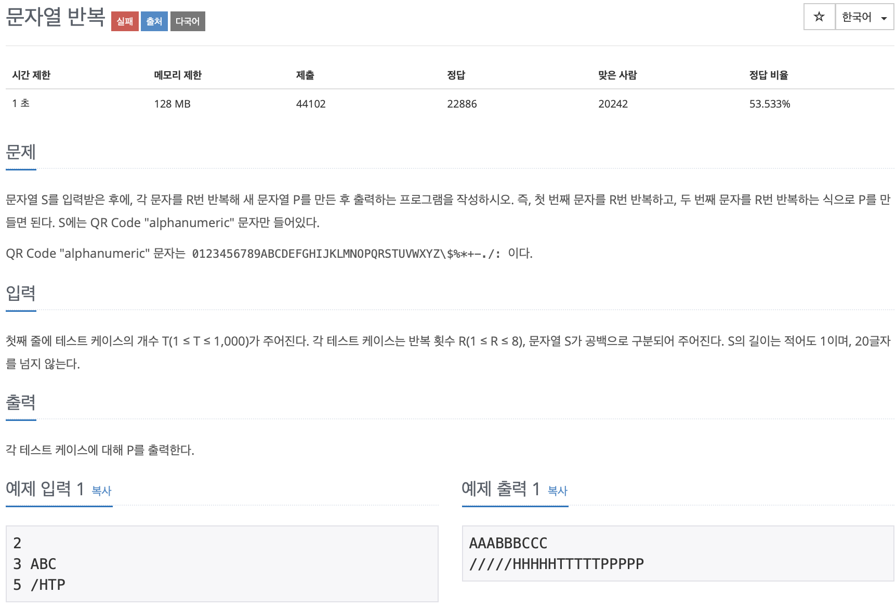

# BOJ 2675

## 문자열 반복

### 문제



</br>

### 소스코드

```c++
#include <iostream>
#include <string>
using namespace std;

int main()
{

    //문제 조건
    int tcase, length;
    string str;

    // 테스크 케이스
    cin >> tcase;

    for (int i = 0; i < tcase; i++)
    {
        //길이와 문자열 입력
        cin >> length >> str;

        //string배열 크기
        int tSize = length * str.length();
        string tmp[1000];

        int idx = 0, strt = 0;

        while (idx < tSize)
        {
            //substr 함수로 tmp배열에 담기
            tmp[idx] = str.substr(strt, 1);

            idx++;

            // idx와 처음 입력한 length의 길이 * 1, 2, 3 ... 이 같으면
            // substr의 인자 strt수를 증가시킴
            for (int i = 1; i <= length + 1; i++)
            {
                if (idx == length * i)
                {
                    strt++;
                }
            }
        }

        for (int i = 0; i < tSize; i++)
        {
            cout << tmp[i];
        }
        str = "";

        //줄바꿈
        cout << "\n";
    }

    return 0;
}

결과
3
1 ABC
ABC
2 ABC
AABBCC
5 ABC
AAAAABBBBBCCCCC
```

</br>

- **오답 반례를 못찾아서 다른 사람의 소스코드 참조....**

```c++
#include<iostream>
#include<string>
using namespace std;

int main() {

	int total;
	cin >> total;
	string word;

	int num;
	for (int i = 0; i < total; i++) {
		cin >> num;
		cin >> word;

		for (int i = 0; i < word.length(); i++) {
			for (int j = 0; j < num; j++) {
				cout << word[i];
			}
		}
		cout << '\n';
	}

}
```

</br>

- ```c++
  string word;
  cin>>word;`  
  ```

  - 단어 입력 시 하나하나 짤려 개별로 입력되는줄 몰랐다.. <u>즉, `substr()` 을 굳이 사용할 필요가 없었다.</u></u>

