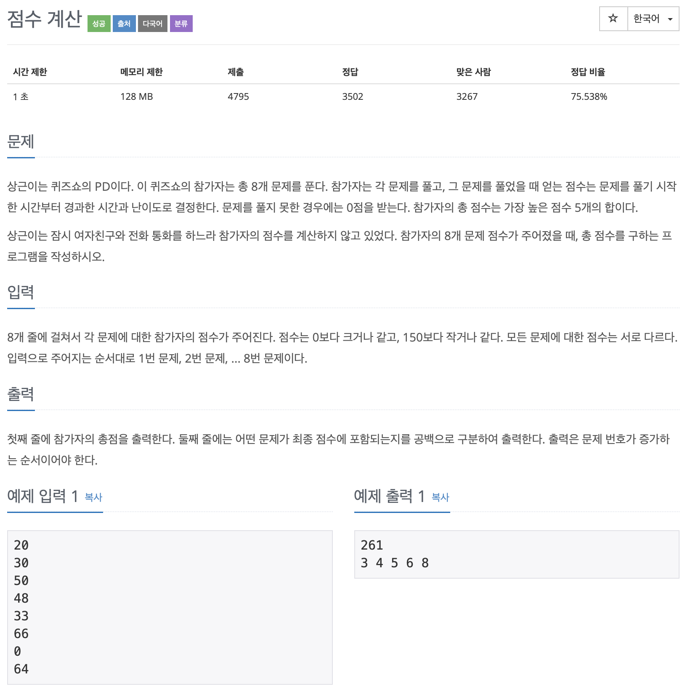

# BOJ 2822

## 점수계산

### 문제



</br> 

### 소스코드

```c++
#include <iostream>
#include <algorithm>
using namespace std;
int main()
{

    // 입력 숫자 담을 배열
    int arr[9];
    // 결과 인덱스 담을 배열
    int result[6];
    int sum = 0;
    int max = -1000;
    int num, idx;

    // 숫자 담기
    for (int i = 0; i < 8; i++)
    {
        cin >> num;

        arr[i] = num;
    }

    // 상위 5개 최댓값을 누적합 반복
    for (int j = 0; j < 5; j++)
    {
        //치댓값 반복 비교
        for (int i = 0; i < 8; i++)
        {
            if (arr[i] > max)
            {
                max = arr[i];
                idx = i;
            }
        }

        // 최댓값 인덱스 담기
        result[j] = idx + 1;

        // 이미 넣은 최댓값 숫자 없애기
        arr[idx] = -1;

        // 누적 합
        sum += max;

        // 비교 변수 초기화
        max = -1000;
    }

    // 합 출력
    cout << sum << endl;

    // 오름차순으로 정렬
    sort(result, result + 5);

    // 결과 인덱스 배열 출력
    for (int i = 0; i < 5; i++)
    {

        cout << result[i] << " ";
    }

    return 0;
}
```

