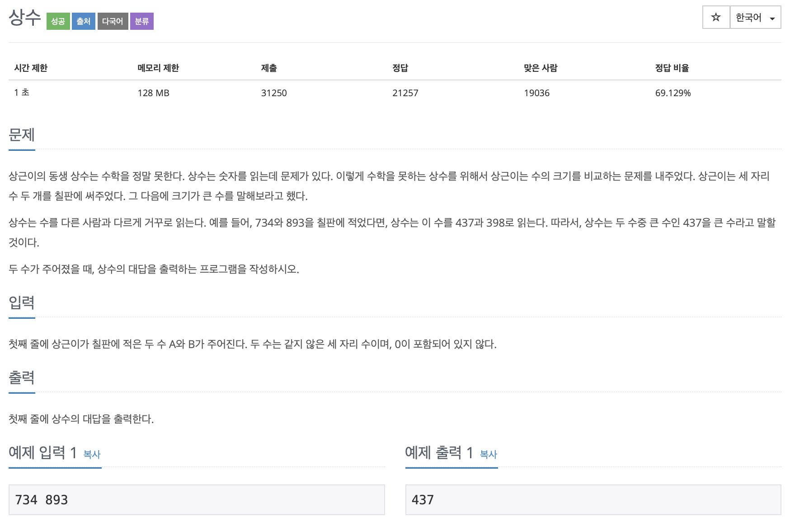

# BOJ 2908

## 상수

### 문제



</br>

### 소스코드

```c++
#include <iostream>
#include <string>
using namespace std;

int main()
{
    // int a, b, tmp;

    string a, b;
    char tmp;

    // a, b 입력
    cin >> a >> b;

    // 1의자리 100의자리 교환
    tmp = a[0];
    a[0] = a[2];
    a[2] = tmp;

    tmp = b[0];
    b[0] = b[2];
    b[2] = tmp;

    // string to integer (stoi)
    stoi(a);
    stoi(b);

    // 최댓값 출력
    if (a < b)
    {
        cout << b << endl;
    }
    else
    {
        cout << a << endl;
    }

    return 0;
}

```

1. `string`으로 받아 첫번째자리 수, 마지막 자리 수 교환
2. `stoi()` 로 숫자화
3. 최댓값 출력