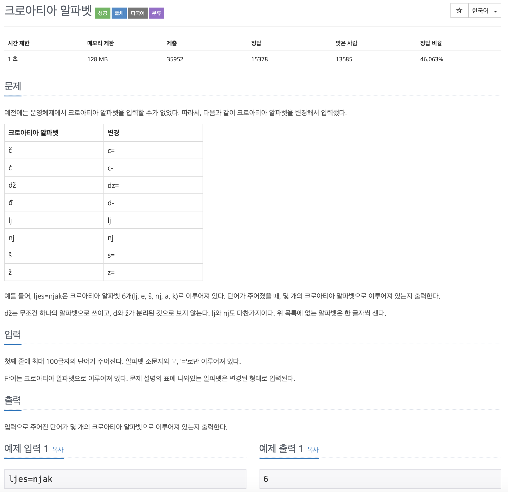

# BOJ 2941

## 크로아티아 알파벳

### 문제




</br>

### 소스코드

```c++
#include <iostream>
#include <string>

using namespace std;

int main()
{
  	//문자열 입력
    string input;
    cin >> input;
 
    //문자열 길이
    int wordLength = 0;
    wordLength = input.length();
  
  	// find함수 이용 시 시작 포인트를 부여해 이동하며 중복 체크를 방지하기 위함
    int point = 0;

  // 문자열에서 find함수를 이용해 차으면 wordLength를 차감하는 방식을 이용함
    for (int i = 0; i < wordLength; i++)
    {

      //찾으면 point 변수를 더해 시작 지점을 늘림
        if (input.find("c=", point) != -1 ||
            input.find("c-", point) != -1 ||
            input.find("d-", point) != -1 ||
            input.find("lj", point) != -1 ||
            input.find("nj", point) != -1 ||
            input.find("s=", point) != -1 ||
            input.find("z=", point) != -1)
        {
            wordLength -= 1;
            point += 2;
        }

      // "dz="는 3글자 이므로 2를 빼주고 point를 3을 더해준다.
        if (input.find("dz=", point) != -1)
        {

            wordLength -= 2;
            point += 3;
        }
    }
    cout << wordLength << endl;

    return 0;
}

```


- 예제의 입출력은 오류없이 나왔지만, 반례를 찾아보니 반복문에서 불필요하게 문자열 길이만큼 연산을 해주니 오답이 나왔다.
  - 예 ) `abcc=dz=` 의 정답은 5이지만 4가 나옴
  - 반복문에서 걸려 해결하지 못함...


</br>

### 다른사람의 코드

```c++
#include <iostream>
#include <string>

using namespace std;

int main()
{
    int count = 0;
    string input;
    cin >> input;
    for (int i = 0; i < input.length(); i++)
    {

        if (input[i] == 'c')
        {
            if (input[i + 1] == '=' || input[i + 1] == '-')
            {
                i++;
            }
        }
        else if (input[i] == 'd')
        {
            if (input[i + 1] == '-')
            {
                i++;
            }
            else if (input[i + 1] == 'z' && input[i + 2] == '=')
            {
                i++;
                i++;
            }
        }
        else if (input[i] == 'l')
        {
            if (input[i + 1] == 'j')
            {
                i++;
            }
        }
        else if (input[i] == 'n')
        {
            if (input[i + 1] == 'j')
            {
                i++;
            }
        }
        else if (input[i] == 's')
        {
            if (input[i + 1] == '=')
            {
                i++;
            }
        }
        else if (input[i] == 'z')
        {
            if (input[i + 1] == '=')
            {
                i++;
            }
        }

        count++;
    }
    cout << count << endl;

    return 0;
}

```

- 문자를 하나하나 다 잘라서 수를 더해가는 방식.