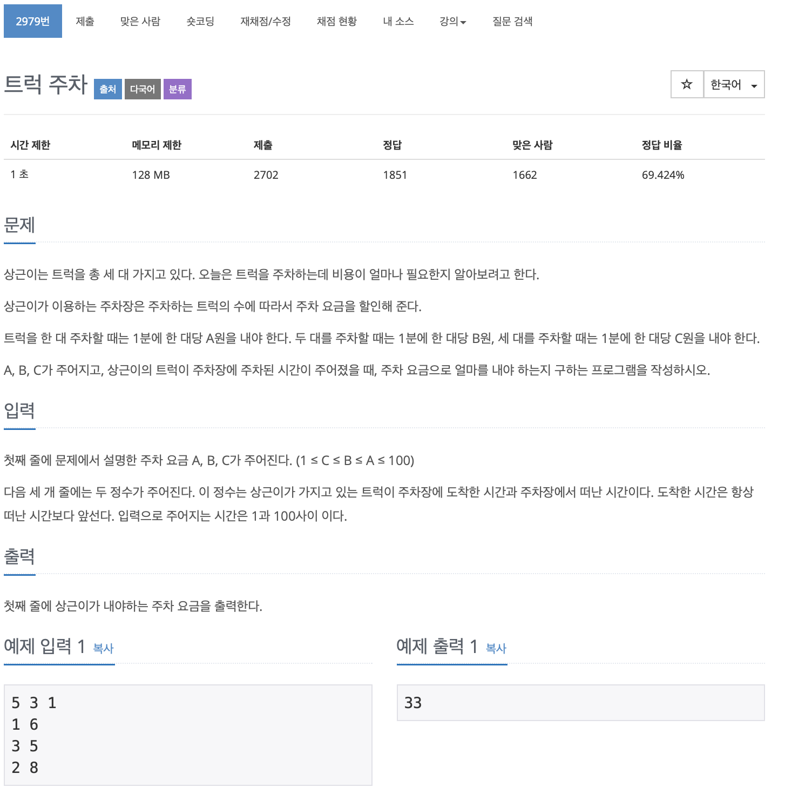

# BOJ 2979

## 트럭 주차

### 문제



</br> 

### 소스코드

```c++
#include <iostream>

using namespace std;
const int MAX = 101;
int fare[MAX];
int main()
{

    int answer = 0;
    int a, b, c;

    cin >> a >> b >> c;
    for (int i = 0; i < 3; i++)
    {
        int arrive, depart;
        cin >> arrive >> depart;
        for (int j = arrive; j < depart; j++)
        {
            fare[j]++;
        }
    }

    for (int i = 1; i < MAX; i++)
    {
        if (fare[i] == 1)
        {
            answer = answer + fare[i] * a;
        }
        if (fare[i] == 2)
        {
            answer = answer + fare[i] * b;
        }
        if (fare[i] == 3)
        {
            answer = answer + fare[i] * c;
        }
    }

    cout << answer << endl;

    return 0;
}
```

- 빈. 배열을 정의하고
- 그 안에 시간동안 사용한 시간을 1로 채워
- 겹치면 누적되는 방법으로 구현했다.

---

- 겹치는 시간에 대해 누적되는 트럭 주차 대수를 해결하지 못함..