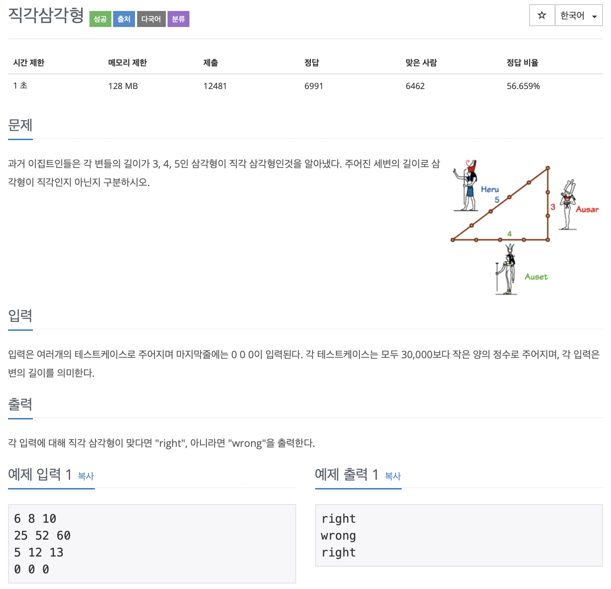

# BOJ 4153

## 직각삼각형

### 문제




</br>

### 소스코드

```c++

#include <iostream>

using namespace std;
int main()
{

    // 입력받을 수 3개
    int a, b, c;
    // 최댓값
    int max;
    while (1)
    {
        cin >> a >> b >> c;
        //종료 조건
        if (a == 0 && b == 0 && c == 0)
            break;

        // 제곱
        a = a * a;
        b = b * b;
        c = c * c;

        // 세 수의 총 합
        int tmp = a + b + c;

        //최댓값 구하기
        if (a > b)
        {
            if (a > c)
            {
                max = a;
            }
            else
            {
                max = c;
            }
        }
        else
        {
            if (b > c)
            {
                max = b;
            }
            else
            {
                max = c;
            }
        }

        // 총합에서 최댓값을 뺀 값과 최댓값을 비교
        // 같으면 직각삼각형
        tmp -= max;
        if (tmp == max)
        {
            cout << "right" << endl;
        }
        else
        {
            cout << "wrong" << endl;
        }
    }

    return 0;
}
```

