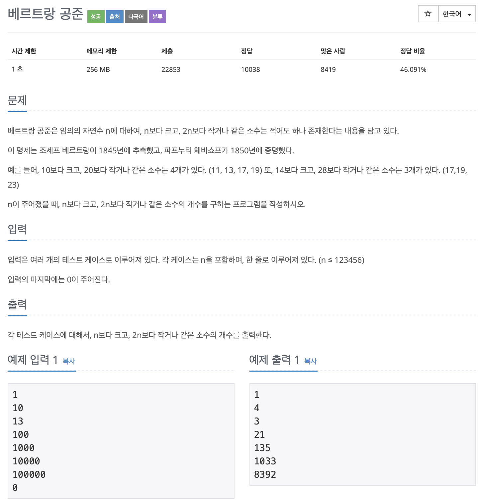

# BOJ 4948

## 베르트랑 공준

### 문제



</br> 

### 소스코드

```c++
#include <iostream>

using namespace std;

int main()
{

    while (1)
    {
        int tmp, result = 0;
        int inputSize, arrLength;

        cin >> inputSize;

        if (inputSize == 0)
        {
            break;
        }
        else
        {

            arrLength = inputSize * 2;

            int arr[arrLength];

            // 배열 초기화
            for (int i = 0; i < arrLength; i++)
            {
                arr[i] = 0;
            }

            for (int i = inputSize + 1; i <= arrLength; i++)
            {

                //소수 판별
                for (int j = 1; j <= arrLength; j++)
                {
                    tmp = i % j;
                    if (j == 1)
                    {
                        continue;
                    }
                    else if (tmp == 0 && i != j)
                    {
                        break;
                    }
                    else if (tmp == 0 && i == j)
                    {
                        arr[i - 1]++;
                    }
                }
            }

            int result = 0;
            for (int i = arrLength / 2; i < arrLength; i++)
            {

                if (arr[i] != 0)
                {
                    result++;
                }
            }
            cout << result << endl;
        }
    }

    // cout << sosu << endl;

    // while (input!=0)
    // {

    // }

    return 0;
}
```

- **에라토스테네스의 채 이용**
- *런타임오류..*

</br> 

### 다른사람의 코드

```c++
#include <iostream>

using namespace std;
int inputSize;
int arr[300000];
int main()
{

    while (1)
    {

        int result = 0;
        cin >> inputSize;
        int arrLength = inputSize * 2;

        for (int i = 0; i <= arrLength; i++)
        {
            arr[i] = 0;
        }

        if (inputSize == 0)
        {
            break;
        }
        else
        {
            for (int i = 2; i <= 2 * arrLength; i++)
            {
                if (arr[i] == 0)
                {
                    arr[i] = 0;
                }

                for (int j = i + i; j <= arrLength; j += i)
                {
                    if (arr[j] != 1)
                    {
                        arr[j] = 1;
                    }
                }
            }

            for (int i = inputSize + 1; i <= inputSize * 2; i++)
            {
                if (arr[i] == 0)
                {
                    result++;
                }
            }
        }

        cout << result << endl;
    }
}

```


- 접근방식은 비슷했지만..
- 소수 판별에서 **배수의 숫자를 이용**했어야 했다.