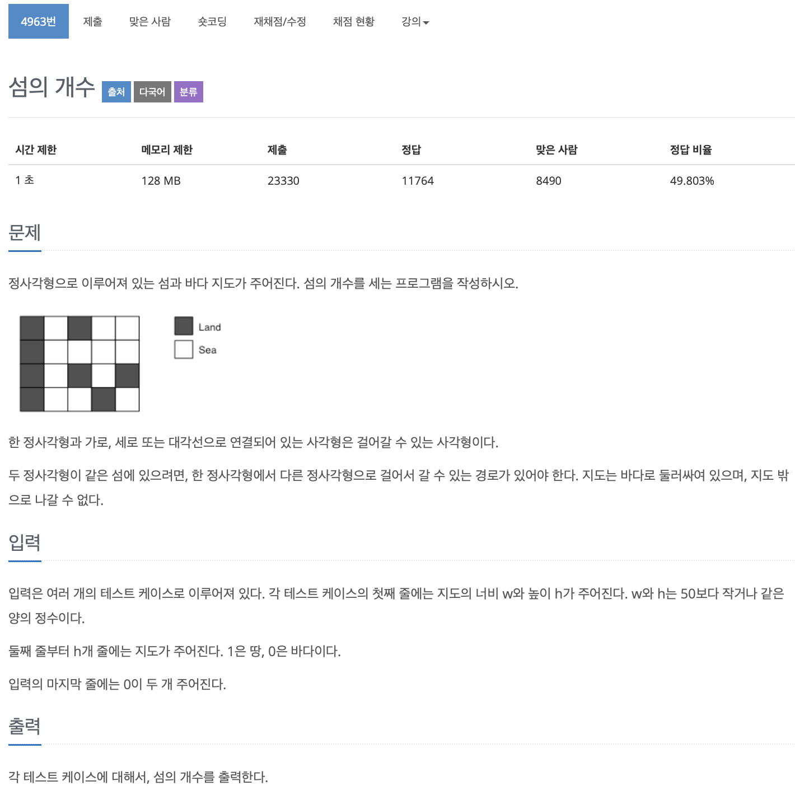

# BOJ 4963

## 섬의 개수

### 문제

# 

### 접근

1. 섬의 위치  **8 방향** 정의
2. boolean 형 DFS함수 만들어 재귀함수를 활용하려 했다.
   1. True의 갯수를 증가시키면 개별 섬의 갯수가 증가하게 됨.. ( 문제에서는 연결된 섬을 하나로 봐야 한다.)

<br/>  

### 부족했던 점

1. Visited 배열 (**방문 여부** 확인하는 배열)

2. 8방향에서 방문 여부를 확인하는 코드

```c++
int nh = h + dh[i];
int nw = w + dw[i];

//범위 내 제한
if (0 <= nw && 0 <= nh && nw < 50 && nh < 50)
{
  //섬에서 방문하지 않은 것들 중
    if (!visited[nh][nw] && arr[nh][nw])
    {
      // 방문 기록 남기기
        visited[nh][nw] = true;
      // 재귀함수 체크한 방향에서 dfs수행
        dfs(nh, nw);
    }
}
```

<br/> 

### 코드

```c++
#include <iostream>

using namespace std;
int w, h;
int island;
int arr[50][50];
int visited[50][50];
int dw[8] = {1, 0, -1, 0, 1, 1, -1, -1};
int dh[8] = {0, 1, 0, -1, -1, 1, -1, 1};

void dfs(int h, int w)
{
    arr[h][w] = true;

    for (int i = 0; i < 8; i++)
    {

        int nh = h + dh[i];
        int nw = w + dw[i];
        if (0 <= nw && 0 <= nh && nw < 50 && nh < 50)
        {
            if (!visited[nh][nw] && arr[nh][nw])
            {
                visited[nh][nw] = true;
                dfs(nh, nw);
            }
        }
    }
}

int main()
{

    while (1)
    {
        cin >> w >> h;
        if (!w && !h)
            break;

        for (int i = 0; i < h; i++)
        {
            for (int j = 0; j < w; j++)
            {
                cin >> arr[i][j];
            }
        }

        for (int i = 0; i < h; i++)
        {
            for (int j = 0; j < w; j++)
            {
                if (arr[i][j] && !visited[i][j])
                {
                    island++;
                    dfs(i, j);
                }
            }
        }

        cout << island << endl;
        memset(arr, false, sizeof(arr));
        memset(visited, false, sizeof(visited));
        island = 0;
    }

    return 0;
}
```


