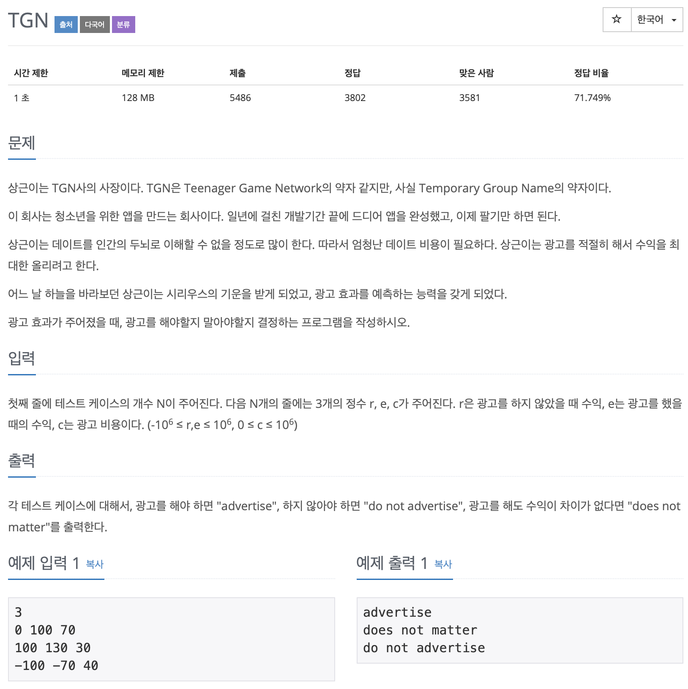

# BOJ 5063

# TGN

### 문제



</br> 

### 소스코드

```c++
#include <iostream>

using namespace std;

int main()
{
    int r, e, c;
    int tcase;
    cin>>tcase;
    for (int i = 0; i < tcase; i++)
    {
        cin >> r >> e >> c;

        if (e - c > r)
        {
            cout << "advertise" << endl;
        }
        else if (e - c == r)
        {
            cout << "does not matter" << endl;
        }
        else if (e - c < r)
        {
            cout << "do not advertise" << endl;
        }
        /* code */
    }

    return 0;
}
```

- 기본 공식 
  - 광고를 했을 경우 (`e - c`) 와 안했을 경우의 수익 `r` 을 비교