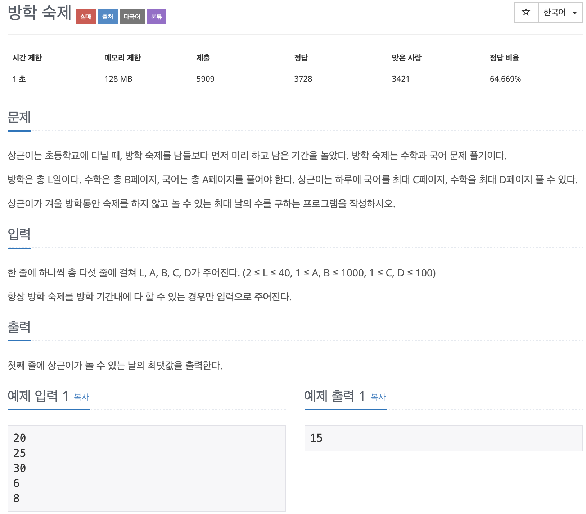

# BOJ 5532

# 방학숙제

### 문제



</br> 

### 소스코드

```c++
#include <iostream>

using namespace std;

int main()
{

    int l, a, b, c, d;
    int cnt = 0;
    cin >> l >> a >> b >> c >> d;

    int totalPage = a + b;
    int totalDay = c + d;

// 전제 소요 기간 대비 방학기간 풀 전체 페이지 
    int pagePerday = totalPage / totalDay;
  
//	소요 날짜
    cnt += pagePerday;
  
//  나머지 담는 변수
    int tmp;
    int tmp2;

//  나머지가 있다면
    if (totalPage % totalDay != 0)
    {
        tmp = totalPage % totalDay;
     
        if (tmp < c && tmp < d)
        {
            cnt += 1;
        }
        tmp = tmp / d;
        tmp2 = tmp % d;
      
//      더 나누어 진다면 소요날짜 추가
        cnt += tmp;

        if (tmp % d != 0)
        {
            cnt += 1;
        }
    }
  
//  전체 방학기간 중 소요날짜 빼기

    cout << l - cnt << endl;
    return 0;
}
```

- 답은 구했지만 오답..
  - 수학과 국어 전체에 관한 계산인줄 알았는데,
  - 각각의 과목 중 짧게 소요되는 날짜를 구해서 빼주는 것이였다.

</br> 

### 다른사람의 코드

```c++
#include <iostream>

using namespace std;

int main()
{

    int l, a, b, c, d;
    int cnt = 0;
    cin >> l >> a >> b >> c >> d;

//  국어과목
    int temp1 = l - (a/ c);
    if( a % c){
        temp1--;
    }
//  수학과목
    int temp2 = l - (b /d);
    if(b%d){
        temp2--;
    }

//  가장 짧게 걸리는 기간 출력
    cout<<min(temp1,temp2)<<endl;

    return 0;
}
```

