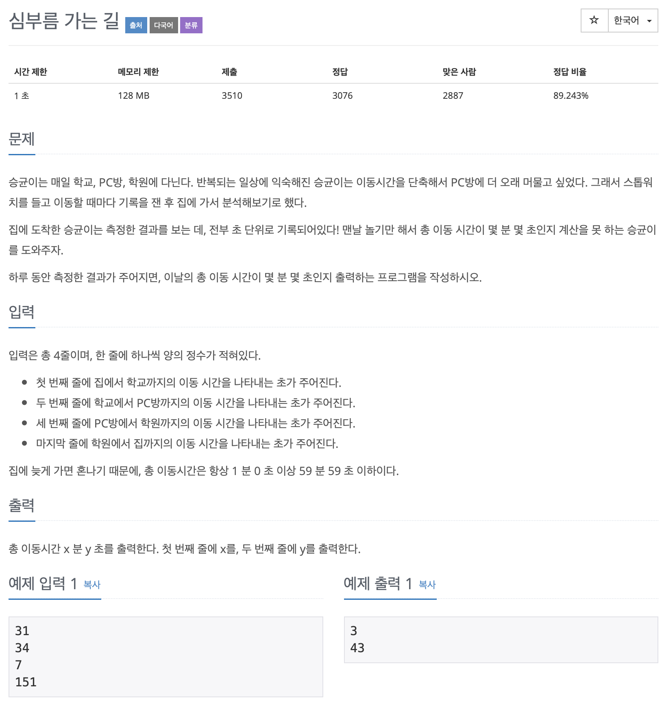

# BOJ 5554

# 심부름가는 길

### 문제



</br> 

### 소스코드

```c++
#include <iostream>
using namespace std;
int main()
{
    int t, sum = 0;

    for (int i = 0; i < 4; i++)
    {
        cin >> t;

        sum += t;
    }

    cout << sum / 60 << '\n'
         << sum % 60 << '\n';

    return 0;
}
```

