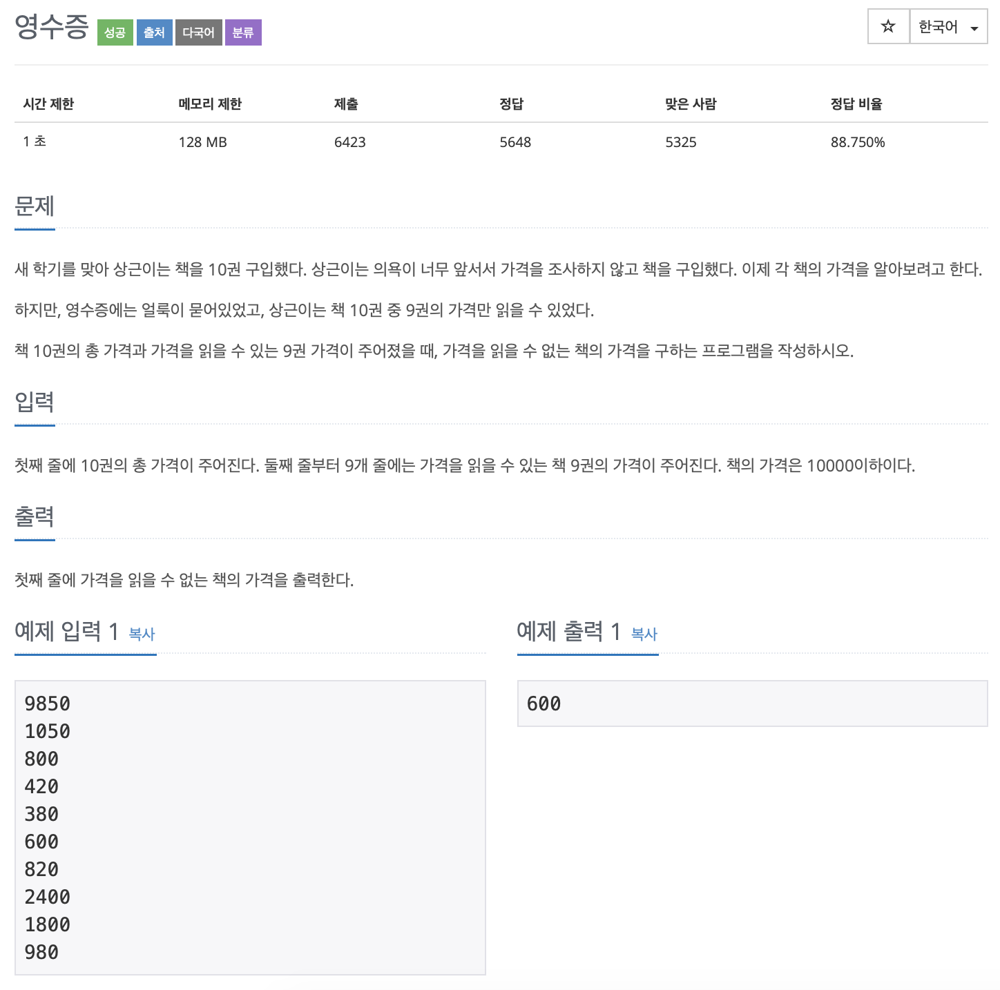

# BOJ 5565

## 영수증

### 문제



</br>

### 소스코드

```c++
#include <iostream>

using namespace std;
int main()
{

    int total, price, sum = 0, result = 0;
    int cnt = 0;
    cin >> total;

    while (1)
    {
//      총 가격
        cin >> price;
      
        sum += price;
        cnt++;
//			9개 입력을 완료하면 종료
        if (cnt == 9)
            break;
    }
  
  // 총 가격에서 누적 금액 빼기
    result = total - sum;
    cout << result << endl;

    return 0;
}
```

