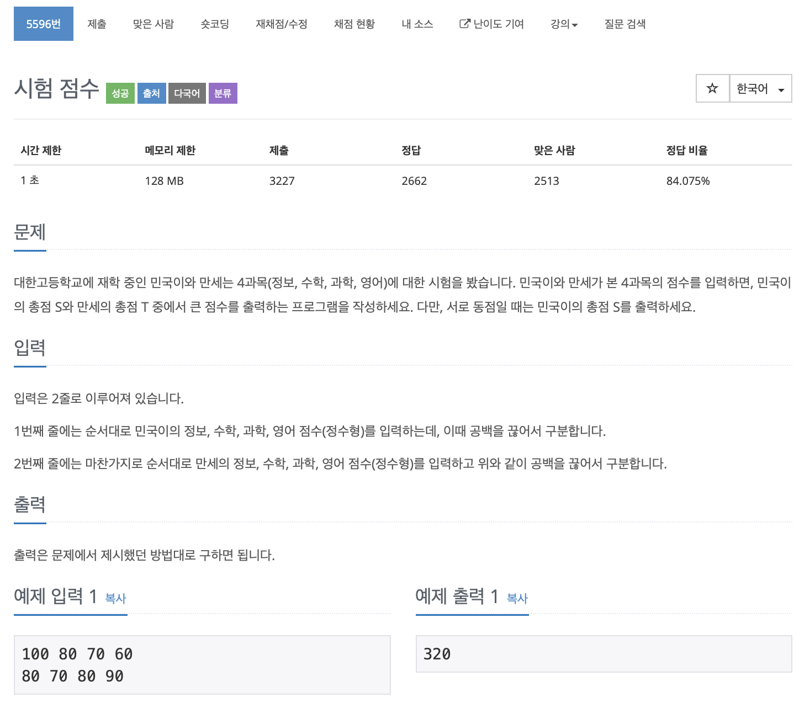

# BOJ 5596

## 시험점수

### 문제



</br> 

### 소스코드

```c++
#include <iostream>

using namespace std;

int main()
{

    int a, b, c, d;

    int score, totalA = 0, totalB = 0;

    for (int i = 0; i < 4; i++)
    {
        cin >> score;
        totalA += score;
    }

    for (int i = 0; i < 4; i++)
    {
        cin >> score;
        totalB += score;
    }

    if (totalA > totalB)
    {
        cout << totalA << endl;
    }
    else if (totalA < totalB)
    {
        cout << totalB << endl;
    }
    else if (totalA == totalB)
    {
        cout << totalA << endl;
    }

    return 0;
}
```


