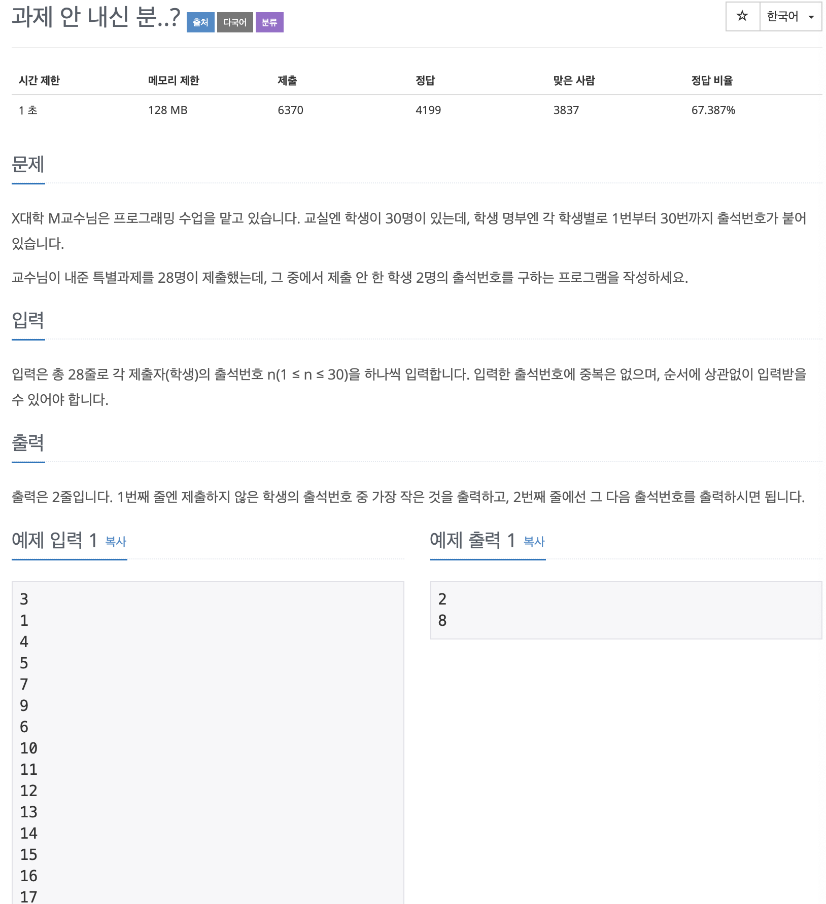

# BOJ 5597

# 과제 안 내신 분..?

### 문제



</br>

### 소스코드

```c++
#include <iostream>

using namespace std;
int arr[31];
int main()
{
    int num;
  
// 출석번호 받기
    for (int i = 0; i < 28; i++)
    {
        cin >> num;
//      낸사람들만 1 대입
        arr[num] = 1;
    }

    for (int i = 1; i < 31; i++)
    {
      
      // 0인 (1이 아닌) 번호만 출력
        if (arr[i] == 0)
        {
            cout << i << endl;
        }
    }

    return 0;
}
```

