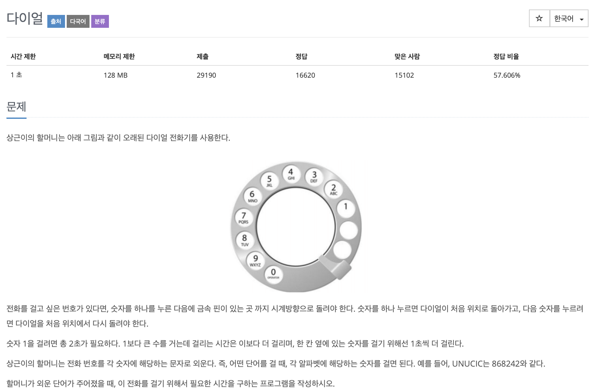

# BOJ 5622

## 다이얼

### 문제



</br>

### 소스코드

```c++
#include <iostream>
#include <string>

using namespace std;

int main()
{
    string name, result;

  // 알파벳 입력
    cin >> name;

  // 입력받은 알파멧 바다의 다이얼 넘버와 알파벳 비교
    for (int i = 0; i < name.length(); i++)
    {
        int num = name[i];

      //아스키코드 (영대문자)
        if (num >= 65 && num <= 67)
        {
            result += "2";
        }
        else if (num >= 68 && num <= 70)
        {
            result += "3";
        }
        else if (num >= 71 && num <= 73)
        {
            result += "4";
        }
        else if (num >= 74 && num <= 76)
        {
            result += "5";
        }
        else if (num >= 77 && num <= 79)
        {
            result += "6";
        }
        else if (num >= 80 && num <= 83)
        {
            result += "7";
        }
        else if (num >= 84 && num <= 86)
        {
            result += "8";
        }
        else if (num >= 87 && num <= 90)
        {
            result += "9";
        }
    }

  // 총 걸린 시간을 담기 위한 변수
    int sum = 0;

  // 우선, 하나하나 integer로 바꿔주기 위해 -'0' 을 해주고 
  // 두번째로, 1초가 더 걸리게 되므로 +1 을 해준다.
    for (int i = 0; i < result.length(); i++)
    {
        sum += result[i] - '0' + 1;
    }

    cout << sum << endl;

    return 0;
}
```

