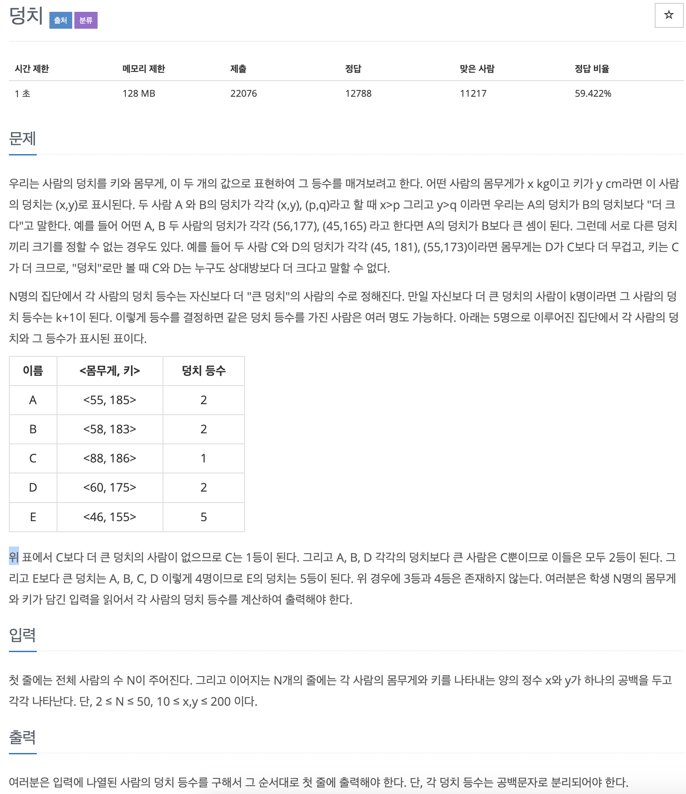

# BOJ 7568

## 덩치

### 문제



<br/>

### 코드

1. pair를 이용해서 키와 몸무게를 입력받았다.
2. 키와 몸무게를 각각 순차적으로 비교하며 순위를 매김
3. 순위를 저장하기 위한 rank배열을 만들고 `fill_n`을 이용해 n사이즈 만큼 1로 채
4. 기준이되는 `i`를 기준으로 `rank[i]++;` 를 하며 순위를 매김
5. 문제는 순위 1등이 5가 나온다. 가장 덩치가 크니까 당연하다.
   1. 이를 해결하기 위해 5 = n  이므로 ranker[i] == n 이면 1로 바꾸기로 함.
   2. 하지만 꼴찌인 1을 해결할 수 없었다.

---

Solution 을 참고해보면 

<u>rank변수를 rank++;하고 기준이되는 i가 증가할때마다 출력하면 됐었다..</u>

```c++
#include <iostream>
#include <vector>
using namespace std;

int main()
{

    int n;
    cin >> n;
    // int ranker[n];
    // fill_n(ranker, n, 1);
    int rank = 1;

    vector<pair<int, int>> v;

    for (int i = 0; i < n; i++)
    {
        int w, h;
        cin >> w >> h;
        v.push_back(make_pair(w, h));
    }

    for (int i = 0; i < n; i++)
    {
        for (int j = 0; j < n; j++)
        {

            // cout<<"v[i] "<<v[i].first<<" "<<v[i].second<<endl;
            // cout<<"v[j] "<<v[j].first<<" "<<v[j].second<<endl;
            // if (i == j)
            // {
            //     continue;
            // }
            if (v[i].first < v[j].first && v[i].second < v[j].second)
            {

                // ranker[i]++;
                // if (ranker[i] == n)
                // {
                //     ranker[i] = 1;
                // }

                rank++;
            }
        }
        cout << rank << ' ';
        rank = 1;
    }

    // for (int i = 0; i < n; i++)
    // {

    //     cout << ranker[i] << ' ';
    // }

    return 0;
}
```

