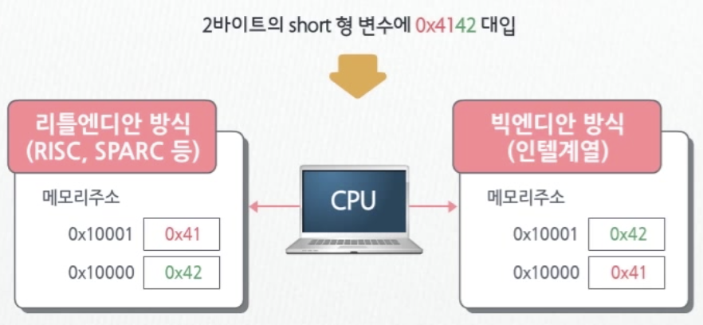

# C++

## 객체지향 언어로서의 C++ 특징

- 객체 지향 프로그램에서 사용되는 용어
  - 클래스 : 객체를 정의하는 원형
  - 객체 : 클래스에 정의된 대로 만들어진 실체(인스턴스)
  - 인스턴스 : 프로그램에서 실제로 실행할 객체
  - 메소드 : 클래스에 정의된 연산(함수)
  - 메시지 : 객체를 통해 메서드를 호출하는 

1. ### 데이터 추상화

   >  실생활에서 다루는 방법과 유사하게 프로그램 처리 하기 위해 **특정 대상의 주요 특성만을 모델링** 하는 것.

</br>

2. ### 캡슐화

   > 객체 관련 데이터 및 함수들을 하나로 묶은 것

   - **정보의 은닉**

     : 객체간 역할 구분 -> 쉬운 프로그램 모듈화 구현 지원


</br>

3. ### 상속

> 기정의된 클래스에 데이터나 함수를 추가하거나 수정해 재정의하는 기능

- 기존 클래스와 파생 클래스 간 **계층구조** 구성 -> 쉬운 클래스 라이브러리 구축

</br>

4. ### 다형성

> 동일한 이름의 함수가 상황에 따라 다르게 동작하느 것

- 중복정의 (오버로딩) & 재정의 (오버라이딩)

</br>

</br>

## 일반화 프로그래밍 언어로서의 C++ 특징

- ### 일반화 프로그래밍 ? 

  : 함수 및 클래스 정의시 범용형 (Generic Type) 사용

    C++에서는 템플릿을 이용하여 기능 지원

  - #### 함수 템플릿

    : 함수 정의 대신 **함수를 만들어내는 방법 정의**

     주로 처리하는 방법은 동일하나 대상이 되는 **데이터의 자료형이 다양한 경우** 사용

  - #### 클래스 템플릿

    : 클래스 정의 대신 **클래스를 생성하는 방법 정의** 

</br>

## Main 함수

> 프로그램이 실행될 때 운영체제에 의해 호출되는 함수 : **진입(Entry Point함수**

리턴 자료형

프로그램 종료 시 운영체제에 반환되는 값

실행 형태

프로그램 실행 불가 시 : 1 반환

정상 종료 시 : 0 반환

</br>

## cout객체 

> 터미널(표준 출력 장치)로 출력될때 사용되는 객체
>
> `<<` 연산자

`count<<"안녕하세요";` ---> 안녕하세요

### 줄바꿈 연산자 `endl`

- 줄바꿈
- **출력 버퍼를 비움**

`count<<"안녕하세요,"<<"만나서 반갑습니다." <<endl;`


`#include <iostream>` 선언 필요

표준 라이브러리 클래스, 함수, 변수 등 사용시 std네임스페이스 지정해야 함.

`std::cout`
`std::endl` 

번거로우면 `using namespace std;`  사용

</br>

## 자료형

>  변수나 객체의 형식 또는 그 크기를 구분하는 용도로 사용

### C++ 제공 자료형

- 기본 자료형

  - 논리, 문자, 정수, 실수
  - C++에서 추가된 자료형
    - 논리형 (bool)
    - 문자형 (wchar_t : 2 or 4 byte (플랫폼에 따라 크기가 다름))
  - 플랫폼에 따라 크기가 다른 자료형
    - 정수형( long, unsigned long  4(32bit) or 8 byte((64bit)))
    - 실수형 ( long double 8 or 10 or 16 byte )
    
      </br>

- 자료형의 크기 확인 방법

  - `sizeof()`

  </br>

- 정수형 기본 자료형의 크기

  - signed
    
    - **부호비트** 추가, 표현범위 : **-32768 ~ 32767** (short 형)
    
    </br>
  - unsigned
    - 음수의 데이터가 없는 경우
    - 표현범위 : **0 ~ 65535** (short 형)

  </br>

  - **데이터 오버 플로우**가 일어날 수 있기 때문에 자료형의 크기 선택을 고려해야한다.

  </br>

- 사용자 정의 자료형

  - 열거형 (enum)
  - 문자열
  - 포인터
  - 배열
  - 구조체 (struct)
  - 공용체 (union)
  - 클래스 (class)
  - typedef


</br>

- ### Typedef

  > 사용자가 이름을 부여함.

  왜 ?

  1. 가독성

  2. 다양한 플랫폼에 포팅이 가능한 프로그램 작성 가능

     Ex) 

     ```c
     
     unsigned int num1, num2;
     unsigned int get_addr(char* add);
     char* put_addr(unsigned int addr);
     
     // --> 모든 줄의 int형을 long형으로 바꾸어야해서 번거롭다
     
     
     typedef unsigned int unit32;
     unit32 num1, num2;
     unit32 get_addr(char* add);
     char* put_addr(unit32 addr);
     
     // --> 맨위에 형변환만 해주면 된다.
       
     전제조건
     : 32비트 정수? int형 크기 4바이트(32bit) 플랫폼 : int형 사용
        				   int형 크기 2바이트(16bit) 플랫폼 : 4바이트 자료형은 long형
     ```


</br>

- ### Enum

  > 하나 이상의 정수형 상수를 원소로 갖는 열거형의 enum

   `enum colors {red, blue, yellow, green, white, black} mycolor;`

  `mycolor = red ` : mycolor 변수에 **0대입**

  `mycolor == blue` : mycolor변수의 값이 blue, **1인지 비교**

  </br>

  왜 ?

  - 가독성
  - 수가 상징하는 의미를 문자로 작성하면 분석이 용이하다.

  ```c
  enum color {red=10, blue=20, yellow, green, white, black} mycolor;
  
  /* yellow는 30이 아니다
    값이 부여된 blue부터 순차적으로 증가함
    yellow 는 21, green은 22
    
   */
  ```

  </br>

## 변수

1. ### 변수 선언

`int num1 = 0, num2(-1);`

**C++에서는 변수도 객체의 한 종류로로 생각한다.**

</br>

2. ### 지역변수, 전역변수

   1. 함수 내 선언 : 지역변수 
   2. 함수 외부 선언 : 전역변수
   3. 

   </br>

   

3. ### 정적변수 

   > 함수 내에서만 사용하는 변수 (static)

   - 함수가 종료되어도 그 값을 유지하고 싶을때 사용한다.
   - **데이터 세그먼트**에 할당된다
   - `static int total = 0;`


</br>

### 상수

#### 리터럴 상수

- 논리상수
- 정수형 상수
- 실수형 상수 
- 문자 및 문자열 상수
- **"" 와 ''는 다르다**
  - 'A' : A문자를 의미
  - "A" : **A문자와 문자열 끝을 알리는 '\0' 문자를 결합**한 **2바이트**의 메모리에 표현, `A+\0`문자열의 **시작주소**를 의미

#### 심볼릭 상수 (`const`)

> 상수를 기호화해서 사용하는 심볼릭 상수

- 상수화된 변수는 **선언 시 반드시 초기화**되어야 한다.
- `const 자료형 변수명 = 초기값;`
- 초기화 값은 **중간에 변경 불가**
- 상수처럼 사용됨

</br>

## 표준 입출력

> iostream 라이브러리에서 제공

- 출력 : `cout`
- 입력 : `cin`
- `cin >> 변수;`
  - **공백, Tab, Enter**를 만나기 전까지의 변수의 자료형에 맞는 데이터를 입력받는다

</br>

## 연산자

- 범위지정 연산자 (`::`)
  - 함수내에 선언된 지역변수와 전역변수 **이름이 동일**할 때, 전역변수를 지정할 때 사용한다.
  - 예 ) `::count`

</br>

## Namespace

- 내가 지정한 네임스페이스 공간 //  구분  // 관련없는 공간

- ```c++
  namespace [네임스페이스 이름]{
  변수 선언;
  함수선언;
  }
  ```

- **생략**하면 **같은 파일 안에서만** 접근 가능

- **함수 외부**에서 정의해야 한다.

- **사용하려는 함수 앞**에 정의해야 한다.

  

### 네임스페이스로 정의된 공간의 변수, 함수로 접근하려면?

- `네임스페이스 이름 :: 함수명 또는 변수명`
- 중첨되어 있을땐 ? **순서대로 (바깥 --> 안쪽)** 연산자 사용!
- 일일이 선언하지 않고 싶을 땐? `using`


</br>

## 선택문 & 반복문 & 제어문


1. ### 선택구조

   참, 거짓 기준은 **0** : <u>**0이 아닌경우가 참**</u>

   1. #### If

   2. #### switch

      : 조건식은 **정수형상수**이거나 **문자형 상수**여야한다.

      default는 생략가능	

   3. #### if VS switch ?

      : 최적화하는 방법은 **switch**가 더 나음

      ​	다중if는 조건식을 처음부터 일일이 비교,
      ​	switch는 case중 하나만 선택되어 실행

</br>

2. ### 반복구조

   1. #### for

   2. #### while

   3. #### do-while

</br>

3. ### 기타구조

   > 프로그램의 흐름을 지정한 위치로 이동하고 싶을  사용

   1. #### goto문

      - 실행되는 도중 특정 위치로 이동해야 하는 경우 사용, goto문의 대상이 되는 위치에는 **레이블**을 붙인다.

      - ```c++
        label 명 :
        			~
                goto label명;
        ```

   2. #### break문

      - <u>if함수에서 사용 불가</u>

   3. #### continue문

      - 다음 주기로 넘어감
      - <u>switch문에서는 사용 불가</u>


</br>

## 배열과 포인터

> 수많은 데이터를 보관하는데에 변수로는 부족하다
>
> 이를 위해, 변수 이외에 데잍를 처리하는 방법을 활용한다.

### 방법

- #### 배열

  > 동일한 데이터들이 메모리에 연속적으로 모여있는 것.

  - 크기가 정해져있다.

  - 배열명 : 배열의 **시작 주소**를 의미

    - **상수**의 성격(변하지 않음)을 가짐

  - **자료형의 크기 * 배열의 크기** 만큼 메모리 할당

    

  </br>

- #### 포인터

  >  메모리를 제어할 수 있는 기능

  - 프로그램이 실행되는 공간인 메모리를 가리킴

  - 메모리의 주소 : 포인터

</br>

- #### 레퍼런스

  > 별도의 메모리를 **할당하지 않음.**	
  >
  > 기존에 존재하는 변수의 메모리를 함께 공유
  >
  > 어떤 변수의 **'별명'**

  - `&` 지정자 사용
  - 선언과 동시에 어떤 변수와 초기화 할 것인지를 명시해야함.
    - *변수 선언 : 메모리 할당*
  - 나중에 다른변수를 참조하도록 **변경 불가.**

</br>

- #### 레퍼런스와 포인터의 차이

  - 포인터
    - 가리키는 대상이 없을수도 있고, 달라질 수도 있다.
    - 함수간의 인자 전달 시 **주소 전달**로 다른 함수의 변수를 이용
  - 레퍼런스 변수
    - 반드시 **가리키는 대상이 존재**해야하고 **달라질 수 없다.**
    - 함수간의 인자 전달 시 다른 함수의 변수에 **별명을 붙여** 바로 사용 
      - (포인터보다 사용이 쉬워 주로 함수의 **인자 전달방법**으로 사용된다.)

</br>

#### 1차원 배열

- **자료형의 크기 * 배열의 크기** 만큼 메모리 할당

- 필요 시 배열을 **선언과 동시에 초기화** 해야한다.

  - 안그러면, 메모리에 남아있던 값, 쓰레기 값을 가지게 된다.

- ###### 매크로를 이용한 배열의 크기 (`#define  매크로명 값 `)

  - 배열 선언 시 반복적인 구조로 처리하는 경우가 많으므로 **배열 선언 시의 크기가 반복횟수가 된다.**

  - `define  매크로명 값 `

    - `;`이 붙지 않음

  - 예시

    - ```c++
      #define ARRAYMAX 10
      int sum [ARRAYMAX];
      for(i = 0 ; i<ARRAYMAX ; i++)
      {
        ....
      }
      ```

  </br>

- 문자열 처리

  - C 스타일의 문자열 처리 함수
    - `#include <cstring>`
      - `char * strcpy( char* dest, const char *scr);` : 복사
      - `char * strcat (char* dest, const char *scr);` : 문자열 덧붙임
      - `int strcmp(const char*s1,  const char* s2);` : 비교
      - `size_t strlen(const char*s);` : 길이

  - c++에서는 문자열 처리를 위한 string클래스를 제공하고 있어 문자열 처리함수보다 더 많이 이용한다.

</br>


#### 2차원 배열

- `자료형 배열명 [행의 크기] [열의 크기]`
- 메모리의 크기는 **자료형의 크기 * 배열의 크기** 
  - `int number[2] [3];`  -->   sizeof(int) * 6
- 2차원 배열도 **연속된 메모리**에 할당 받음
  - 배열의 원소는 행첨자와 열 첨자를 이용하여 표현
  - `배열명 [행첨자] [열첨자]` : 배열에서의 **위치**를 의미하며 각각 **0부터 시작**

</br>


#### 포인터 변수

- 자료형과 무관하게 **32bit 플랫폼은 4byte, 64bit플랫폼은 8byte할당**
  
  - 플랫폼을 모를땐 ? `cout << sizeof(int *) <<endl;`
- 자료형 : 포인터의 기본형(base type)
  
- `자료형 * 변수명;`
  
- ##### 주소 연산자

  - `&` : 뒤에 따라오는 변수의 주소

  - `*` : 포인터 변수 앞에 쓰이는 연산자, 포인터 변수가 가리키는 곳의 내용 (값)

  - ```c++
    int * p; // 주소를 담을 수 있도록 메모리를 할당 받음, 주소가 저장되어 있지 않은 상태 => 초기화 필요
    int number ;
    p = &number; //일반 변수 선언 후 변수의 주소를 포인터변수 p에 저장
    ```

  </br>

- ##### 포인터 변수 연산

  - **+, -, ++, --** 연산자만 사용
  - **메모리의 주소를 연산**한다는 의미
  - 소수점이 포함된 수의 연산은 불가
  - **포인터 변수의 자료형 크기** 만큼 연산이 이루어진다.

  </br>

- ##### 동적메모리

  - 전역, 지역변수 처럼 미리 선언 X, 프로그램 실행 시 할당 받는 메모리

  - 

  - `new`

    : 동적 메모리 할당, `자료형 * 변수명 = new 자료형;` ==> 양쪽의 **자료형은 반드시 일치**해야 한다.

  - `delete`

    : 동적 메모리 해제,  `delete 변수명`

  - `new[]`

  - `delete[]`

  - 동적할당과 동시에 메모리 초기화

    - ```c++
      #include <iostream>
      
      using namespace std;
      
      int main()
      {
      
          int *p = new int(0); //초기화 할 값 명시
          // new 연산자의 수행 결과 : 동적할당 실패 시 null반환
      
          if (p == N ULL)
          {
              cout << "memory allocation failed" << endl;
              exit(1);
          }
      
          *p = 100;
      
          delete p; //다 사용하면 항상 해제 해주어야 한다.
          p = NULL;
      }
      ```

</br>

#### 포인터 배열

> 포인터 배열은 각 원소가 모두 포인터 자료형인 배열

- `자료형 * 배열명[크기];`

- `char * cityName[] ={"Seoul", "Busan","Daeku","Incheon",NULL};`

  - **문자열의 길이가 모두 일정하지 않으므로** 포인터 배열로 구성하는 것이 좀 더 효율적

    

  </br>

#### 함수 포인터


- 다양한 함수들이 **서로 다른 환경에서 호출**되어야 하는 경우 사용
- 컴파일러, 어셈블러, 인터프리터 등과 같은 **시스템 소프트웨어를 작성**하는 경우 사용
- **동적 라이브러리 함수** 이용하는 경우
- OOP 프로그램 특징인 **다형성**을 구형하는 경우

</br>

##### 선언

- `리턴타입 (*함수포인터 변수명)([자료형 변수명, ...,]);`
- `int (*calc) (int num1, int num2);` 
  - calc : 함수 포인터 변수로 함수의 **시작 주소**를 대입하여 사용 가능
  - 함수 포인터 변수에 대입할 수 있는 함수는 **반환 값이 int형**임
  - 매개변수는 **int형 2**개로 구성된 함수
  - <u>변수명에 괄호가 붙는다</u>
    - `int *calc();   != int (*calc);` 
    - int형 포인터를 반환하는 **calc함수의** 호출을 의미하는 것이다.

</br>

#### void포인터

> void : 값이 없을 때 사용
>
> void * : 주소를 저장하는 자료형, 어떤 자료형이든 저장 가능

- 포인터 변수가 가리키는 메모리의 내용 참조 시 **형 변환**을 해주어야 한다.
  - **크기가 없어** 메모리를 얼마나 참조해야 하는지 알 수 없기 때문


</br>

#### 포인터 상수(`const`)

- 주로 함수의 인자 전달 시 인자의 값을 변경하지 못하게 하기 위해 사용한다.

- const의 **위치**에 따라  의미가 달라짐

- 자료형 앞, 포인터 앞, 포인터 양쪽

- ##### 자료형 앞

  - 포인터가 가리키는 메모리의 내용 변경 불가, 포인터 변수는 변경불가

  - ```c++
    int number 1 = 100;
    int number 2 = 200;
    const int* p = &number1;
    
    *p = number2; //컴파일 오류 발생
    p = &number2; //포인터 변수 자체에 대한 변화이므로 정상적으로 실행
    ```

    

  </br>

- ##### 포인터 앞

  - 포인터가 가리키는 내용 변경 가능, 포인터 변수는 변경 불가

  - ```c++
    int number 1 = 20;
    int number 2 = 30;
    int* const p = &number1;
    
    *p = number2; //정상
    p = &number2; //컴파일 오류 발생
    ```

    

</br>

- ##### 자료형 앞, 포인터 변수 앞 양쪽에 오는 경우

  - 포인터가 가리키는 내용, 포인터 변수 변경 불가

  - ```c++
    int number = 30;
    const int* const p = &number;
    *pc = t; //컴파일 오류
    pc = &t; //컴파일 오류
    ```

</br>

</br>

## 레퍼런스의 사용

> 레퍼런스(다른 변수에 대한 별명)는 기존에 존재하는 변수의 메모리를 함께 사용

- 선언
  - `자료형 & 레퍼런스명 = 변수명;`
  - 선언 시 반드시 **초기화** 해야한다.
    - 나중에 다른 변수 참조하도록 변경 불가.
- `const`로 **레퍼런스 상수**를 만들 수 있다.

 

</br>

## 구조체, 공용체

### 구조체 선언 `struct`

```c++
struct [구조체 이름]{
 	자료형 멤버이름;
  ....
}[변수명 또는 객체명];

//구조체 이름 생략 시 변수 또는 객체명을 지정해 주어야함.
```

- 변수 선언 = 메모리의 할당

  - C언어에서는 struct키워드와 함께 구조체 자료형의 이름을 명시
  - <u>C++에서는 struct키워드는 생략 가능하다</u>
    - `MEMINFO person;`
    - `MEMINFO person = {"최대인", 5800};`
  - **구조체 선언 순서대로** 메모리를 할당 받음

  - <u>순서가 바뀌면 ?</u> 엉뚱한 메모리를 참조하게되어 오동작할 수 있음.

- 초기값을 더 많이 지정하면 ? 컴파일 에러

- 초기값을 더 적게 지정하면 ? 0 으로 자동 초기화

- *구조체의 크기는 각 멤버들의 크기를 **모두 더한것과 같거나 클 수 있다.***

  - **컴파일러의 메모리 정렬 방식**에 의해 멤버들 사이에 사용되지 않는 바이트가 들어가기도 하기 때문이다.
  - `sizeof`연산자로 구조체의 크기를 확인


</br>

### 구조체 배열

> 서로 관련된 정보들을 모아 한꺼번에 처리할 수 있는 자료 구조로 표현한 기본 단위
>
> 데이터는 수천, 수만개
>
> --> **구조체 배열**을 이용해 표현

- `구조체자료형이름 구조체배열이름 [크기];`

  - **모두 동일한 구조체 자료형**으로 이루어짐
  - **첨자**를 이용해 원소들 표현

  

</br>

### 구조체 포인터

- `MEMINFO*p = NULL;`

  : 현재 0번지로 초기화된 상태 --> 포인터 변수 p를 사용할 수 없는 상태

- `MEMINFO s;`
  `p = &s;`
  : 포인터변수 p 사용가능

- #### 구조체 포인터 변수를 통한 메모리의 멤버 접근

  - 화살표 `->` 연산자 이용

    - `p -> name`

    

  - ```c++
    MEMINFO person[10];
    MEMINFO* ptr;//구조체 포인터 변수
    
    // ptr포인터 변수는 person배열의 첫번째 원소를 가리킴
    // 구조체 배열 person의 시작주소 대입
    ptr = person;
    ```

  - 구조체 배열도 **연속적인 메모리 할당**을 받기 때문에 일밴배열처럼 **포인터 변수의 연산**을 통해 접근이 가능하다.

  - 예제

    ```c++
    #include <iostream>
    #include <cstring>
    
    using namespace std;
    #define MAX 10
    
    int main()
    {
    
        struct meminfo
        {
            char name[20];
            int salary;
        };
    
        meminfo person[MAX] = {
            {"김대표", 100000},
            {"이부장", 70000},
            {"홍과장", 40000},
    
        };
    
        meminfo *ptr;
    
        ptr = person;
    
        int count = 3;
    
        for (; count < MAX; count++)
        {
            cout << "이름은 ? ";
            cin >> (ptr + count)->name;
            // 프로그램 종료
            if (strcmp((ptr + count)->name, "end") == 0)
                break;
            cout << "연봉은 ? ";
            cin >> (ptr + count)->salary;
        }
    
        for (count--; count >= 0; count--)
        {
            cout << (ptr + count)->name << "의 연봉은 "
                 << (ptr + count)->salary << "입니다 " << endl;
        }
    
        //출력 시 count변수에 마지막에 입력된 원소의 위치가 저장되어 있으므로 마지막 원소부터 첫번째 원소의 순서로 출력돔.
        return 0;
    }
    
    // 입력
    이름은 ? 광수
    연봉은 ? 222
    이름은 ? end
     
    // 출력
    광수의 연봉은 222입니다 
    홍과장의 연봉은 40000입니다 
    이부장의 연봉은 70000입니다 
    김대표의 연봉은 100000입니다
    ```

    

</br>

### 구조체와 동적할당

> 구조체 포인터 변수는 정적 메모리를 지정하는 용도로 이용
>
> 하지만, **동적 메모리 할당** 시 더 많이 이용

- `MEMINFO* ptr = new MEMINFO;`
  - 시작 주소를 ptr포인터 변수에 대입
  - 포인터 변수가 새로 할당된 메모리를 가리킴
  - `ptr ->name` , `ptr->salary`

- **동적 VS 정적**

  - 메모리가 컴파일 시 할당되는지, 실행하는 동안 할당되는지의 차이

  - 동적 구조체 배열의 선언

    - `MEMINFO *ptr=new MEMINFO[10];`

  - 동적 배열의 크기 실행

    - ```c++
      int size;
      cin>>size;
      MEMEINFO *parray = new MEMINFO[size];
      ```

      

</br>


### 공용체

> 같은 메모리 공간(멤버 변수 중 가장 **큰 자료형**에 맞추어 할당) 을 여러 멤버가 함께 공유하는 자료형

- 선언형식

  - ```c++
    union[자료형이름]{
      [자료형 멤버변수 이름;]
    }[변수명];
    
    
    union KEY{
      unsigned int input
      unsinged short code[2];
    }key;
    
    key.input (정수형 번수와 동일처리)
    ```

- 바이트 순서

  - CPU아키텍처에 따라 short, int, long형의 자료형의 바이트 순서는 서로 달라질 수 있다.

    

- *예)*

  ```c++
  #include <iostream>
  
  using namespace std;
  
  int main()
  {
  
      union KEY {
          // 전체 크기는 4바이트로 전체는 input멤버로 각 한바이트마다 byte배열 멤버로 접근
          unsigned int input;
          unsigned char byte[4];
      };
  
      KEY key;
      key.input = 0xc0a86401;
  
      int i;
  
      for (i = 3; i >= 0; i--)
      {
          cout << (int)key.byte[i] << endl;
      }
  
      return 0;
  }
  
  
  //출력
  192   (0xc0)
  168		(0xa8)
  100		(0x64)
  1			(0x01)
    
    
  ```

  

## 함수

### 디폴트 매개변수

> 함수 호출 시 인자를 생략할 경우 자동으로 디폴트 값이 사용되도록 하는 것

- `int f(int n1, int n2 = 2, int n3 = 3);`

  - 사용자의 함수 호출 ===> 실제 함수 호출

    : `f(10,20,30);  ===> f(10,20,30);`
    	`f(10); ===> f(10,2,3);`

- <u>왼쪽</u>부터 차례대로 전달

  - 오른쪽에서 인자 잔달 시 왼쪽 매개변수는 디폴트인자 이용 불가

    `f(10,,30);`  : *불가*

- 인자는 <u>오른쪽</u>부터 차례대로 전달

  - 오른쪽 매개변수 디폴트 값 지정 없이 왼쪽 매개변수 디폴트값 지정 불가

    `int f(int n.= 1, int n2 = 2, int n3);` : *불가*

</br>

### 매개변수 전달 방법

1. **값**에 의한 전달

   </br>

2. **주소**에 의한 전달

   : 호출한 함수의 메모리 주소 전달 -> 호출된 함수에서 호출한 메모리의 <u>간접 참조 허용</u> 

   ​	===> 호출된 함수 안에서 호출한 함수의 **메모리 내용 변경 가능**

   </br>

3. **레퍼런스**에 의한 전달

   > 호출한 함수의 메모리 정보 공유

   - 호출된 함수에서 호출한 메모리의 **직접 참조 및 변경 가능**

   - 값에 의한 전달에 비해 **불필요한 메모리 복사가 이루어지지 않음**
   - 주소에 의한 전달에 비해 **단순한 연산자**를 사용하므로 간결하게 프로그램 작성
     - **구조체**에 활용할 경우 효과적
   - 전달만 받는 인자는 **`const`키워드**를 이용해 레퍼런스 상수로 전달하여 **안전한** 프로그램 작성 가능

</br>

### 인라인 함수

* *일반 함수의 호출 및 리턴 과정*
  1. 함수 호출
  2. 인자들 및 복귀 주소를 스택에 저장
  3. 함수의 시작번지로 뛰어가 실행
  4. 호출된 함수에서 스택에 저장된 인자 불러오기
  5. 함수 실행
  6. 레지스터에 반환 값 저장
  7. 스택에서 복귀 주소를 읽어와 이전 위치로 이동

</br>

* <u>**인라인 함수는**, 이러한 과정들을 해결하는 **오버헤드를 줄이기** 위한 방법 중 하나</u>

  * 컴파일 시 함수 호출을 실제 함수 코드로 대처하는 인라인 함수
    * 함수 호철에 따른 오버헤드가 없어 수행속도가 빠름
    * 반면,반복 수행하면 결과물이 커질 수 있다.

  ```c++
  inline 함수명 ([자료형 변수명]){
    [명령문]
    [return]
  }
  ```

  - 함수 호출 전, 미리 정의되어 있어야 한다.
    - 컴파일러가 코드를 대치하기 위해 함수 코드가 완성되어 있어야 하므로 함수 호출 전 인라인 함수가 미리 정의되어 있어야 한다.

  </br>

  - 인자 자료형 지정이 가능하므로 제대로된 형 검사 가능

  - 괄호 없이도 항상 인자 먼저 평가한 후에 실행됨

    => <u>**연산자 우선순위에 대한 미처리 발생 불가**</u>

  - 