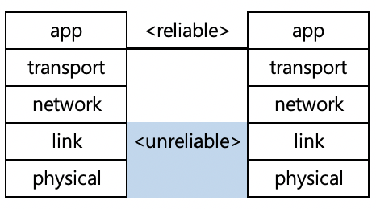
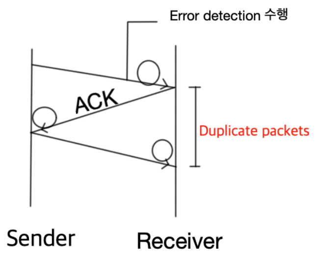
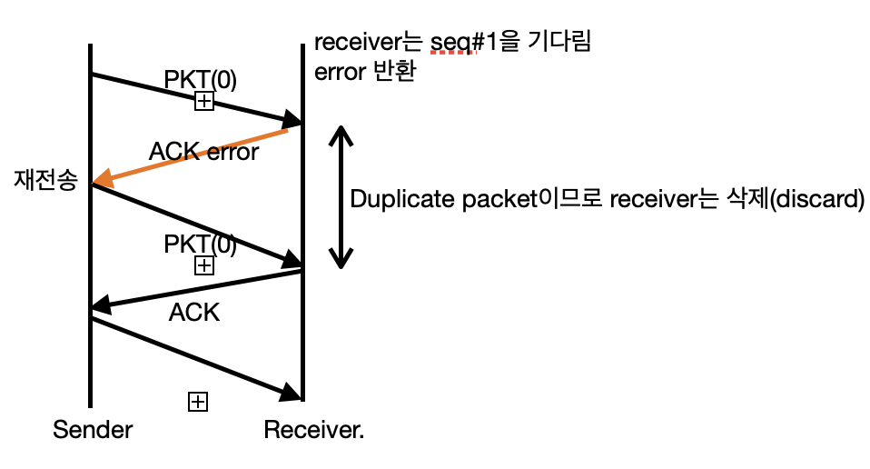
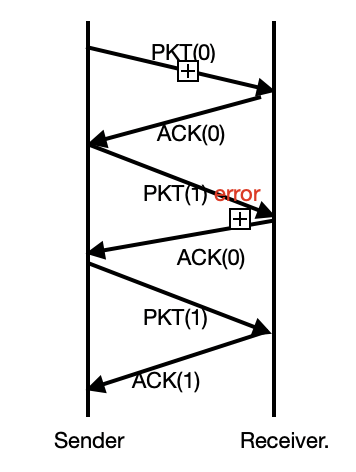
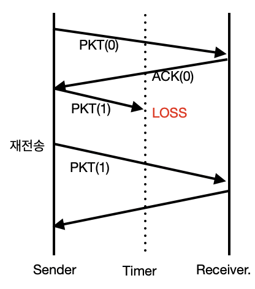
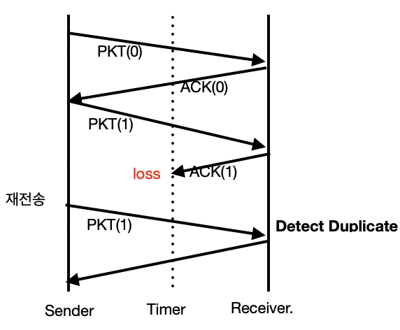
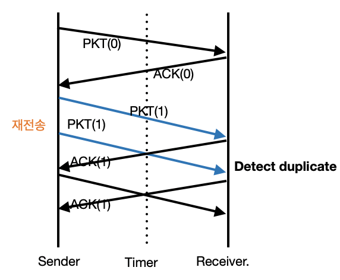

# 목차

[강의1](#1번째-수업)

[강의2](#2번째-수업)

[강의3](#3번째-수업)

[강의4](#4번째-수업)

---

 

# 1번째 수업

## Netword edge

- End systems(hosts):
  - run application programs
  - Web, email, ...
- Client  / server model
  - client host requests, receives services from always-on server
  - Web browser / server, email client / server, ...
- peer - peer model
  - minimal use of dedicated servers
  - Skype, BitTorrent, ...

  

### TCP (Transmission Control <u>Protocol</u>)

> Connection - oriented Service

- Reliable, in - order byte stream data transfer
  - loss : acknowledgements and retransmission
  - 메시지가 유실되지 않고 신뢰성 있게 전송됨
  - 메시지 순서를 지키며 전송됨
- flow control
  - sender won't  overwhelm receiver
  - sender가 receiver 에게 보내는 속도를 알맞게 조절해줌.
- congestion control
  - senders "slow down sending rate" when network congested
  - 메시지의 양을 적당하게 받을 수 있게 컨트롤해준다.
- 이러한 것들을 서비스 해주기 때문에 UDP에 비해 **리소스를 많이 소모**한다 

---

**참고** **(TCP vs UDP)**

### **UDP (User Datagram <u>Protocol</u>)**

> Connectionless Service

- unreliabe data transfer
- No flow control 
- No congestion control

*UDP는 다 서비스를 안해주는데 장점은 무엇이냐 ?*

굳이 장점이라고 하자면,

**속도가 빠르다.**

받아들이는 입장에 상관없이 보내는 쪽은 속도에 관계없이 보낼 수 있다.

하지만 **안정성은 보장할 수 없다.**

그래서 속도는 장점이라고 할 수는 없지만,

**선택적으로 사용**하면 된다. 

**<u>메시지가 유실되도 상관없을 경우 UDP 사용</u>** (예.보이스톡)

---

  

### Protocol

서로간의 규약, 준비동작

  

### Network Core

: 라우터들끼리 얽힌 망

 

*<u>**메시지를 어떻게 전달하냐 ?**</u>*

1. **Circuit switching**
   - 출발지 - 목적지까지 가는길을 미리 예약해놓고 특정 사용자만을 위해 사용하도록 만들어 놓은 것.
   - 예전 유선 전화망
2. **Packet(bit들의 묶음) switching**
   - 인터넷 방식에서는 이 방법을 사용
   - user가 보내는 데이터를 패킷단위로 받아 그때그때 올바른 방향으로 보내주는 방식

  

*<u>**어떠한 장단점이 있는가 ?**</u>*  

**장점**

1 Mbps link 의 bandwidth가 있고  100kbps 속도의 여러명의 유저가 있을 경우.

Circuit switching 이면 10명에게만 제공 가능하다.

반면, packet switching 은 제약이 없다.

인터넷 사용 패턴을 보면 항상 데이터를 요청하는 것이 아닌 필요할 때만 데이터를 요청한다. 실질적으로 사용안하는 시간이 더 길기 때문에 동시에 같은 요청이 몰리지 않는다면 더 packet switching이 보다 더 효율적이다 

  

**단점 ?**

**Packet delay** 

> <u>동시에 몰리는 경우</u>에 발생

다음 패킷으로 보내는데 까지 걸리는 dalay

1. nodal proceesing (들어오고)

   : 새로운 패킷을 받으면 패킷 **검사**하는 processing delay

2. Queueing (기다리고)

   : 나가는 것보다 들어오는 양이 더 많을 경우 대기줄(?)이 생긴다. 이에 대한 **유실을 방지하기 위해 buffer or queue에 저장**

3. Transmission Delay (나가기 전)

   : 한 비트가 뿜어져 나가는 순간부터 완전히 다 나갈때까지 걸리는 시간

   `Transmission delay = 패킷 크기 / link band width`

   Band width가 클수록 delay가 작아진다.

4. Propagation delay (나온 후)

   : 비트가 나와서 다음 라우터까지 도달하는 시간

   속도는 단순히 빛의 속도.(컨트롤 불가)

  

**delay를 줄이기 위해서?**

1. router를 좋은거 산다. --> processing delay 이슈 

2. 케이블 공사해서 band width를 늘려버려 ---> transmission delay 이슈

3. queueing dealy는 client에 의해 좌우되므로 조절하기가 매우 까다로움 --> Queueing delay 이슈

   - 정해진 queue사이제를 넘치면 뒤에 들어오는 데이터는 버린다. (packet 유실)

     : 인터넷에서의 유실은 대부분 queueing delay 과정에서 발생

 

*<u>**근데 TCP는 이런 유실을 방지한다고 했는데 ?**</u>*

**재전송**밖에 답이 없다

  

누가 재전송할건지에 관한 선택할 수 있는 옵션 2가지

1. 유실이 일어난 라우터 바로 직전의 라우터가 재전송
2. 처음부터 재전송

  

인터넷에서는 **처음부터 재전송**하는 것으로 디자인됨.

중간에 라우터들은 "no - brain"이다 ==> **dumb core** (전달만해)

 

*왜 ?*

중간 라우터들이 할일이 너무나 많아진다.. (너무 느려진다)

---

 

# 2번째 수업

## 프로토콜

> 각 네트워크 계층마다 수 많은 프로토콜이 존재

| 네트워크 계층  | 대표적인 프로토콜 |
| :------------: | :---------------: |
|      App       |       HTTP        |
|   Transport    |     TCP , UDP     |
|    Network     |        IP         |
|      Link      | Wifi, LTE, 이더넷 |
| Physical Layer |                   |

- App - 프로세스 자체

*코딩할땐 중간에 라우터 통신들에 대해 전혀 신경쓸 필요가 없다.*

 

### Client -- Server 구조

1. Server
   - 고정된 IP주소
   - Always on

---

*IPC (Interprocess comunication)  : Process 사이의 통신 (한 컴퓨터 내), OS가 통신을 위해 인터페이스를 만들어 놓음*

다른 컴퓨터와의 프로세스와 프로세스 사이의 통신

다른 컴퓨터상에 위차한다는 것 뿐이지 같은 개념

인터페이스 - **Socket** 같은 개념

---

 

통신을 위해 사전에 연결시켜야 하는 무언가가 있어야 한다.

이를 위해서는 **상대편의 소켓 주소**를 알아야 한다.

이것의 주소를 인덱싱하는 것 : **IP 주소, Port**

- IP 주소 : 어떤 컴퓨터인지 지칭, 

- Port :  컴퓨터 안에. 프로세싱이 많은데 **어떤 프로세스**인지 지칭해주는 역할 ( 포트에 물려져 있는 소켓 )

 예를들면, 우리가 네이버에 접속하기 위해 naver.com을 입력하는데 사실 ip주소:포트번호(123.23.23:**80**)를 입력해야 된다.

대부분의 웹사이트는 기본적으로 80번 포트를 사용한다. 왜 ?

1. 서버는 always-on, 주소가 변함이 없어야 함.
2. 네이버와 구글은 주소가 다름

==> <u>DNS가 도메인을 바꿔주는대신 80번까지는 공통으로 하자. (안그러면 너무 포트까지 다 만들어줘야하기 때문.)</u>

 

각 계층에서는 하위 계층에서 제공하는 기능들을 사용함.

Transport Layer(현재의 TCP) 에서 제공하는 서비스는 **Data Integrity만 제공**

그래서 이것저것 깔아라 하는 것들이 App(웹브라우저) 에서 나오는 것이다.

그 밖의 서비스들

- timig
- throughput
- security

---

*timing VS throughput* 

- timing 
  - 내가보낸 패키지가 그 시간 범위 안에 도착해야 한다. (시간)

- Throughput
  - 단위 시간안에 처리할 수 있는 정보의 양 (양에 대한 얘기)

---

  

### HTTP

> 단순히 링크된 텍스트들을 전송하는 프로토콜

- **request, respose**
  - 이런 과정 이전에 TCP 커넥션을 해주어야한다. )APP의 하위 레이어인 transport)
- **stateless**
  - request가 들어오면 response해서 보내면 끝 (기억을 하지 않음)

  

HTTP가 TCP커넥션을 사용하는 방식에 따라 2가지로 나뉜다.

1. **non-persistant**

   : 주고받고 나서 TCP연결을 끊을 때

2. **persistant**

   : 주고받고 나서도 TCP연결을 끊지 않을 때 (현재 웹프라우저의 default값)

---

# 3번째 수업

# 4번째 수업

## Application Layer2

---

*저번시간 요약*

UDP 기능 2가지

1. App에게 multiplexing 제공
2. Error checking

---

  

### TCP 

> reliable data transer
>
> reliabe : 하나도 유실없이 전달되는 것

- reliable 한 것처럼 보이지만 사실 환경은 아래쪽 (unreliable)과 같으며, 이로인해 reliable한 것처럼 느껴지게 된다.

- Unreliable 하면 ?
  - Packet loss
  - Packet error

  

#### rdt1.0

만약 완벽히 reliable하면 딱히 할 일은 없다.

#### rdt2.0 : packet error 발생 (no loss 전제)

1. 에러 detection

   checksum bits

2. 에러가 있다면 ? **feedback** 필수

   1. 잘 받았다 : ACKs (Acknowlegement)
   2. 아니다 : NAKs (Negative Acknowlegement)

3. Retransmission

 

---

*이 방식이 정말 완전 (complete) 한가 ?*

<u>그렇지 않다.</u>

feedback이 잘못된 메세지일 경우때문

sender는 다시 받은 메세지가 ACK 인지 NAK인지 모른다. 즉, 새거인지 중복(duplicate) 된 것인지 모른다.

--> 이를 위해 구분하는 번호인 **Sequence Number**가 필요

---

  

#### rdt2.1

- Seq# 는 패킷의 header부분에 들어간다  (부가정보니까 )
- 이때, 시퀀스 넘버를 번호순으로 부여하게 되면 ?
  -  패킷 헤더부분의 시퀀스넘버를 담는 부분이 매우매우 커지게 된다. 부가정보를 담는 부분이니까 최소화 해야하는데...
  - 그럼 얼마나 최소화 가능한가 ?
    - **사실 0과 1이면 충분함**
      - 받았으면 0, 보내는건 1

- sender 
  - 시퀀스넘버를 부여하고
  - ACK/NAK 인지 체크
  - NAK이면 재전송
- revceiver
  - duplicate인지 반드시 체크
  - NAK 또는 ACK을 전송

  

#### rdt2.2

> NAK을 없애는 protocol

- Loss된 상황
- 오직 ACK만 사용한다.

1. NAK대신 receiver는 seq#를 보낸다 (가장 마지막으로 성공적으로 받은 seq#를 )
2. 1번(PKT(1)) 보냈는데 성공했던 0번이 왔다. -> Nagative Feedback

  

#### rdt3.0

- Loss & Error 상황

- loss되면 receiver가 받지 못한다.

  : 반응이 없게 됨을 의미

- **Timer**로 해결

  - Sender 는 packet을 보낼 때마다 timer를 함께 실행

- Timer는 얼마나 맞춰야 하나 ?

  - 산술적으로는 어려움..
  - 매우 짧을 경우 
    - 장점 : recovery reaction이 짧다.
    - 단점 : 중복 패킷 발생
  - 매우 긴 경우
    - 단점 : loss반응이 느림

  

- **상황 1 : packet이 유실된 경우**

  

  

  

- **상황 2 : ACK이 유실된 경우**

  

  

- **상황 3 : 성급한 timeout**

  

  

 

#### 마무리

**packet** 

: **|Header | Data|**

**Header 부분**

1. Error detection
2. feedback
3. retransmission
4. Sequence Number

  UDP와는 다르게 많은 정보를 담고 있다.

실제 TCP에서는 rdt와 다르게 한번에 보내고 한번에 받는 구조이다.