# 목차

[강의1](#1번째-수업)

[강의2](#2번째-수업)

[강의3](#3번째-수업)

[강의4](#4번째-수업)

[강의5](#5번째-수업)

[강의6](#6번째-수업)

<br/>

# 1번째 수업

## 운영체제 


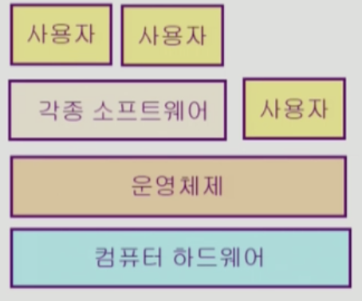


- 컴퓨터 하드웨어 바로 위에 설치되어 사용자 및 다른 모든 소프트웨어와 하드웨어를 연결하는 소프트웨어 계층
  - 운영체제를 기준으로 컴퓨터 하드웨어(아래), 사용자 및 각종소프트웨어 (위) 부분으로 나누어 어떻게 인터액션을 하며 기능을 해야 하는가

- 협의의 운영체제(커널)
  - 운영체제의 핵심 부분으로 **메모리에 상주**하는 부분
- 광의의 운영체제
  - 커널 뿐 아니라 각종 주변 시스템 유틸리티를 포함한 개념

<br/> 

### 운영체제의 목표

1. 컴퓨터 시스템을 편리하게 사용할 수 있는 환경 제공 (윗단)
   - 운영체제는 동시 사용자  / 프로그램들이 각각 독자적으로 수행되는 것같은 느낌을 제공
   - 하드웨어를 직접 다루는 복잡한 부분을 운영체제가 대행

2. 컴퓨터 시스템의 **<u>자원(HW자원 + SW자원)을 효율적으로 관리</u>** (아랫단)
   - 프로세서, 기억장치, 입출력 장치(하드웨어 자원) 등의 효율적 관리
     - 사용자간의 형평성있는 자원 분배
     - 주어진 자원(이미 정해진 성능) 으로 최대한의 성능을 이끌도록
   - 사용자 및 운영체제 자신의 보호
   - 프로세스, 파일, 메시지(소프트웨어 자원) 등을 관리

<br/> **<u>운영체제는 무엇이냐 ? 자원관리자이다 , 자원을 효율적으로 관리하는 것</u>**

<br/> 

### 운영체제의 분류

#### 1. 동시작업 가능 여부

- 단일 작업 (Single Tasking)
  - 한번에 단 하나의 작업만 처리
  - 예) MS-DOS

- 다중 작업 (Multi Tasking)
  - 동시에 두개 이상의 작업 처리
  - UNIX, MS Windows

<br/>

#### 2. 사용자의 수

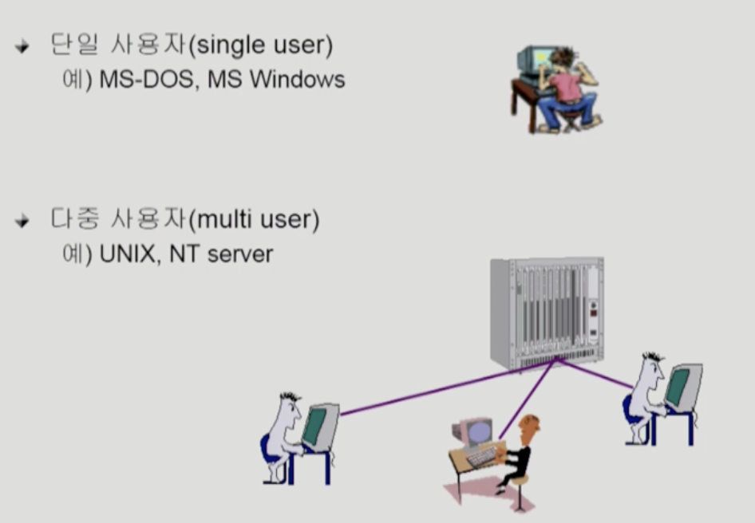

- 단일 사용자
  - MS-DOS, MS Windows

- 다중 사용자
  - UNIX, NT server (Ex.학과 서버)

<br/> 

#### 3. 처리 방식

- **일괄처리 (batch processing)**

  - 작업 요청의 일정량을 모아서 한꺼번에 처리
  - 작업이 완전 종료될 때까지 기다려야 한다.
  - 초기 PushCard 시스템

  

- **시분할 (time sharing)**
  - 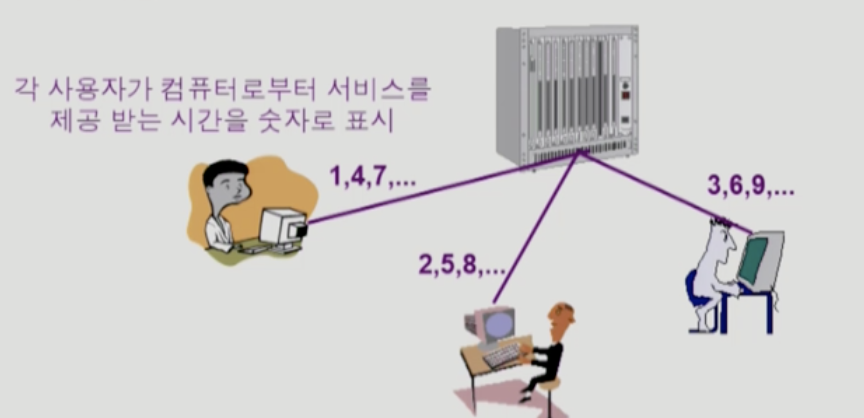
  - 요새 사용하는 컴퓨터 그 자체 
  - 여러 작업 수행 시 컴퓨터 처리 능력을 일정한 시간 단위로 분할하여 사용
  - 일괄 처리 시스템에 비해 **짧은 응답시간**을 가짐 (Ex. UNIX)
  - Interactive한 방식
    - Interactive : 컴퓨터 키보드를 누르면 바로 나오는 것
  - 시간에 대해 deadline(제약조건)이 있는것은 아님
  - 사람이 느끼기에 빠르게 느끼게 하기 위한 것에 목적


- **실시간 (Realtime OS)**
  - 정해진 시간안에 어떠한 일이 반드시 종료됨이 보장되어야 하는 실시간 시스템을 위한 특수한 목적의 OS
    - Ex) 원자로/공장 제어, 미사일 제어, 반도체 정비


- **실시간 시스템의 개념 확장**

  - Hard realtime system (경성 실시간 시스템)

  - Soft realtime system(연성 실시간 시스템)

    - 최근에 나온 기술

    - deadline은 있지만 지켜지지 않아도 큰 문제는 아님

      Ex) 영화 상영시 초당 frame 관련 분야

<br/>

### 몇 가지 용어

여러 작업을 동시에 수행하는 것을 뜻하는 용어들

- **Multitasking**
  - 보다 일반적인 용어
  - CPU에서는 하나의 작업만 실행이 되는데 매우 짧은 시간에 분할해서 할당을 하기 때문에 동시에 실행되는 것처럼 느끼는 것.
- **Multiprogramming**
  - 메모리에 여러 프로그램이 올라가 있음을 강조 (메모리 강조)
- **Time sharing**
  - CPU의 시간을 분할하여 나누어 쓴다는 의미를 강조 (CPU강조)
- **Multiprocess**


<u>구분할 것</u>!

**Multiprocessor**

> 하나의 컴퓨터에 CPU가 여러개 붙어 있음을 의미한다.


CPU가 하나 있더라도 분할해서 동시에 실행 가능 (위 4가지)

CPU가 여러개 (Multiprocessor)

--> <u>HW적으로 다르다</u>


<br/>


### 운영체제의 예

- **유닉스(UNIX)**

  - 초창기 대형 컴퓨터를 위해 만들어진 운영체제 ( VS 개인용은 Windows )

  - 코드의 대부분을 C언어로 작성

  - 높은 이식성

    - 하나의 컴퓨터에 돌아가는 unix를 전혀다른 컴퓨터에 이식하기가 용이하다

    - 낮은 이식성은 무엇 ?

      : 툭정 컴퓨터 기계어에만 국한되게 만든 것

  - 최소한의 커널 구조 (커널의 크기를 아주 작게 만듦)

    - 핵심 기능만 커널에 넣음

  - 복잡한 시스템에 맞게 확장 용이

  - 소스 코드 공개

  - 프로그램 개발에 용이

  - 다양한 버전

    - System V FreeBSD , ...
    - Linux

<br/>

- **DOS (Disk Operation System)**
  - 단일 사용자용 운영체제, 메모리 관리능력의 한계 (주 기억장치 : 640KB)

<br/>

- **MS Windows**
  - MS사의 다중 작업용 GUI기반 운여 체제
  - Plug and Play 네트워크 환경 강화
  - DOS용 응용 프로그램과 호환성 제공
  - 불안정성
  - 풍부한 자원 소프트웨어

<br/> 

- **Handled device를 위한 OS**
  - PalmOS, Pocket PC, Tiny OS


### 운영체제의 구조

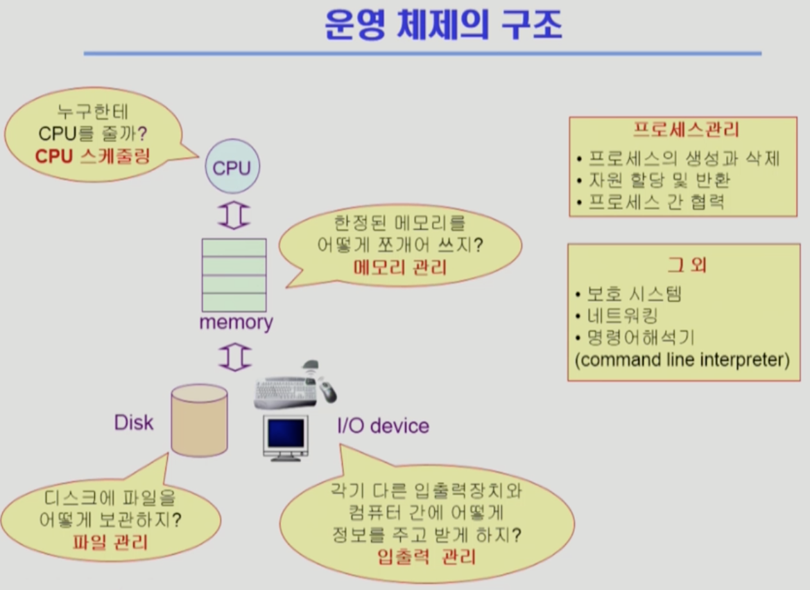


<u>본인이 운영체제라고 생각하고 공부해야 한다.</u>

- 대부분의 알고리즘은 OS프로그램 자체의 내용

- 운영체제의 통제를 받으며 그 운영체제는 사람이 프로그램이 하는 것이다.

  

<br/> 

# 2번째 수업

## 1. System Structure & Program Execution(1)

> 하드웨어적인 부분을 설명하는 챕터

<br/>

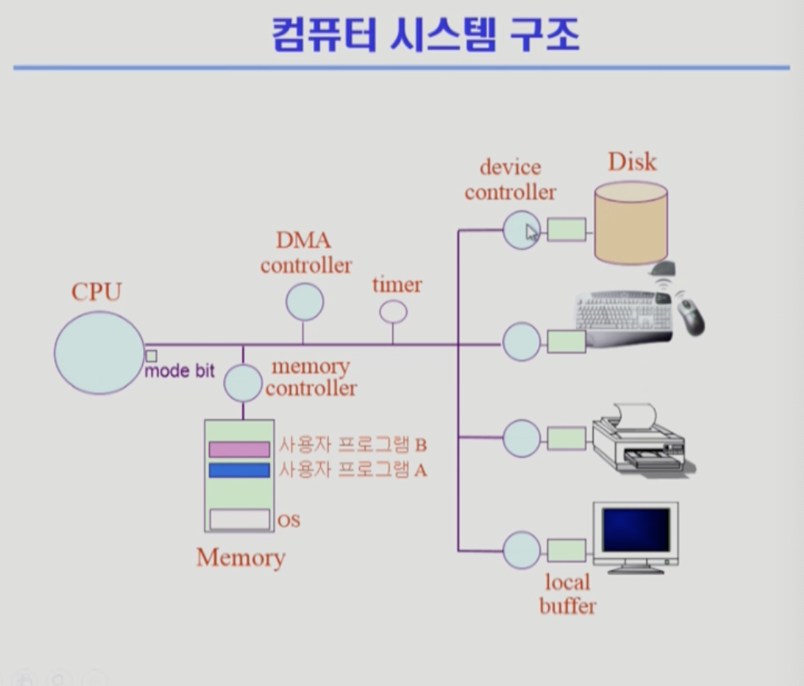


- **Disk** :  input/ output 동시 수행하는 역할
- (Device) **Controller** : 작은 CPU역할
  - 각각의 작업 공간 : local buffer

- **CPU** : 메모리의 인스트럭션을 실행하는 작업만을 수행한다. (메모리랑만 일한다.)
  - CPU 내부
    - **Register** : 메모리보다 더 빠르면서 정보를 저장하는 공간
    - **mode bit** : CPU실행 시 <u>OS</u> 인지 <u>사용자 프로그램</u>인지 구분해주는 역할
    - **interrupt line** : CPU가 인스트럭션을 수행할 때, 동시에 디바이스에서 정보 요청이 있을 때 정보를 전달하기 이한 역할
  - Disk에서 정보를 가져와야 하면, CPU가 Disk Controller에게 시킨다. (CPU가 직접 접근하는 것이 아님)
  - 그러고 CPU가 노는것이아니라 메모리와 계속 interaction한다

- **timer** : 만약 무한루프에 빠지면 CPU는 아무것도 못하게 되는데 이를 방지하기 위해 timer가 존재한다.
  - 특정 프로그램이 CPU를 독점하는것을 막기 위한 역할.
  - 시간이 지나면 interrupt line에 알려준다.
  - CPU <--> interrrupt line 체크 <--> 메모리 의 과정을 거치는데, 
  - interrupt line에 (타이머) 가 알려주면 CPU 제어권이 자동적으로 사용자 프로그램에서 OS로 넘어간다.

- 사용자 프로그램은 직접 IO장치에 접근하지 못한다. (보안 문제 등등 ) CPU를 통해서 접근해야 한다.

<br/>

### mode bit 

- 0 
  - 모니터모드 : OS 코드 수행
  - 메모리 및 IO디바이스 접근 가능
  - 사용자 프로그램에게 CPU를 넘기기 전에 mode bit을 1로 셋팅한다.
- 1
  - 실행할 수 있는 인스트럭션은 제한되어 있다. (보안상의 문제)
  - 커널모드, 시스템모드, 모니터 모드 : 사용자 프로그램 수행
  - Interrupt가 들어오면 자동적으로 0으로 바뀌면서 모드가 바뀌게 된다.


<br/> 

### timer

- CPU를 특정 프로그램이 독점하는 것으로부터 보호
- 타이머값이 0이되면 타이머 인터럽트 발생
- 타이머는 매 클럭 틱 때마다 1씩 감소

<br/>

### DMA controller 

너무 인터럽트를 많이 받게 되어 비효율이 발생한다..

이를 위해 DMA Controller가 존재

(Direct Memory Access) 메모리를 cpu 뿐만아니라 DMA도 접근할 수 있도록 한다.

동시에 접근하는 문제를 방지하기 위해 memory controller가 이를 중재한다


---

- **device driver**
  - OS코드 중 각 장치별 처리 루틴  -> **Software**

- **device controller (장치 제어기)**
  - 각 장치를 통제하는 작은 **하드웨어** 장치 CPU 

---

<br/> 

### I/O 의 수행

- 모든 입출력 명령은 특권 명령 (0번) in kernel

  - **System call**

    : I/O사용을 위해 운영체제에게 부탁하는 것.

    어떤식으로 ? **Trap을 사용한다.**

    *메모리안에서 직접 주소 점프를 못한다. mode bit 이 1이니까*.

    *프로그램적으로 인터럽트를 걸고 mode bit을 0으로 바꾼다. CPU제어권이 OS로 넘어가고, 디스크 컨트롤러에게 읽어오라고 시킬 수 있게 된다. (software interrupt = **trap**)*

    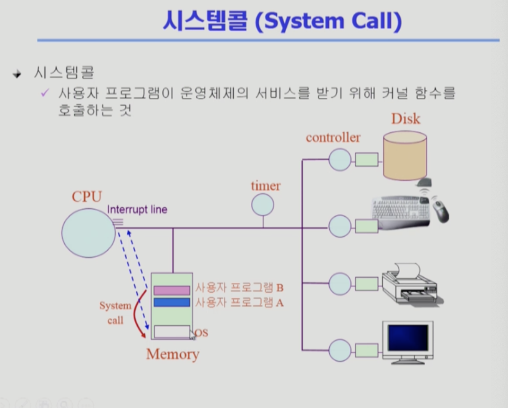

  <br/> 

### Interrupt 

인터럽트 당한 시점의 레지스터와 program counter를 save한 후 cpu의 제어 인터럽트 처리 루틴에 넘긴다

#### 넓은 의미의 interrupt

- **Hardware interrupt** : 하드웨어가 발생시킨 인터럽트 (일반적인 경우)
- **Software interrupt(Trap) :** 
  - Exception : 응용프로그램의 오류
  - Sytem call : 프로그램이 커널 함수를 호출하는 경우

- <u>작업이 완료되면 다시 hardware interrupt가 발생해 cpu에게 끝났다는 것을 알려준다.</u>

- 현대의 운영체제는 인터럽트에 의해 구동된다.

<br/>

#### interrupt 용어

1. **인터럽트 벡터**

   : 해당 인터럽트 처리 루틴 주소를 가지고 있다.

   인터럽트 종류마다 무슨일을 해야하는지 코드에 이미 정의(인터럽트 처리 루틴)되어 있다.

2. **인터럽트 처리 루틴 (인터럽트 핸들러)**

   해당 인터럽트를 처리하는 커널 함수

---

<br/> 

# 3번째 수업

## 동기식 입출력(Synchronous I/O) & 비동기식 입출력

- **Synchronous I/O**
  - I/O 요청 후 입출력 작업이 완료된 후에야 제어가 사용자 프로그램에 넘어감
  - 구현 방법 1.
    - I/O가 끝날 때까지 CPU를 낭비시킴
    - 매 시점 하나의 I/O만 일어날 수 있음
  - 구현 방법 2 .
    - I/O가 완료될 때까지 해당 프로그램에게서 CPU를 빼앗음
    - I/O가 처리를 기다리는 줄에 그 프로그램 줄을 세움
    - 다른 프로그램에게 CPU를 줌

- **Asynchorous I/O**
  - I/O가 시작된 후 입출력 작업이 끝나기를 기다리지 않고 제어가 사용자 프로그램에 즉시 넘어감
  - write 작업 시 보톹 async

*두 경우 모두 I/O의 완료는 **인터럽트**로 알려준다*


<br/> 

## DMA (Direct Memory Access)

> CPU외에 메모리 접근 가능한 장치

*I/O에 의해서 CPU가 인터럽트를 너무 많이 당해 비효율적이다.*

*--> DMA가 도와줌*

<br/>

- 블럭정도의 데이터 **정보가 쌓이면** DMA가 CPU에게 인터럽트를 걸어줌

  : CPU의 중재 없이 device controller가 device의 buffer storage의 내용을 메모리에 **block단위**로 직접 전송


<br/> 

## I/O를 할 수 있는 방식

서로 다른 입출력 명령어

- I/O를 수행하는 special intruction에 의해 (왼쪽)
- Memory Mapped I/O에 의해 (오른쪽)


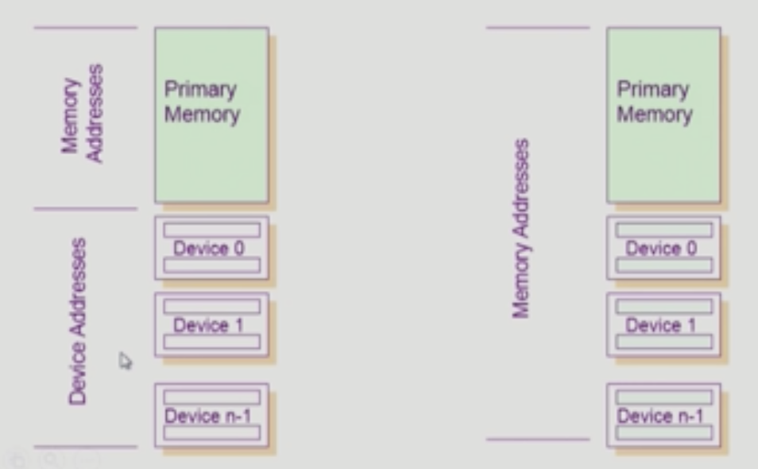

- 왼편이 일반적
  - 메모리와 디바이스에 각각 주소가 존재하고 접근하는 방식


<br/> 

## 저장장치 계층 구조 

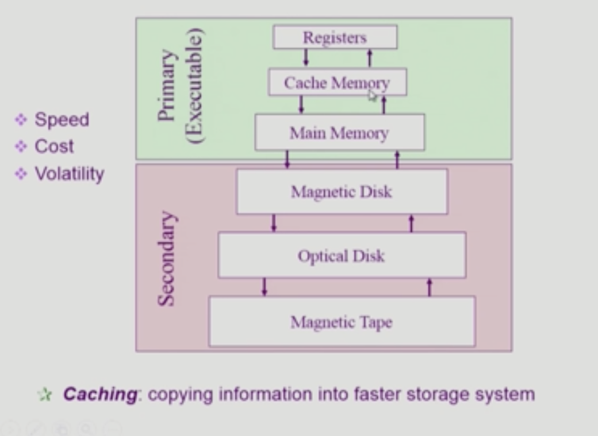

- 위로갈수록 빠르지만 비싸기 때문에 용량이 적다.
- 휘발성 : 아래쪽 - 비활성, 위쪽 - 휘발성
- CPU가 직접 접근해서 처리가능 - **Primary**
  
- CPU가 접근가능 ? **바이트** 단위로 접근 가능해야 한다.
  
- CPU가 직접 접근해서 처리불가능 - **Secondary**
  
- 하드디스크의 경우 **섹터단위**로 접근하기 때문에 불가능
  
- Register와 Main Memory간 속도차이도 크다.

  - 이에 대해 완충역할을 하기 위해 Cache Memory가 존재하는데 용량이 더 작기 때문에 모든 정보를 담을 수 없어 필요한 정보만 담는다.

    : **Caching** 

  - Caching은 재사용을 목적으로 한다. 모든 과정을 거치지 않아도 되는 효과


<br/> 

## 프로그램의 실행 (메모리 Load)

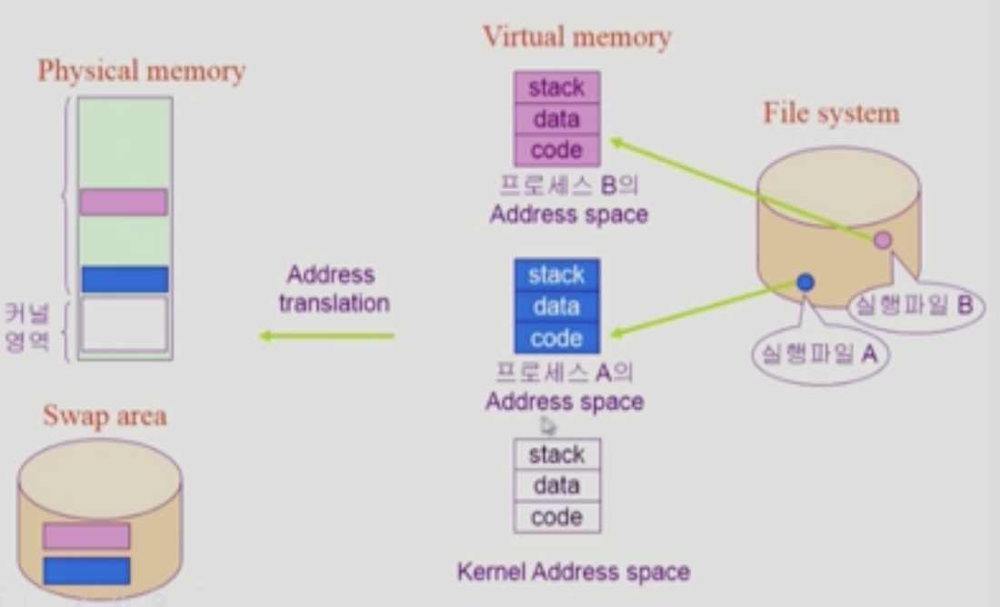

1. 프로그램 실행 (**File system**)
   - 비 휘발성 디스크
2. 각 모든 프로그램마다 가상메모리에 프로그램의 주소 공간 (**Address space**) 이 독자적으로 생긴다.
   - 주소 공간은 code(기계어 코드), data (변수 및 자료구조) , stack (함수호출 및 리턴시 사용)으로 구성된다.
3. 주소변환 **Address translation**
   - 가상메모리 주소와 physical memory주소가 다르게 올라가는데 이를 변환해주는 하드웨어 장치가 존재
4. 물리적인 메모리에 올려 놓는다.
   - 필요한 부분만 찢어서
   - 필요하지 않은 부분은 **Swap area**에 내려놓는다.
   - swap area : 휘발성 디스크 , 메모리의 부족한 용량의 연장 개념
5. 사용하지 않으면 쫓아낸다.

<br/> 

## 커널 주소 공간의 내용

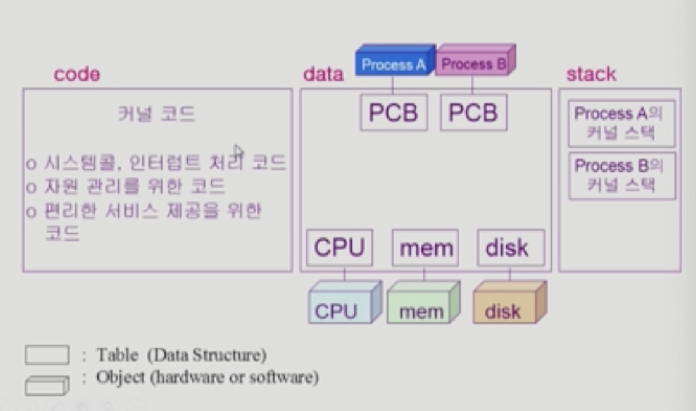

- code
  - 커널 코드
    - 자원관리를 위한 코드
    - 편리한 인터페이스 제공을 위한 코드
    - 인터럽트, 시스템콜 처리 코드
- DATA
  - 하드웨어(CPU, memory, disk)마다 만들어진 자료구조를 관리
  - PCB(Process Control Block) 프로그램이 돌아가면 그 프로그램을 관리하기 위한 관리 
- stack
  - 커널 스택


<br/> 

## 사용자 프로그램이 사용하는 함수

- 함수

  - 사용자 정의 함수
    - 자신의 프로그램에서 정의한 함수
  - 라이브러리 함수
    - 갖다 쓴 함수

  *영역 자체가 다르므로 점프가 불가능*

  *인터럽트로 cpu제어권을 넘겨 커널함수로 넘어가는 방식이어야한다.*

  - 커널 함수
    - 운영체제 프로그램의 함수
    - 커널함수의 호풀 = 시스템 콜

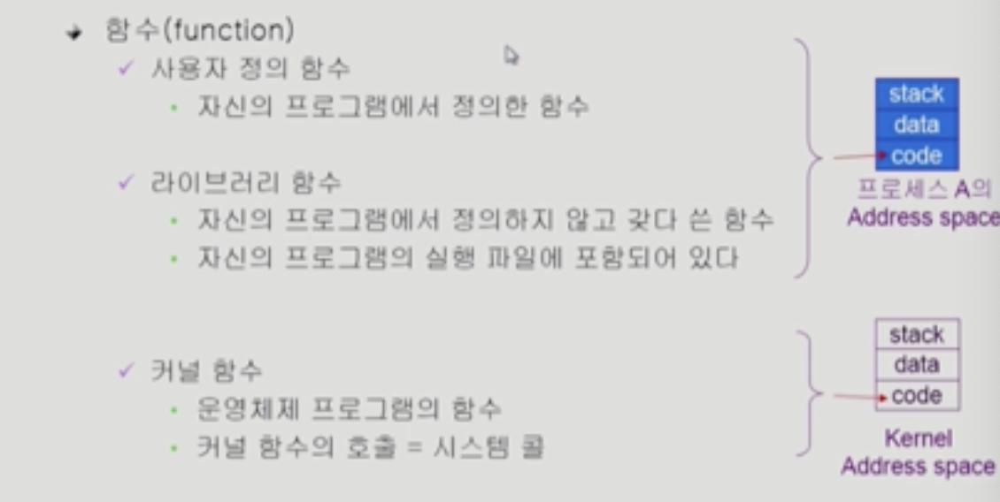

<br/> 

## 프로그램의 실행

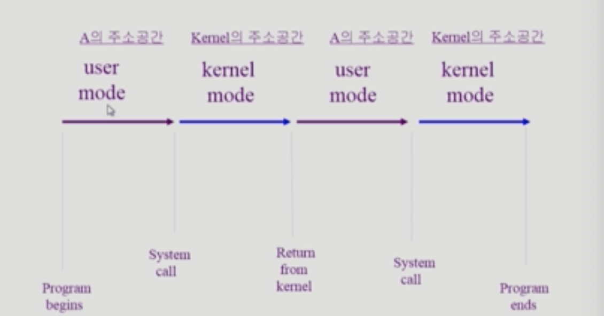


<br/> 

---

<br/> 

# 4번째 수업

## 프로세스

> Process is a program in execution
>
> " 실행중인 프로그램 "

<br/>

- **프로세스의 Context(문맥)** **<중요>**
  - CPU 수행 상태를 나타내는 하드웨어 문맥
    - **PC** (Program Counter)
    - 각종 **register**
  - 프로세스의 주소 공간(메모리 관련)
    - code, data, stack
  - 프로세스 관련 커널 자료 구조
    - PCB (Process Control Block)
      - OS에서 프로세스가 실행될 때마다 PCB를 통해 올바른지 검사한다.
    - Kenel Stack
      - 각 프로세스가 본인이 할 수 없는 일을 대신 요청 (system call)하면 PC를 가리키는것이 아니라 커널 주소공간을 가리킴.
      - 커널도 함수로 구성
      - 커널의 코도를 실행하고 커널 주소공간의 stack에 정보를 저장한다
      - 이때 프로세스별로 구분해서 저장한다.

- *문맥을 모르면 다음 프로세스 진행 시 처음부터 다시 해야한다.*


<br/> 

## 프로세스의 상태

프로세스는 상태가 변경되며 수행된다

- **Running**
  - CPU를 잡고 instruction을 수행중인 상태
- **Ready**
  - CPU를 기다리는 상태(메모리 등 다른 조건을 모두 만족하고 있다는 전제)
- **Blocked(wait, sleep)**
  - CPU를 주어도 당장 instructiond를 수행할 수 없는 상태
  - Process 자신이 요청한 event(오래걸리는 I/O 작업) 가 즉시 만족되지 않아 이를 기다리는 상태
  - EX) 디스크에서 file을 읽어와야 하는 경우
- [Suspended(stopped)](#중기-스케줄러-때문에-추가된-프로세스의-상태)

- *New : 프로세스가 생성중인 상태*
- *Terminated : 수행이 끝난 상태이지만 정리할게 남아 있는 상태*

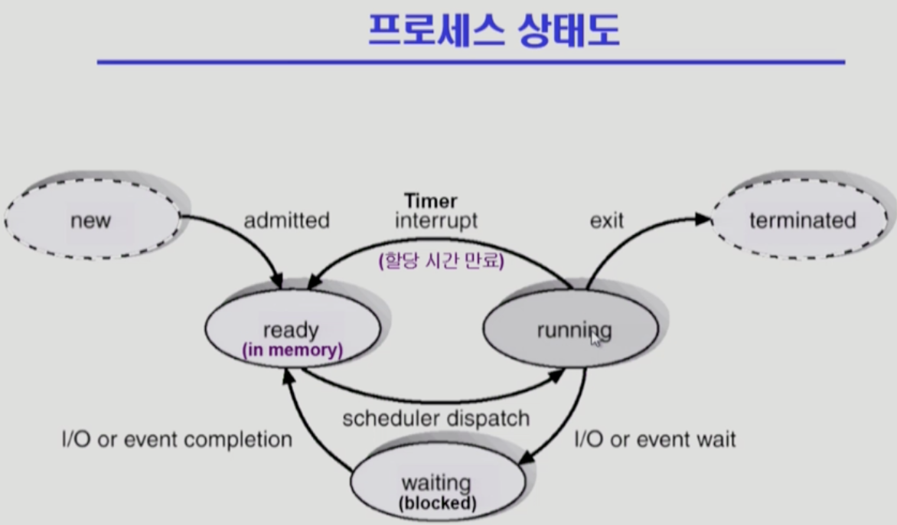

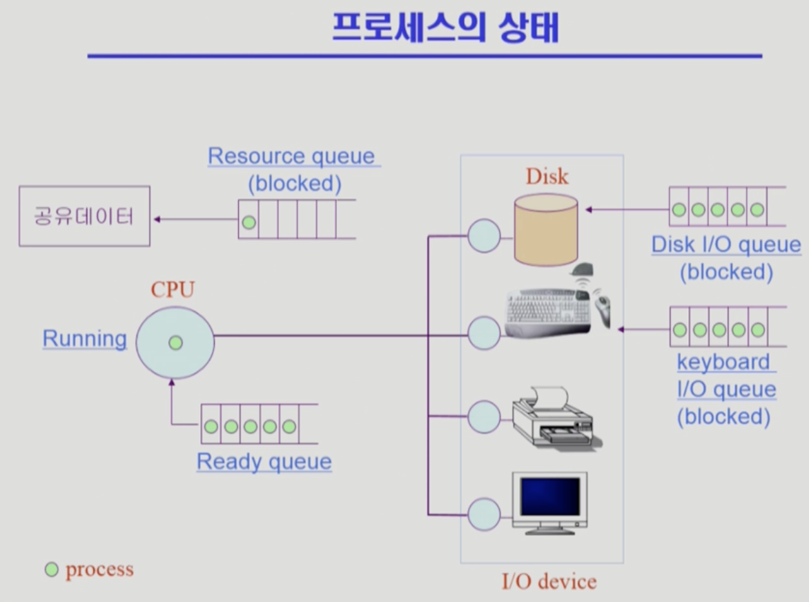

<br/> 

## PCB

- 운영체제가 각 프로세스를 관리하기 위해 프로세스당 유지하는 정보

- 구성 요소

  1. OS가 관리상 사용하는 정보
     - Process state, Process ID
     - scheduling information, priority
  2. CPU 수행 관련 하드웨어 값
     - Program Counter, registers
  3. 메모리 관련
     - Code, data, stack의 위치 정보
  4. 파일 관련
     - Open file descriptors..

  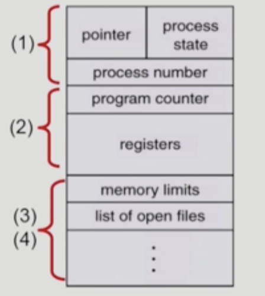

  

<br/> 

## 문맥 교환 (Context Switch)

- CPU를 한 프로세스에서 다른 프로세스로 넘겨주는 과정

- CPU가 다른 프로세스에게 넘어갈 때 운영체제는 다음을 수행

  - CPU를 내어주는 프로세스의 상태를 그 프로세스의 PCB에 저장
  - CPU를 새롭게 얻는 프로세스의 상태를 PCB에서 읽음

  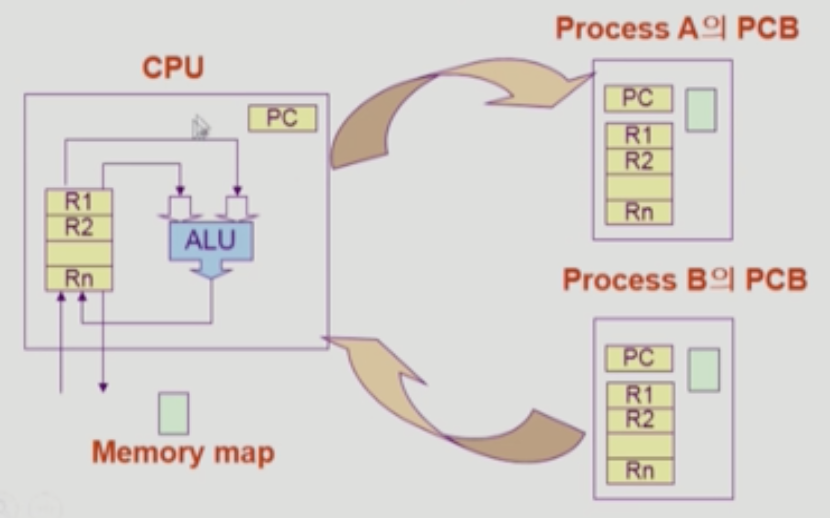

  <br/> 

- System call 이나 Interrupt 발생시 반드시 context switch가 일어나는 것은 아니다.

  -  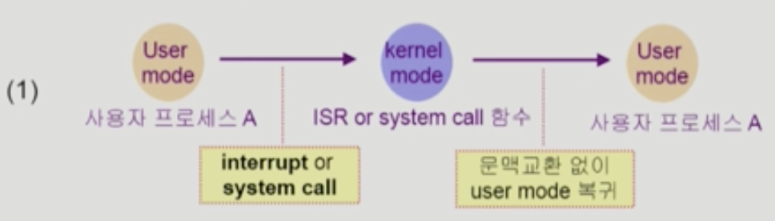
    - Interrupt가 발생했지만 Kernel 모드에서 요청된 건을 수행 완료하고  다시 UserMode로 복귀한 것 (Switch X)
<<<<<<< HEAD

  <br/> 

  

  - 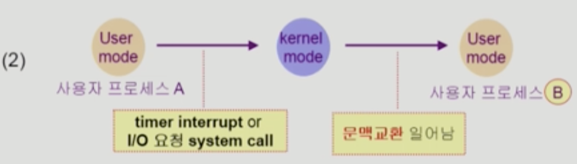
    - timer interrupt는 CPU를 다른 프로세스로 넘기기 위한 의도를 가진 인터럽트

  <br/> 

- (1)의 경우에도 메모리 <--> kernel 사이에 CPU컨텍스트를 위한 PCB 저장이 필요하지만 (2) 경우보다 오버헤드가 덜 하다.
  
  - ex. Cache Memory flush
- CPU - (<u>Cache Memory</u>) - 메인메모리
  - 문맥교환이 이루어지면 캐시 메모리는 모두 지워져야 한다.
  - (1)번 경우에는 이렇게까지 할 필요는 없다.

<br/> 

## 프로세스를 스케줄링하기 위한 큐

- **Job Queue**
  - 현재 시스템에 있는 모든 프로세스의 집합 가장 큰 범위
- **Ready Queue**
  - 현재 메모리 내에 있으면서 CPU를 잡아서 실행되기를 기다리는 프로세스의 짖ㅂ합
- **Device Queue**
  - I/O device의 처리를 기다리는 프로세스의 집합
- 프로세스들은 각 큐들을 오가며 수행된다.
- Ready Queue에 있으면 Device Queue에 없다. 반대도 마찬가지

<br/> 

## 스케줄러

- **Long-term scheduler (장기 스케줄러 or Job scheduler)**
  - 시작 프로세스 중 어느 것을 ready-queue로 보낼지 결정
  - 프로세스에 memory(및 각종 자원) 을 주는 문제
  - degree of Multiprogramming을 제어
    - Multiprogramming : 메모리에 여러 프로그램이 동시에 올라가는 것
    - <u>프로그램이 몇개 올라가 있는 프로세스의 수를 제어</u>
  - time sharing system에는 보통 장기 스케줄러가 없음 (무조건 ready)
- **Short-term scheduler (단기 스케줄러 or CPU scheduler)** 
  - 짧은 시간단위로 스케줄링이 이러우점
  - millisecode단위, 충분히 빨라야함
  - 프로세스에 CPU를 주는 문제
  - 어떤 프로세스를 다음번에 running시킬지를 결정
- **Medium-term scheduler (중기 스케줄러 or swapper)** 
  - 여유 공간을 마련하기 위해 일부 프로그램을 골라서 프로세스를 통째로 메모리에서 디스크로 쫓아냄
  - 프로세스에게서 **memory를 뺏는 문제**
  - Degree of multiprogramming 을 제어

<br/> 

### 중기 스케줄러 때문에 추가된 프로세스의 상태

: **Suspended(stopped)**

- 외부적인 이유로 프로세스의 수행이 정지된 상태
- 프로세스는 통째로 디스크에 swap out된다.
  - 사용자가 프로그램을 일시 정지시킨 경우 (break key)
  - 시스템이 여러 이유로 프로세스를 잠시 중단시킴 (메모리에 너무 많은 프로세스가 올라와 있을 때)


- *Blocked : 자신이 요청한 event가 만족되면 Ready*
- *Suspended : 외부에서 resume해 주어야 Active*

<br/> 

**프로세스 상태도 ( User Mode 기준 )**

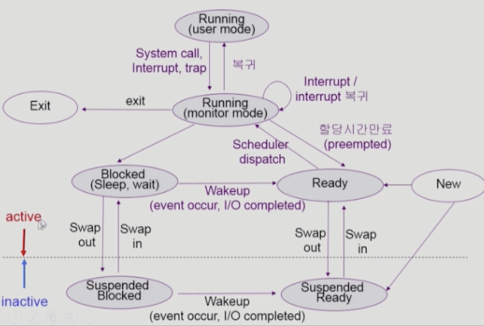

<br/> <br/> 

# 5번째 수업

## 스레드 ( Thread )

> ' lightweight process ' 
>
> CPU를 수행하는 단위
>
>  하나의 CPU 안에 프로세스 내부에 실행 단위가 여러개 있는 것.

<br/> 

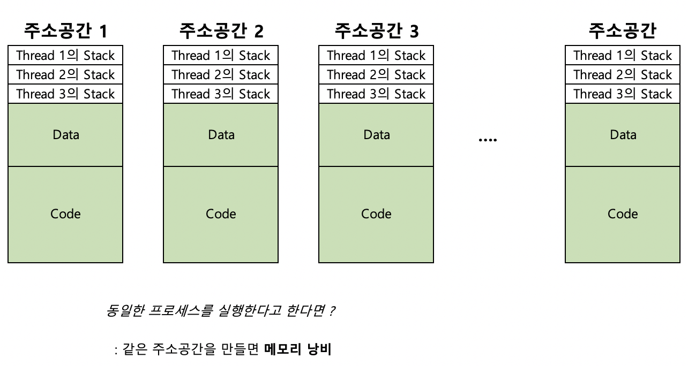

<br/>


<br/> 

- **Thread 의 구성**

  - Program Counter
  - register set
  - Stack space

  <br/> 

- **Thread가 동료 thread와 공유하는 부분** (= task)

  - **code** section
  - **data** section
  - **OS** resources


<br/> 

- **장점**

  1. **Responsiveness** (응답성)

     : 스레드가 하나가 *blocked상태*일 때, 다른 스레드가 CPU를 잡아 빠른 응답처리가 가능하다.

  2. **Resource Sharing**

     : binary code, data, 프로세스 자원들을 공유할 수 있다.

       똑같은 일을 반복하는 작업 시 스레드를 통해 장점이 발휘된다.

  3. **Economy**

     1. process를 만드는 것 자체는 오버헤드가 꽤 큰편이지만 대신에 thread를 만들면 가볍다.
     2. CPU switching : context switching은 오버헤드가 상당히 큰 편이다. 대신 thread간 switching은 보다 간단함.
     3. 병렬성 증가 (CPU가 여러개 달린 컴퓨터에서만 해당됨)
     4. 동일한 일을 수행하는 **다중 스레드가 협력**하여 높은 처리율 (throughput)과 성능향상

  *cpu가 하나일 경우*

  ---

  *MP일 경우*

  4. **Utilization of MP(multi processor) Architectures**

  

<br/>

- kernel에 의해 지원받는 경우
  - **kernel Threads**
  - 스레드가 여러개인 것을 **CPU가 알고** 있는 경우

- library에 의해 지원받는 경우
  - **User Threads**
  - 커널 지원 X, 사용자 수준 ,약간의 제약점 존재 가능
- real-time threads

<br/> <br/> 

# 6번째 수업

## 프로세스 

> 시스템 콜
>
> ​	fork(), exec(), wait(), exit()

### 프로세스 생성

> Copy-on-write(COW)
>
> : 내용이 바뀔때(write) copy한다(물리적인 메모리에 할당된 정보만) 는 의미

- 부모 프로세스가 자식 프로세스를 생성한다 (복제 생성)
  - Parent(1) -> children (n)
- 프로세스의 트리(계층구조) 형성
- 프로세스는 자원을 필요로한다.
  - 운영체제로부터 받는다
  - 부모와 공유한다.
- 자원의 공유
  - 부모와 자식이 모든 자원을 공유하는 모델
  - 일부를 공유하는 모델
  - 전혀 공유하지 않는 모델
- 수행 (Execution)
  - 부모와 자식은 공존하며 수행되는 모델
  - 자식이 종료(terminate)될 때까지 부모가 기다리는 모델

- 주소공간

  - 자식은 부모의 공간을 복사함 (binary and OS data)
  - 자식은 그 공간에 새로운 프로그램을 올림

- 유닉스의 예

  - **fork()** 

    - 시스템 콜이 새로운 프로세스를 생성

    - 부모를 그대로 복사

    - 주소공간 할당

      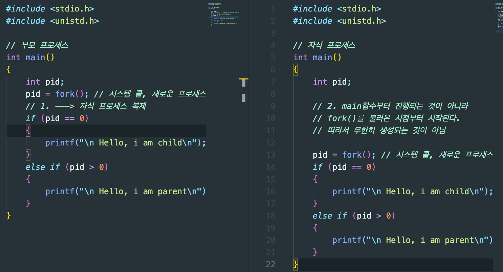

      - Parent process : pid > 0
      - Child process : pid = 0

  - **exec()**

    - 시스템 콜을 통해 새로운 프로그램을 메모리에 올림 (덮어씌움)

    - 예제1)

      - ```c
        #in	clude <stdio.h>
        #include <unistd.h>
        
        // 부모 프로세스
        int main()
        {
            int pid;
            pid = fork(); 
            if (pid == 0)
            {
                printf("\n Hello, i am child\n");
                execlp("/bin/date", "/bin/date", (char *)0);
            }
            else if (pid > 0)
            {
                printf("\n Hello, i am parent\n");
            }
        }
        ```

      - 새로운프로그램이 생성된다

      - ```c
        //자식 프로세스
        int main(){
          ...
        }
        ```

      

    - 예제 2)

      - ```c
        int main(){
          printf("1");
          execlp("echo","echo","hello","3",(char*)0);
          print("2");
        }
        ```

        - 2는 영원히 출력 불가능

    - <u>다시 되돌아 올 수 없음</u>

  - **wait()**

    - 호출하면 커널은 child가 종료될 때까지 프로세스 A를 sleep시킨다(block상태)
    - Child process가 종료되면 커널은 프로세스 A를 깨운다 (ready상태)

  - fork, exec 은 운영체제를 거쳐서 진행된다.

<br/>

###  프로세스 종료

- **exit** : 프로세스가 마지막 명령을 수행한 후 운영체제에게 이를 알려줌 (자발적)
  - 자식이 부모에게 output data를 보냄 (via wait)
  - 자식이 먼저 종료가 되어야한다.
  - 프로세스의 각종 자원들이 운영체제에게 반납됨

- **abort** : 부모프로세스가 자식의 수행을 종료시킴 (비자발적)
  - 자식이 할당 자원의 한계치를 넘어섬
  - 자식에게 할당된 task가 더이상 필요하지 않음
  - 부모가 종료(exit)하는 경우
    - 운영체제는 부모 프로세스가 종료하는 경우 자식이 더 이상 수행되도록 두지 않는다
    - 단계적인 종료

- 자발적 종료
  - 마지막 statement 수행 후 exit() 시스템 콜을 통해 
  - 프로그램에 명시적으로 적어주지 않아도 main함수가 리턴되는 위치에 컴파일러가 넣어줌
- 비자발적 종료
  - 부모 프로세스가 자식 프로세스를 강제 종료
    - 자식 프로세스가 한계치를 넘어서는 자원 요청시
    - 자식에게 할당된 task가 더이상 필요하지 않음
  - 키보드로 **kill**, **break** 등을 친 경우
  - 부모가 종료(exit)하는 경우
    - 부모 프로세스가 종료하기 전에 자식들이 먼저 종료됨


<br/> 

### 프로세스 간 협력

> 프로세스는 매우 독립적

- 독립적 프로세스

  - 프로세스느 원칙적으로 하나의 프로세스가 다른 프로세스에 영향을 미치지 못한다.

- 협력 프로세스

  - 협력 메커니즘을 통해 영향을 미치는 경우

- 프로세스 간 협력 메커니즘 (**IPC** : Interprocess Communication)

  - 메시지를 전달하는 방법

    : **message passing** : 커널을 통해 메시지 전달 (*직접전달하는 방법은 없다*)

    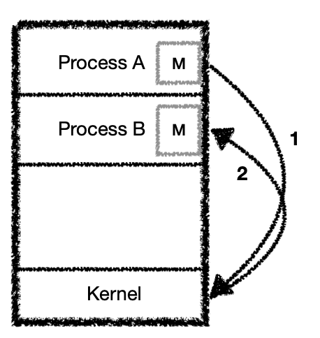

    <br/> 

  - 주소공간을 공유하는 방법

    : **shared memory** : 서로 다른 프로세스 간에도 일부 주소 공간을 고유하게 하는 메커니즘

    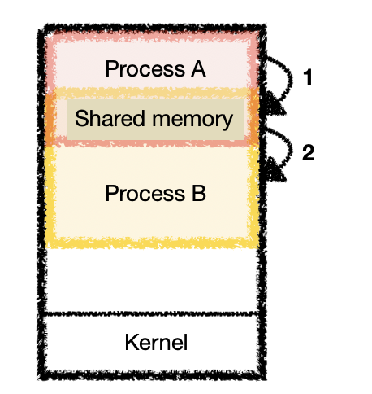

<br/> 

#### message passing 

> message system
>
> ​	: 프로세스 사이에 공유변수를 일체 사용하지 않고 통신하는 시스템

1. Direct Communication

   : 통신하려는 프로세스의 이름을 명시적으로 표시

   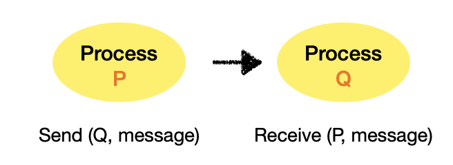

   

   

2. Indirect Communication

   : mailbox(또는 port)를 통해 메시지를 간접 전달

   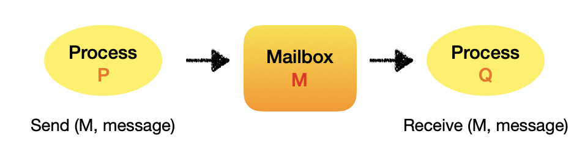

   

   

   

   