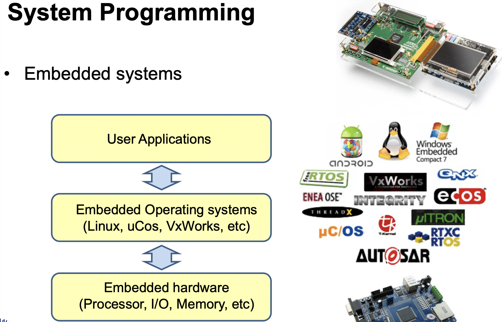
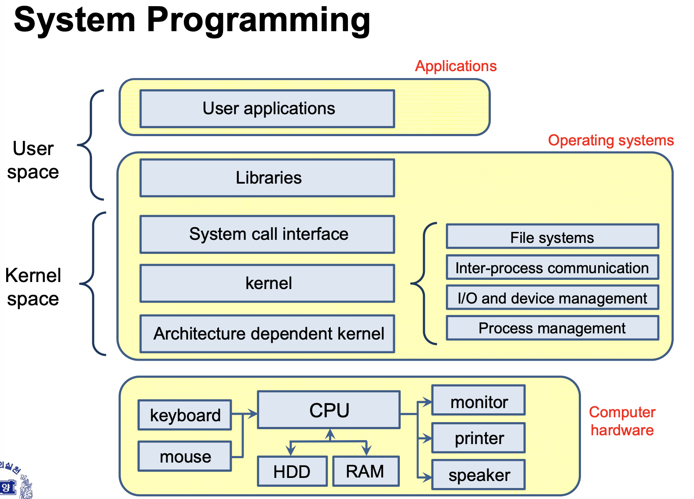
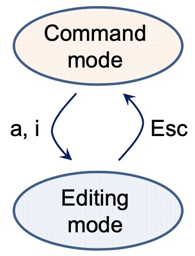

# 목차

[강의1](#1번째-강의)

[강의2](#2번째-강의)

[강의3](#3번째-강의)

---

<br/> 

# 1번째 강의


---


## 1. Computer System 구성

- Apllications
- Operating systems(OS)
  - 어떤 운영체제는 기본은 비슷하다. 
    - 스케줄링, 스레드, 프로세스 ,메모리관리 등등
- Computer hardware

---



- 엄밀히 말혀먼, 컴퓨터 시스템도 Embeded시스템 구성중 하나다.
  - ( HW + SW의 결합 Embeded systems ) 

<br/>

## 2. Embeded System 구성

- User applications
  - Android, OS, ...
- Embeded Operating systems
  - 실제로 임베디드를 개발하는 일부 개발자들이 접하는 시스템
  - Linux가 대표적
- Embeded hardware
  - Ex ) 스마트폰

---

### Computer System 구조



- 하드웨어와 가장 처음 맞물리는 부분을 **Architectur dependent kernel**
  - **Architecture** : 컴퓨터 구조
  - x86 (intel 프로세서 구조), ARM(임베디드 프로세스), ...
  - **OS구조 중 가장 바닥**에 있어 하드웨어의 구성에 맞춰 상위 프로그램들을 수행


- 바로 위 **kernel**

  - OS중 가장 핵심적으로 다루는 부분을 kernel이라고 부른다.

  - kernel의 대표적인 4가지 기능들

    - **File systems** (핵심)

      : 각 운영체제 안에서 데이터를 파일, 폴더 등의 형태로 저장하기 위함, ( FAT, HPFS, .. ) , 상이한 운영체제에서는 호환이 잘 안됨

    - Inter-process communication

      - Process간 서로서로 통신을 한다는 의미
      - 실제 사용자에게 직접적으로 느껴지지 않는 부분. 프로세스는 컴퓨터 내부에서 이루어지기 때문.

    - I/O and device management 
      
      - device관리
    - **Process management** (핵심)
      - OS는 내부적 동작 시 기본적 단위는 **프로세스**
      - 그 프로세스들이 여러가지가 될수도 없어질수도 변화할수도 있기 때문에 그에 맞게 프로세스를 맞추기 위해서는 메모리 관리도 필수적이다.


- <u>**System call Interface**</u>

  - 간단하게는 API와 같은 것.
  - kernel or OS 기능들을 함수화 되어있는 부분들.
  - **hardware OS간 연동해아하는 경우**가 많이 있는데 이를 interface를 이용해 거기에 정의되어있는 함수를 콜하는 것.

  

- **Libraries**

  - 위에 함수 구현을 위해 Libraries에 다 구현이 되어있다.


---


## 3. History of Microprocessors

*하드웨어에 따라 OS가 달라지는 경우가 있기 때문에 Microprocessor에 대해 간단히 알 필요가 있다.*

1. intel이라는 회사의 역사와 함께한다.

2. 1960이후, **4비트 ms 개발 -> 8비트 -> 16비트**

3. 발전하게 된 계기는 클럭 속도(**MIPS**) 가 향상되면서 부터

   1. **MIPS** ( Million Instruction per Second )

      : 1초에 백만개 interaction 수행 가능, ( 2MIPS 는 1초에 2백만개 수행 가능 )

4. 90년 후반, 클럭 스피드는 3Ghz 기준으로  물리적으로 향상에 한계가 옴

5. 클럭스피드 뿐만 아니라 **병렬 프로세싱**으로 결정내림 

   1. Dual core, Hexa Core , ... 
   2. 대표적으로 Intel Xeon 
   3. 그위에 돌아가는 OS가 그 코어를 잘 이용하게 끔 OS가 구성 되어야함.

   

---


## 4. History of OS

- **mainframes** (1950's)

  1. 굉장히 크고, 운영체제로 돌아가는 컴퓨터가 아니였다.
  2. 자기네들이 개발한 OS (proprietary OS)
  3. 개인 소유 X
  4. batch processing
  5. VMX 하드웨어의 한 종류
  6. 초창기 Unix 개발
  7. 하드웨어가 굉장히 Bulky하고 소유하기 어려웠다. -> 수만명의 사람이 공유를 해야만 함
     : 여러사람과 공유하는 **multiuser OS**가 필요하게 됨 (현재 Unix의 장점)

  

- **초창기 Personal computers** (1970's)

  1. 호환이 되지 않거나 OS가 없는경우 중구난방

  2. CP/M : 그나마 많이 쓰인 OS

     : 초창기 Apple에서도 쓰임, 현재도 쓰이는 OS에 큰 영향을 줌.

  

- **PC's and Macs** (1980's)

  1. 개인용 컴퓨터가 널리 쓰이게 됨
  2. 하드웨어의 발전 : Microprocessor가 많이 쓰이게 됨
  3. IBM에서 MS에게 OS개발을 요청함
  4. MS의 DOS운영체제 출현 (CP/M에서 많은 영향을 받음)
     1. <u>command-line OS</u>


- **GUI(Graphical user interface)** (1980's)
  1. Apple Lise, Macintosh


- **1990's ~**
  - microprocessors가 굉장히 빠르게 발전하며 OS도 빠르게 발전함
  - Multi-threading & multi-processing 기능들을 주로 지원하는 형태로 OS가 발전


---


### OS의 타입

- Simple Batch System (옛날)

  

- Multiprogramming Batch System (time-sharing systems)

  - 현재쓰는 OS에도 이런기능이 들어가 있다. 
  - 하드웨어는 하나인데 동시에 돌릴 수 있도록

  

- MultiProcessor System

  - 하드웨어가 여러개가 들어갈 수 있기 때문에 이를 잘 관리할 수 있는 OS가 필요

  

- Distributed OS

  - 물리적으로 컴퓨터, 하드웨어가 여러개로 분산되어 있는 경우

  

- Real-time OS

  - 일반적인 OS와는 다소 다름
  - 일반적인 OS ? real-time을 보장은 못함
  - 어느경우에 사용하나 ? 여러가지의 다양한 프로세서가 돌아가는데 절대적으로 맞추어야 하는 deadline이 있는데 굉장히 타이트하다.
    - 유도탄 미사일 예시


---


### C 프로그램 개발 환경

*C 프로그래밍시 이루어지는 동작들에 대한 이해가 필요*

1. 프로그래밍 
2. 컴파일
   1. 내부에 무슨일이 일어나는지 이해하자


### 컴파일 시 동작

1. Preprocessr 가 동작 (선처리)
   1. 실행되는 binary코드를 골라내고, 컴파일러에 **추가적인 정보**를 제공하기 위한 directives 영역( Ex.`#include <stdio.h>`) 존재
2. 코드부분만 골라내 실질적인 compile이 이루어짐
   1. 변수들을 골라내고 메모리 영역으로 배치를 하고 컴파일러를 하게 된다.
   2. assembly code, binary file 등이 나온다 (object code 생성)
3. Linker
   1. 컴파일러에서 만든 오브젝트 코드들을 링크해서 하나로 붙인다.
   2. 실행 파일이 나온다
4. Loader (실행파일 실행 )
   1. 5개 정도의메모리에 배치
5. 메로리를 읽어와 CPU가 실행


<br/> <br/>

# 2번째 강의

## 1. 텍스트 에디터

### 종류

- **vi**
  - 가장 널리 쓰임
  - Cross-platform
- **gEdit**
  - 윈도우즈와 비슷
  - Cross-platform
- **Nano editor**
- **Emacs editor**
  - 굉장히 오래된 에디터
  - 전문가에게 적합

<br/>

#### Vi Editor

- `vi {filename}`

  예 )` vi new_text`

  - 기존 파일 존재하면 Open
  - 없으면 새로운 file생성
  - **확장자라는것이 없다.**

  <br/>

##### 모드 (Vi Modes of Operation)

1. Command mode ( 최초 실행시  동작 )

   - 커서 이동

     - 한줄한줄 그리고 페이지 이동도 가능

   - 검색

   - Command mode로 변환 : `ESC` 키 이용

   - Editing mode로 변환 : `a` (append), `i`  (insert) 키 이용

     

2. Editing mode

<br/>

##### Vi command 명령어

1. `:q` : 수정한게 없이 바로 나가는 경우

   `:q!` : 수정한게 있더라도 저장하지 않고 나감

   <br/>

2. `wq` : 수정사항 저장 후 나가기

   `w` : 수정사항 저장, 나가지 않음

   <br/>

3. h / j / k / l : 좌 하 상 우

   편집중에 Edit mode와 command mode 왔다갔다하기 불편하므로 커서키로도 이동 가능

   <br/>

4. 삭제 관련 명령어

   - `x` : 글자 삭제

   - `2x` ( 10x ... etc) :  2글자 삭제 (10글자 삭제)

   - `u` : 실행 취소

   - `dd` : 커서가 위치해 있는 한 줄삭제

   - `2dd `: 연속되어 있는 줄 삭제 ( 다음 2둘도 삭제 )

   - `s` : 글자를 덮어쓰기로 수정 (대체)

   - `d^ `: 커서 위치부터 그 줄에 맨 앞까지 삭제

   - `d$` : 커서 위치부터 그 줄에 맨 뒤까지 삭제

   - `dw` : 커서가 위치된 단어만 삭제

   - `p` : 붙여넣기

     - 복사를 안했는데 ?

       : 어떤식으로 삭제 명령을 하게 된다면, 삭제와 동시에 클립보드에 copy가 된다.

   - `yy` : 지우면서 복사를 하지 않고 그대로 copy기능을 수행

     - 10줄 복사 ? `10yy`

<br/>

5. 이동 관련 명령어 ( `^` : control )
   - `:linenum` : 해당하는 줄로 이동
   - `^f ` : 바로 다음 페이지
   - `^b` : 이전 페이지
   - `w` : 다음 단어로 커서 이동
     - `3w` : 3단어 뒤로 이동
   - `b` : 이전 단어로 커서 이동
   - `5G` : 5th 줄로 이동 (G : go)

<br/>

## 2. 컴파일

### **GCC**

> Linux환경에서 가장 널리 쓰이는 GNU컴파일러(오픈소스)

- gcc : C 코드 컴파일러
- g++ : C++ 코드 컴파일러
- console-based 컴파일러
  - Graphic 이 아닌 **콘솔창(터미널) 환경**

- 실행하면
  1. Preprocessing 
  2. Compilation
  3. Assembly
  4. Linking 

- 도움말 : `man gcc`

<br/>

####  GCC options (or Flags)

- `-c`

  : 링크는 하지 않고 컴파일하라

  **Object 파일**로 ouput발생

- `-o <filename>`

  : 구체적으로 정해주지 않으면 default값의 파일명(Ex. a.out)으로 나온다.

- `-g`

  : 디버그 정보 추가

  *디버깅 해야 하는 경우 ?*

  *: 컴파일 및 링크까지 성공해서 실행시켰는데 오류 발생하는 경우 ( 메모리 문제 등 )*

  gdb라는 디버거를 통해 디버깅을 할 수 있다.

- `-Wall`

  : 경고를 모두 표시

- `-I <path>`

  : 디렉토리로부터 header파일을 찾는 경우 경로를 지정

- `-L <path>`

  : 디렉토리로부터 Library를 찾는 경우 경로를 지정

- `-l <library name>`

  : 특정 라이브러리를 지정 

- `-Werror`

  : warning을 error로 표시해라

  <br/>

- *예시*

  - `gcc hello_world.c`

    : a.out 생성 (default값)

  - `gcc -c hello_world.c`

    : hello_world.o (링크를 하지 않은 오브젝트 파일 생성)

  - `gcc hello_world.c -o hello_world`

  - `gcc -g hello_world.c -o hello_world`

  - `gcc hello_world.c -o hello_world -lmath`

    : math라이브러리 사용

  <br/>

#### Makefile

보통 프로젝트안에는 c코드 및 헤더파일이 매우 많다.

프로젝트 빌드를 하면 컴파일 된 후 최종적 실행파일이 나온다.

이러한 과정을 도와주는 것이 **Makefile**이다

`make` 명령어로 makefile이라는 이름을 찾는다. 

- Make
  - 프로그램 빌딩을 간단하게 해줄 수 있는 Tool
- CMake
  - 대형 프로젝트인 경우 여러 컴퓨터에서 실행될 때, 다양한 환경에 맞출 수 있다.

<br/>

예시1)

```makefile
hello : main.o display.o hello.o #(--> dependency)
	gcc main.o display.o hello.o -o hello #(--> link만 해준것)

clean :
	rm -rf *.o hello

main.o : main.c
	gcc -c main.c
	  # : main.o파일이 생성 (hello rule로부터의 의존파일)
	  
display.o : display.c
	gcc -c display.c
		# : main.o파일이 생성 (hello rule로부터의 의존파일)
		
hello.o : hello.c
	gcc -c hello.c
		# : main.o파일이 생성 (hello rule로부터의 의존파일)
```

- make를 실행하면

  **항상 첫번째 rule**을 실행한다.사실 항상 최종 명령이다.
  밑에 있는 rule들이 하나하나 실행된다.

  `make hello `

  ​	: 특정 rule을 지정해서 실행 가능하다.

- clean (`make clean`)은 ?
  
  - 보통 프로그램 수정이 필요할 경우, 수정 후 컴파일을 다시해야 할 때, 그 전 빌드업 했던 데이터를 삭제하고 다시 하고 싶을 경우 사용.


<br/>

예시2) 

매크로 사용해서 맵핑하는 방법 **`$(변수)`** 

```makefile
CC=gcc
CFLAGS = -g -Wall
OBJ:=main.o display.o hello.o
EXE=hello

all:$(EXE)

$(EXE) : $(OBJ)
	$(CC) $(OBJ) -o $(EXE)
	
hello.o : hello.h hello. c
	$(CC) $(CFLAGS) -c hello.c
	
...
```


<br/> 

##### Makefile의 구성요소

- Comments ( `#` )

- Rules

  - 2줄로 구성

    ```makefile
    #룰 이름 : #dependency
    hello.o : hello.c
    	gcc -c hello.c
    ```

    <br/>

- Dependency Lines

  ```makefile
  hello.exe : main. o hello.o #dependency line
  	gcc main.o hello.o -o hello.exe #Shell Line
  	
  #	rule을 실행하기 위해 main.o, hello.o 가 필요하다
  # 만약 main.o 혹은 hello.o가 상태가 변하였다면,
  # 해당 rule은 다시 컴파일해야 한다.
  # 컴파일 전 체크하게 된다.
  ```

  <br/>

- Shell Lines

  ```makefile
  hello.exe : main. o hello.o #dependency line
  	gcc main.o hello.o -o hello.exe #Shell Line
  	
  	#주의!!
  	#		앞에 공백!
  	# 	스페이스바로 인한 공백이 아닌 Tab키를 이용해 공백을 주어야한다.
  ```

  <br/>

- Macros

  ```makefile
  HOME = /home/user1
  PROJ = $(home) /my_project
  CINC = $(PROJ)/include
  LIB = $(PROC)/lib
  INCL = -I$(PROJ) -I$(CINC) -L$(LIB)
  ```

  <br/>

- Inference Rules (`%`)

  wild card의 의미

  ```makefile
  %.o : %.c
  ```


<br/>

---

<br/> 

# 3번째 강의

## C언어에서의 포인터의 사용

### 포인터 

> 변수의 값을 직접 다루는 것이 아니라 메모리의 주소 값을 다루는 것.
>
> 어떠한 변수의 메모리의 주소값이 필요할 경우가 있다.

<br/> 

- **Reference operator(&)**
  - &a : a의 주소값

- **Pointers**

  - 선언하는 방법 : `int *b;` 

    : b라는 변수를 포인터로 선언한다.

- 메모리를 접근하거나 주소를 바꾸기(manipulate)위해 사용

- `int a;` 
  - 컴파일 - 실행파일 실행 -> int a가 실행이 될때, a는 메모리 주소와 맵핑이 된다. 맵핑되는 주소값으로 실행.

<br/> i*nt 의 크기는 32비트, char 는 8비트*

`int *b;`

`char *c;`

b,c  변수 안에 값이 할당되어 있는 것이 아닌 **주소**가 담겨있다.

가리켜진(Pointing) 주소에 비로소 값이 있는 것.

이때 **b의 크기는 32비트**

- *왜 32비트 ?*
  - 32비트 컴퓨터 기준으로 한 것. ( 2^32 (4GB) 만큼 가능한 주소번지 수, 64비트는 2^64)
- 그렇다면 **c의 크기는 ?**
  - **따라서 c의 크기는 8비트가 아닌 32비트이고, c가 가리키는 주소의 크기가 8비트가 된다.**

<br/>

*예1*

```c
#include <stdio.h>

int main()
{
    int val = 10;

    printf("val : %d, Address : %d \n", val, &val);
    return 0;
}

//결과
//  val : 10, Address : -489773288
// address는 매번 실행할 때마다 변할 수 있다.
```

<br/> *예2*

```c
#include <stdio.h>

int main()
{

    int *pv;
    int num = 20;
    printf("[pv] Adress : %d, Content : %d \n", pv, *pv);
    // [pv] Adress : -431319248, Content : 0

    printf("[num] Adress : %d, Content : %d \n", &num, num);
    // [num] Adress : -292436212, Content : 20

    pv = &num;
    printf("[pv] Adress : %d, Content : %d \n", pv, *pv);
    // [pv] Adress : -319117556, Content : 20
    // pv가 num의 주소값에 간다. pv가 num의 주소에 가게 된다. (링크가 된다.)

    num = 11;
    printf("[pv] Adress : %d, Content : %d \n", pv, *pv);
    // [pv] Adress : -345671924, Content : 11
    // num의 값이 11로 바뀌었다. (링크된 num의 값이 변경)

    *pv = 2;
    printf("[num] Adress : %d, Content : %d \n", &num, num);
    // [num] Adress : -508496116, Content : 2
    // pv에 연결된(링크된) 것은 num이다.
    // 이 pv가 연결된 num의 값을 2로 변경한다는 의미

    return 0;
}

//결과
//  val : 10, Address : -489773288
// address는 매번 실행할 때마다 변할 수 있다.
```

<br/> *예3 ) 흔히 하는 실수*

```c
#include <stdio.h>

int main()
{

    int *pv, val;
  //1.
    pv = val; // 오류
	//2.
    *pv = &val; // 오류 : pv가 따라간 값은 정수가 나오는데 val은 주소값이다. 
	//3.
    *pv = val; // Good
	//4.
    pv = &val; // Good 
    return 0;
}
```

*3번과 4번은 같은 것인가?*

- 3번은 pv가 가리키는 주소에 해당하는 값을 val로 치환하는 것 (연결성X)
- 4번은 pv의 주소값에 val의 주소값을 대입하는것 (연결성O)

<br/> 

*예4)*

**address항상 byte로 이루어짐**

char타입의 경우 (*8bit는 1byte*) **1byte씩 증가**

int타입은 32비트를 차지하는데, 32비트는 **4바이트**임

따라서 int타입의 경우 **index하나당 4바이트를 차지**한다.

Index가 하나씩 증가할때마다 **주소는 4씩 증가.**

<u>접근하려면 데이터 타입에 따라 +하는 바이트의 수가 달라져야 한다.</u>

```c
#include <stdio.h>

int main()
{

    char c[4] = {'a','b','c','d'};
    int d[4] = {5,6,7,8};

    int i ;

    for ( i = 0; i < 4; i++)
    {
        printf("Address of c[%d] = %x\n", i, &c[i]);
        printf("&c[%d] = %x, (c+%d) = %x\n" , i , &c[i], i , (c + i));
        printf("c[%d] = %c, *(c+%d) = %c\n" , i , c[i], i , *(c + i));
    }

    // Address of c[0] = e3d926f8
    // &c[0] = e3d926f8, (c+0) = e3d926f8
    // c[0] = a, *(c+0) = a
    // Address of c[1] = e3d926f9
    // &c[1] = e3d926f9, (c+1) = e3d926f9
    // c[1] = b, *(c+1) = b
    // Address of c[2] = e3d926fa
    // &c[2] = e3d926fa, (c+2) = e3d926fa
    // c[2] = c, *(c+2) = c
    // Address of c[3] = e3d926fb
    // &c[3] = e3d926fb, (c+3) = e3d926fb
    // c[3] = d, *(c+3) = d
		
  	// 1씩 증가하는 것을 볼 수 있다.


    for ( i = 0; i < 4; i++)
    {
        printf("Address of d[%d] = %x\n", i, &d[i]);
        printf("&d[%d] = %x, (d+%d) = %x\n" , i , &d[i], i , (d + i));
        printf("d[%d] = %d, *(d+%d) = %d\n" , i , d[i], i , *(d + i));
    }    

    // Address of d[0] = e3d92700
    // &d[0] = e3d92700, (d+0) = e3d92700
    // d[0] = 5, *(d+0) = 5
    // Address of d[1] = e3d92704
    // &d[1] = e3d92704, (d+1) = e3d92704
    // d[1] = 6, *(d+1) = 6
    // Address of d[2] = e3d92708
    // &d[2] = e3d92708, (d+2) = e3d92708
    // d[2] = 7, *(d+2) = 7
    // Address of d[3] = e3d9270c
    // &d[3] = e3d9270c, (d+3) = e3d9270c
    // d[3] = 8, *(d+3) = 8
  
  	// 4씩 증가하는 것을 볼 수 있다.
    return 0;
}
```


