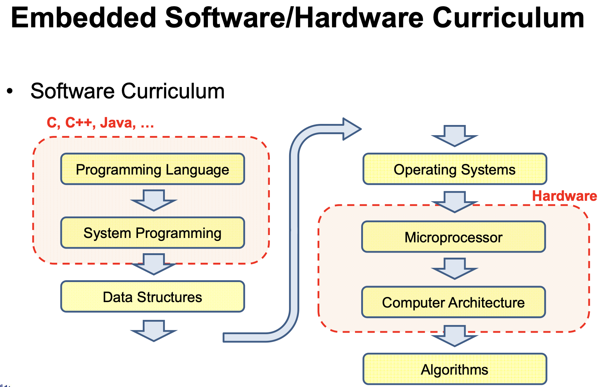
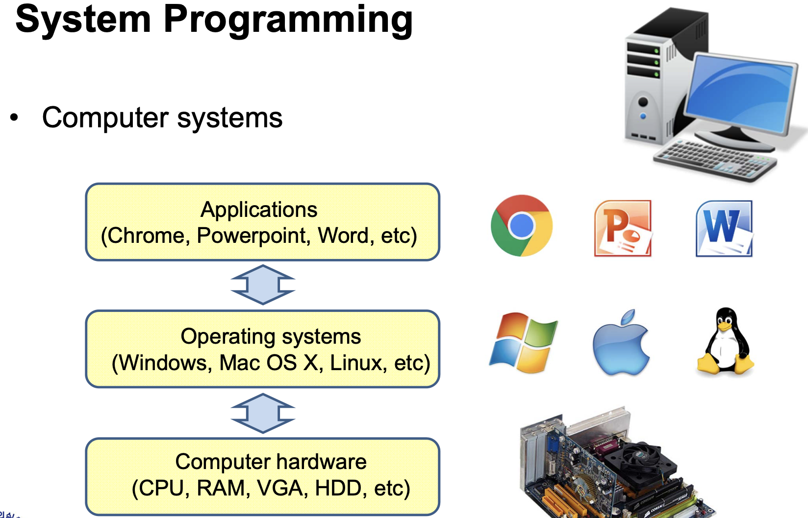
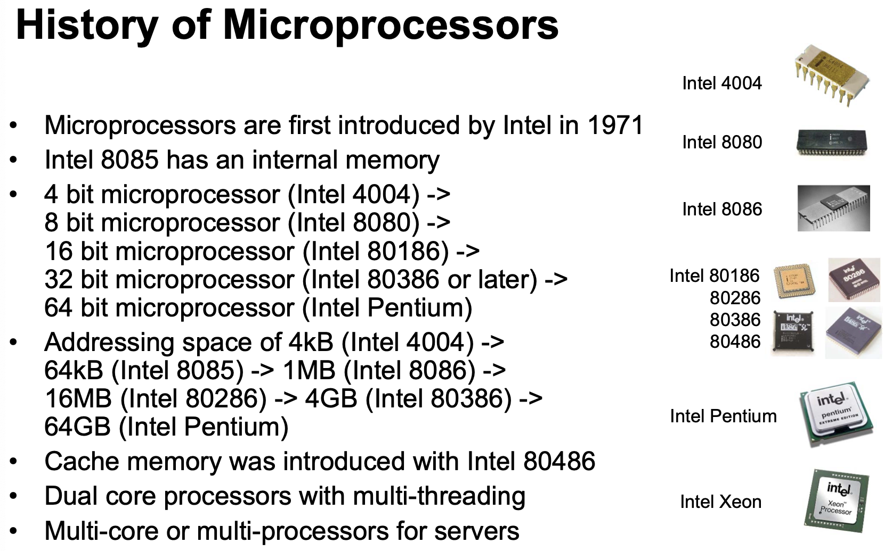
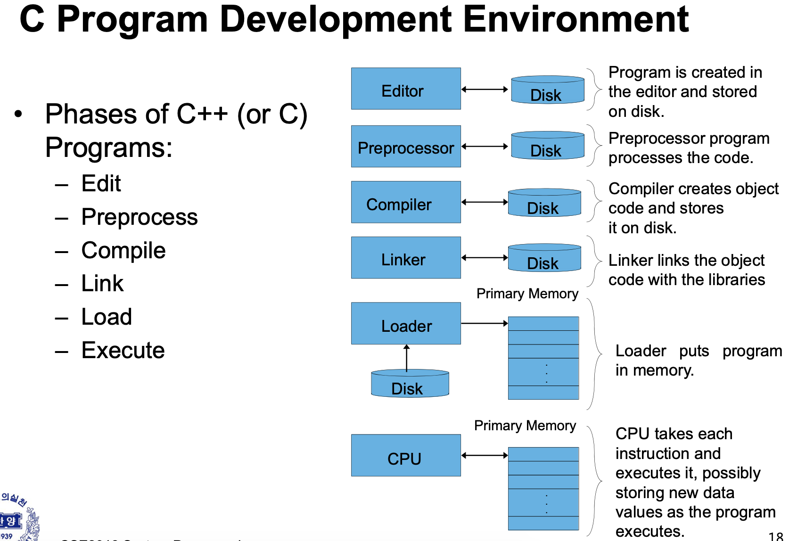

---

### Computer System 구성

- Apllications
- Operating systems(OS)
  - 어떤 운영체제는 기본은 비슷하다. 
    - 스케줄링, 스레드, 프로세스 ,메모리관리 등등
- Computer hardware

---

- 엄밀히 말혀먼, 컴퓨터 시스템도 Embeded시스템 구성중 하나다.
  - ( HW + SW의 결합 Embeded systems ) 

 

### Embeded System 구성

- User applications
  - Android, OS, ...
- Embeded Operating systems
  - 실제로 임베디드를 개발하는 일부 개발자들이 접하는 시스템
  - Linux가 대표적
- Embeded hardware
  - Ex ) 스마트폰

---

### Computer System 구조

- 하드웨어와 가장 처음 맞물리는 부분을 **Architectur dependent kernel**
  - **Architecture** : 컴퓨터 구조
  - x86 (intel 프로세서 구조), ARM(임베디드 프로세스), ...
  - **OS구조 중 가장 바닥**에 있어 하드웨어의 구성에 맞춰 상위 프로그램들을 수행

- 바로 위 **kernel**

  - OS중 가장 핵심적으로 다루는 부분을 kernel이라고 부른다.

  - kernel의 대표적인 4가지 기능들

    - **File systems** (핵심)

      : 각 운영체제 안에서 데이터를 파일, 폴더 등의 형태로 저장하기 위함, ( FAT, HPFS, .. ) , 상이한 운영체제에서는 호환이 잘 안됨

    - Inter-process communication

      - Process간 서로서로 통신을 한다는 의미
      - 실제 사용자에게 직접적으로 느껴지지 않는 부분. 프로세스는 컴퓨터 내부에서 이루어지기 때문.

    - I/O and device management 
      - device관리
    - **Process management** (핵심)
      - OS는 내부적 동작 시 기본적 단위는 **프로세스**
      - 그 프로세스들이 여러가지가 될수도 없어질수도 변화할수도 있기 때문에 그에 맞게 프로세스를 맞추기 위해서는 메모리 관리도 필수적이다.

- <u>**System call Interface**</u>

  - 간단하게는 API와 같은 것.
  - kernel or OS 기능들을 함수화 되어있는 부분들.
  - **hardware OS간 연동해아하는 경우**가 많이 있는데 이를 interface를 이용해 거기에 정의되어있는 함수를 콜하는 것.

  

- **Libraries**

  - 위에 함수 구현을 위해 Libraries에 다 구현이 되어있다.

---

### History of Microprocessors

*하드웨어에 따라 OS가 달라지는 경우가 있기 때문에 Microprocessor에 대해 간단히 알 필요가 있다.*

1. intel이라는 회사의 역사와 함께한다.

2. 1960이후, **4비트 ms 개발 -> 8비트 -> 16비트**

3. 발전하게 된 계기는 클럭 속도(**MIPS**) 가 향상되면서 부터

   1. **MIPS** ( Million Instruction per Second )

      : 1초에 백만개 interaction 수행 가능, ( 2MIPS 는 1초에 2백만개 수행 가능 )

4. 90년 후반, 클럭 스피드는 3Ghz 기준으로  물리적으로 향상에 한계가 옴

5. 클럭스피드 뿐만 아니라 **병렬 프로세싱**으로 결정내림 

   1. Dual core, Hexa Core , ... 
   2. 대표적으로 Intel Xeon 
   3. 그위에 돌아가는 OS가 그 코어를 잘 이용하게 끔 OS가 구성 되어야함.

   

---

### History of OS

- **mainframes** (1950's)

  1. 굉장히 크고, 운영체제로 돌아가는 컴퓨터가 아니였다.
  2. 자기네들이 개발한 OS (proprietary OS)
  3. 개인 소유 X
  4. batch processing
  5. VMX 하드웨어의 한 종류
  6. 초창기 Unix 개발
  7. 하드웨어가 굉장히 Bulky하고 소유하기 어려웠다. -> 수만명의 사람이 공유를 해야만 함
     : 여러사람과 공유하는 **multiuser OS**가 필요하게 됨 (현재 Unix의 장점)

  

- **초창기 Personal computers** (1970's)

  1. 호환이 되지 않거나 OS가 없는경우 중구난방

  2. CP/M : 그나마 많이 쓰인 OS

     : 초창기 Apple에서도 쓰임, 현재도 쓰이는 OS에 큰 영향을 줌.

  

- **PC's and Macs** (1980's)

  1. 개인용 컴퓨터가 널리 쓰이게 됨
  2. 하드웨어의 발전 : Microprocessor가 많이 쓰이게 됨
  3. IBM에서 MS에게 OS개발을 요청함
  4. MS의 DOS운영체제 출현 (CP/M에서 많은 영향을 받음)
     1. <u>command-line OS</u>

- **GUI(Graphical user interface)** (1980's)
  1. Apple Lise, Macintosh

- **1990's ~**
  - microprocessors가 굉장히 빠르게 발전하며 OS도 빠르게 발전함
  - Multi-threading & multi-processing 기능들을 주로 지원하는 형태로 OS가 발전

---

### OS의 타입

- Simple Batch System (옛날)

  

- Multiprogramming Batch System (time-sharing systems)

  - 현재쓰는 OS에도 이런기능이 들어가 있다. 
  - 하드웨어는 하나인데 동시에 돌릴 수 있도록

  

- MultiProcessor System

  - 하드웨어가 여러개가 들어갈 수 있기 때문에 이를 잘 관리할 수 있는 OS가 필요

  

- Distributed OS

  - 물리적으로 컴퓨터, 하드웨어가 여러개로 분산되어 있는 경우

  

- Real-time OS

  - 일반적인 OS와는 다소 다름
  - 일반적인 OS ? real-time을 보장은 못함
  - 어느경우에 사용하나 ? 여러가지의 다양한 프로세서가 돌아가는데 절대적으로 맞추어야 하는 deadline이 있는데 굉장히 타이트하다.
    - 유도탄 미사일 예시

---

### C 프로그램 개발 환경

*C 프로그래밍시 이루어지는 동작들에 대한 이해가 필요*

1. 프로그래밍 
2. 컴파일
   1. 내부에 무슨일이 일어나는지 이해하자

#### 컴파일 시 동작

1. Preprocessr 가 동작 (선처리)
   1. 실행되는 binary코드를 골라내고, 컴파일러에 **추가적인 정보**를 제공하기 위한 directives 영역( Ex.`#include <stdio.h>`) 존재
2. 코드부분만 골라내 실질적인 compile이 이루어짐
   1. 변수들을 골라내고 메모리 영역으로 배치를 하고 컴파일러를 하게 된다.
   2. assembly code, binary file 등이 나온다 (object code 생성)
3. Linker
   1. 컴파일러에서 만든 오브젝트 코드들을 링크해서 하나로 붙인다.
   2. 실행 파일이 나온다
4. Loader (실행파일 실행 )
   1. 5개 정도의메모리에 배치
5. 메로리를 읽어와 CPU가 실행

